# Rancangan Database Sistem Pengelolaan Persediaan Material dan Gudang

**Versi Framework Target:** Laravel 12  
**Database Server Engine:** PostgreSQL 16 / MySQL 8.0+  
**Dokumen Acuan:** `rancangan-aplikasi-persediaan-gudang.md`  

---

## 1. Ringkasan Eksekutif Arsitektur Database

Rancangan database ini disusun untuk mendukung aplikasi **Persediaan Material dan Gudang (17 Lokasi Gudang)** berbasis arsitektur **Laravel 12 Modular Monolith**.

Prinsip utama yang diterapkan pada skema data ini:
1. **Immutable Inventory Ledger**: Perubahan stok fisik dan finansial hanya boleh dicatat secara *append-only* di tabel `inventory_movements`. Riwayat mutasi tidak pernah di-update atau di-delete.
2. **Quick Read Stock Balances Projection**: Tabel `stock_balances` berfungsi sebagai cache/proyeksi saldo real-time untuk performa *read* yang cepat, dan di-update secara konsisten dalam *database transaction* menggunakan *row locking* (`SELECT ... FOR UPDATE`).
3. **Warehouse-Scoped Access**: Penugasan pengguna ke gudang dikontrol melalui tabel pivot `user_warehouse_assignments` dan diterapkan pada level query scope & policy Laravel.
4. **Optimistic & Pessimistic Locking**: `inventory_transactions` dilengkapi `lock_version` untuk mencegah *lost updates*, serta `stock_reservations` untuk mencegah *overselling/double allocation* stok saat approval berlangsung.

---

## 2. Diagram Relasi Entitas (ERD)

```mermaid
erDiagram
    USERS ||--o{ USER_WAREHOUSE_ASSIGNMENTS : assigned_to
    WAREHOUSES ||--o{ USER_WAREHOUSE_ASSIGNMENTS : scopes
    WAREHOUSES ||--o{ WAREHOUSE_LOCATIONS : contains
    ORGANIZATIONAL_FUNCTIONS ||--o{ POSITIONS : defines
    POSITIONS ||--o{ USER_POSITION_ASSIGNMENTS : holds

    MATERIAL_CLASSIFICATIONS ||--o{ MATERIALS : classifies
    MATERIAL_CATEGORIES ||--o{ MATERIALS : categorizes
    UOMS ||--o{ MATERIALS : measures

    MATERIALS ||--o{ STOCK_LOTS : batches
    WAREHOUSES ||--o{ STOCK_LOTS : stores
    STOCK_LOTS ||--o{ STOCK_LABELS : prints_qr
    WAREHOUSE_LOCATIONS ||--o{ STOCK_LABELS : placed_at

    MATERIALS ||--o{ STOCK_BALANCES : tracks
    WAREHOUSES ||--o{ STOCK_BALANCES : holds
    STOCK_LOTS ||--o{ STOCK_BALANCES : details

    TRANSACTION_SUBTYPES ||--o{ INVENTORY_TRANSACTIONS : categorizes
    USERS ||--o{ INVENTORY_TRANSACTIONS : requests
    WAREHOUSES ||--o{ INVENTORY_TRANSACTIONS : source_wh
    WAREHOUSES ||--o{ INVENTORY_TRANSACTIONS : dest_wh

    INVENTORY_TRANSACTIONS ||--|{ INVENTORY_TRANSACTION_ITEMS : contains
    MATERIALS ||--o{ INVENTORY_TRANSACTION_ITEMS : specifies
    UOMS ||--o{ INVENTORY_TRANSACTION_ITEMS : uses

    INVENTORY_TRANSACTIONS ||--o{ TRANSACTION_DOCUMENTS : attaches
    INVENTORY_TRANSACTIONS ||--o{ TRANSACTION_APPROVALS : approves
    INVENTORY_TRANSACTIONS ||--o{ TRANSACTION_HISTORIES : logs

    INVENTORY_TRANSACTIONS ||--o{ INVENTORY_MOVEMENTS : generates
    INVENTORY_TRANSACTION_ITEMS ||--o{ INVENTORY_MOVEMENTS : derives
    STOCK_LOTS ||--o{ INVENTORY_MOVEMENTS : affects

    STOCK_COUNT_SESSIONS ||--|{ STOCK_COUNT_ITEMS : records
    WAREHOUSES ||--o{ STOCK_COUNT_SESSIONS : operates_on
    STOCK_COUNT_SESSIONS ||--o{ INVENTORY_ADJUSTMENTS : triggers
```



---

## 3. Skema Migration Laravel (`database/migrations`)

### 3.1 Domain Identity, Access & Organisasi

#### `2026_01_01_000001_create_users_table.php`
```php
<?php

use Illuminate\Database\Migrations\Migration;
use Illuminate\Database\Schema\Blueprint;
use Illuminate\Support\Facades\Schema;

return new class extends Migration {
    public function up(): void
    {
        Schema::create('users', function (Blueprint $table) {
            $table->id();
            $table->string('employee_number')->unique()->comment('NIP / Nomor Induk Pegawai');
            $table->string('name');
            $table->string('email')->unique();
            $table->string('password');
            $table->enum('status', ['active', 'inactive'])->default('active');
            $table->timestamp('last_login_at')->nullable();
            $table->rememberToken();
            $table->timestamps();
        });
    }

    public function down(): void
    {
        Schema::dropIfExists('users');
    }
};
```

#### `2026_01_01_000002_create_organizational_functions_table.php`
```php
<?php

use Illuminate\Database\Migrations\Migration;
use Illuminate\Database\Schema\Blueprint;
use Illuminate\Support\Facades\Schema;

return new class extends Migration {
    public function up(): void
    {
        Schema::create('organizational_functions', function (Blueprint $table) {
            $table->id();
            $table->string('code', 20)->unique()->comment('Kode Fungsi: PERS, GDG, ACT, MGT, HLD');
            $table->string('name');
            $table->foreignId('parent_id')->nullable()->constrained('organizational_functions')->nullOnDelete();
            $table->boolean('is_active')->default(true);
            $table->timestamps();
        });
    }

    public function down(): void
    {
        Schema::dropIfExists('organizational_functions');
    }
};
```

#### `2026_01_01_000003_create_positions_table.php`
```php
<?php

use Illuminate\Database\Migrations\Migration;
use Illuminate\Database\Schema\Blueprint;
use Illuminate\Support\Facades\Schema;

return new class extends Migration {
    public function up(): void
    {
        Schema::create('positions', function (Blueprint $table) {
            $table->id();
            $table->foreignId('function_id')->constrained('organizational_functions')->cascadeOnDelete();
            $table->string('code', 30)->unique();
            $table->string('name');
            $table->boolean('is_active')->default(true);
            $table->timestamps();
        });
    }

    public function down(): void
    {
        Schema::dropIfExists('positions');
    }
};
```

#### `2026_01_01_000004_create_user_position_assignments_table.php`
```php
<?php

use Illuminate\Database\Migrations\Migration;
use Illuminate\Database\Schema\Blueprint;
use Illuminate\Support\Facades\Schema;

return new class extends Migration {
    public function up(): void
    {
        Schema::create('user_position_assignments', function (Blueprint $table) {
            $table->id();
            $table->foreignId('user_id')->constrained('users')->cascadeOnDelete();
            $table->foreignId('position_id')->constrained('positions')->cascadeOnDelete();
            $table->date('valid_from');
            $table->date('valid_until')->nullable();
            $table->boolean('is_primary')->default(true);
            $table->timestamps();
        });
    }

    public function down(): void
    {
        Schema::dropIfExists('user_position_assignments');
    }
};
```

#### `2026_01_01_000005_create_warehouses_table.php`
```php
<?php

use Illuminate\Database\Migrations\Migration;
use Illuminate\Database\Schema\Blueprint;
use Illuminate\Support\Facades\Schema;

return new class extends Migration {
    public function up(): void
    {
        Schema::create('warehouses', function (Blueprint $table) {
            $table->id();
            $table->string('code', 10)->unique()->comment('Kode Singkatan Gudang (misal: MDN, BGR, JKT, PKR)');
            $table->string('name');
            $table->string('region_code', 20);
            $table->text('address')->nullable();
            $table->string('timezone')->default('Asia/Jakarta');
            $table->boolean('is_active')->default(true);
            $table->timestamps();
        });
    }

    public function down(): void
    {
        Schema::dropIfExists('warehouses');
    }
};
```

#### `2026_01_01_000006_create_warehouse_locations_table.php`
```php
<?php

use Illuminate\Database\Migrations\Migration;
use Illuminate\Database\Schema\Blueprint;
use Illuminate\Support\Facades\Schema;

return new class extends Migration {
    public function up(): void
    {
        Schema::create('warehouse_locations', function (Blueprint $table) {
            $table->id();
            $table->foreignId('warehouse_id')->constrained('warehouses')->cascadeOnDelete();
            $table->string('code', 50)->comment('Kode Lokasi/Bin, misal: RAK-A1-02');
            $table->string('name');
            $table->enum('type', ['zone', 'rack', 'bin', 'staging', 'transit', 'quarantine'])->default('bin');
            $table->foreignId('parent_id')->nullable()->constrained('warehouse_locations')->nullOnDelete();
            $table->boolean('is_active')->default(true);
            $table->timestamps();

            $table->unique(['warehouse_id', 'code']);
        });
    }

    public function down(): void
    {
        Schema::dropIfExists('warehouse_locations');
    }
};
```

#### `2026_01_01_000007_create_user_warehouse_assignments_table.php`
```php
<?php

use Illuminate\Database\Migrations\Migration;
use Illuminate\Database\Schema\Blueprint;
use Illuminate\Support\Facades\Schema;

return new class extends Migration {
    public function up(): void
    {
        Schema::create('user_warehouse_assignments', function (Blueprint $table) {
            $table->id();
            $table->foreignId('user_id')->constrained('users')->cascadeOnDelete();
            $table->foreignId('warehouse_id')->constrained('warehouses')->cascadeOnDelete();
            $table->string('role_scope', 50)->comment('warehouse_head, warehouse_staff, inventory_verifier');
            $table->date('valid_from');
            $table->date('valid_until')->nullable();
            $table->timestamps();

            $table->unique(['user_id', 'warehouse_id', 'role_scope']);
        });
    }

    public function down(): void
    {
        Schema::dropIfExists('user_warehouse_assignments');
    }
};
```

---

### 3.2 Domain Bank Data Master Material

#### `2026_01_01_000010_create_material_classifications_table.php`
```php
<?php

use Illuminate\Database\Migrations\Migration;
use Illuminate\Database\Schema\Blueprint;
use Illuminate\Support\Facades\Schema;

return new class extends Migration {
    public function up(): void
    {
        Schema::create('material_classifications', function (Blueprint $table) {
            $table->id();
            $table->string('code', 20)->unique();
            $table->string('name');
            $table->integer('sort_order')->default(0);
            $table->boolean('is_active')->default(true);
            $table->timestamps();
        });
    }

    public function down(): void
    {
        Schema::dropIfExists('material_classifications');
    }
};
```

#### `2026_01_01_000011_create_material_categories_table.php`
```php
<?php

use Illuminate\Database\Migrations\Migration;
use Illuminate\Database\Schema\Blueprint;
use Illuminate\Support\Facades\Schema;

return new class extends Migration {
    public function up(): void
    {
        Schema::create('material_categories', function (Blueprint $table) {
            $table->id();
            $table->string('code', 20)->unique();
            $table->string('name');
            $table->integer('sort_order')->default(0);
            $table->boolean('is_active')->default(true);
            $table->timestamps();
        });
    }

    public function down(): void
    {
        Schema::dropIfExists('material_categories');
    }
};
```

#### `2026_01_01_000012_create_uoms_table.php`
```php
<?php

use Illuminate\Database\Migrations\Migration;
use Illuminate\Database\Schema\Blueprint;
use Illuminate\Support\Facades\Schema;

return new class extends Migration {
    public function up(): void
    {
        Schema::create('uoms', function (Blueprint $table) {
            $table->id();
            $table->string('code', 10)->unique()->comment('EA, MTR, SET, KG, LTR');
            $table->string('name');
            $table->unsignedTinyInteger('decimal_precision')->default(0);
            $table->boolean('is_active')->default(true);
            $table->timestamps();
        });
    }

    public function down(): void
    {
        Schema::dropIfExists('uoms');
    }
};
```

#### `2026_01_01_000013_create_materials_table.php`
```php
<?php

use Illuminate\Database\Migrations\Migration;
use Illuminate\Database\Schema\Blueprint;
use Illuminate\Support\Facades\Schema;

return new class extends Migration {
    public function up(): void
    {
        Schema::create('materials', function (Blueprint $table) {
            $table->id();
            $table->string('kimap', 30)->unique()->comment('Kode KIMAP Material Unik');
            $table->string('name');
            $table->foreignId('classification_id')->constrained('material_classifications');
            $table->foreignId('category_id')->constrained('material_categories');
            $table->foreignId('base_uom_id')->constrained('uoms');
            $table->text('description')->nullable();
            $table->boolean('is_serialized')->default(false);
            $table->boolean('is_active')->default(true);
            $table->timestamps();
        });
    }

    public function down(): void
    {
        Schema::dropIfExists('materials');
    }
};
```

#### `2026_01_01_000014_create_material_status_assignments_table.php`
```php
<?php

use Illuminate\Database\Migrations\Migration;
use Illuminate\Database\Schema\Blueprint;
use Illuminate\Support\Facades\Schema;

return new class extends Migration {
    public function up(): void
    {
        Schema::create('material_status_assignments', function (Blueprint $table) {
            $table->id();
            $table->foreignId('material_id')->constrained('materials')->cascadeOnDelete();
            $table->foreignId('warehouse_id')->constrained('warehouses')->cascadeOnDelete();
            $table->enum('status_code', ['FM', 'SM', 'PDS', 'DS'])->default('FM')->comment('FM=Fast, SM=Slow, PDS=Potential Dead Stock, DS=Dead Stock');
            $table->date('effective_from');
            $table->date('effective_until')->nullable();
            $table->text('reason')->nullable();
            $table->foreignId('assigned_by')->constrained('users');
            $table->timestamps();
        });
    }

    public function down(): void
    {
        Schema::dropIfExists('material_status_assignments');
    }
};
```

---

### 3.3 Domain Inventory Core & Ledger Stok

#### `2026_01_01_000020_create_stock_lots_table.php`
```php
<?php

use Illuminate\Database\Migrations\Migration;
use Illuminate\Database\Schema\Blueprint;
use Illuminate\Support\Facades\Schema;

return new class extends Migration {
    public function up(): void
    {
        Schema::create('stock_lots', function (Blueprint $table) {
            $table->id();
            $table->foreignId('warehouse_id')->constrained('warehouses');
            $table->foreignId('material_id')->constrained('materials');
            $table->string('acquisition_period', 6)->comment('Format YYYYMM');
            $table->unsignedBigInteger('receipt_item_id')->nullable();
            $table->decimal('unit_price', 18, 4)->default(0);
            $table->decimal('original_quantity', 14, 4);
            $table->decimal('remaining_quantity', 14, 4);
            $table->enum('status', ['active', 'exhausted', 'quarantined', 'written_off'])->default('active');
            $table->timestamps();
        });
    }

    public function down(): void
    {
        Schema::dropIfExists('stock_lots');
    }
};
```

#### `2026_01_01_000021_create_stock_labels_table.php`
```php
<?php

use Illuminate\Database\Migrations\Migration;
use Illuminate\Database\Schema\Blueprint;
use Illuminate\Support\Facades\Schema;

return new class extends Migration {
    public function up(): void
    {
        Schema::create('stock_labels', function (Blueprint $table) {
            $table->id();
            $table->foreignId('stock_lot_id')->constrained('stock_lots')->cascadeOnDelete();
            $table->foreignId('warehouse_location_id')->constrained('warehouse_locations');
            $table->string('qr_token', 64)->unique()->comment('Token Unik QR Code yang Di-scan');
            $table->string('card_number', 50)->comment('Nomor Kartu Material Fisik');
            $table->decimal('label_quantity', 14, 4);
            $table->decimal('remaining_quantity', 14, 4);
            $table->unsignedInteger('printed_count')->default(0);
            $table->timestamp('last_printed_at')->nullable();
            $table->enum('status', ['active', 'consumed', 'void', 'reprinted'])->default('active');
            $table->timestamps();
        });
    }

    public function down(): void
    {
        Schema::dropIfExists('stock_labels');
    }
};
```

#### `2026_01_01_000022_create_inventory_movements_table.php`
```php
<?php

use Illuminate\Database\Migrations\Migration;
use Illuminate\Database\Schema\Blueprint;
use Illuminate\Support\Facades\Schema;

return new class extends Migration {
    public function up(): void
    {
        Schema::create('inventory_movements', function (Blueprint $table) {
            $table->uuid('id')->primary();
            $table->uuid('transaction_id');
            $table->unsignedBigInteger('transaction_item_id');
            $table->foreignId('warehouse_id')->constrained('warehouses');
            $table->foreignId('warehouse_location_id')->constrained('warehouse_locations');
            $table->foreignId('material_id')->constrained('materials');
            $table->foreignId('stock_lot_id')->constrained('stock_lots');
            $table->foreignId('stock_label_id')->nullable()->constrained('stock_labels');
            $table->enum('movement_type', ['inbound', 'outbound', 'transit_in', 'transit_out', 'quarantine', 'write_off', 'adjustment']);
            $table->decimal('quantity_delta', 14, 4)->comment('Positif (+) Masuk, Negatif (-) Keluar');
            $table->decimal('amount_delta', 18, 4);
            $table->timestamp('occurred_at');
            $table->foreignId('posted_by')->constrained('users');
            $table->uuid('reversal_of_id')->nullable();
            $table->timestamps();

            $table->index(['warehouse_id', 'material_id', 'occurred_at']);
        });
    }

    public function down(): void
    {
        Schema::dropIfExists('inventory_movements');
    }
};
```

#### `2026_01_01_000023_create_stock_balances_table.php`
```php
<?php

use Illuminate\Database\Migrations\Migration;
use Illuminate\Database\Schema\Blueprint;
use Illuminate\Support\Facades\Schema;

return new class extends Migration {
    public function up(): void
    {
        Schema::create('stock_balances', function (Blueprint $table) {
            $table->id();
            $table->foreignId('warehouse_id')->constrained('warehouses');
            $table->foreignId('warehouse_location_id')->constrained('warehouse_locations');
            $table->foreignId('material_id')->constrained('materials');
            $table->foreignId('stock_lot_id')->constrained('stock_lots');
            $table->decimal('on_hand_quantity', 14, 4)->default(0);
            $table->decimal('reserved_quantity', 14, 4)->default(0);
            $table->decimal('in_transit_quantity', 14, 4)->default(0);
            $table->decimal('quarantined_quantity', 14, 4)->default(0);
            $table->decimal('average_unit_cost', 18, 4)->default(0);
            $table->timestamps();

            $table->unique(['warehouse_id', 'warehouse_location_id', 'material_id', 'stock_lot_id'], 'unique_balance_key');
        });
    }

    public function down(): void
    {
        Schema::dropIfExists('stock_balances');
    }
};
```

#### `2026_01_01_000024_create_stock_reservations_table.php`
```php
<?php

use Illuminate\Database\Migrations\Migration;
use Illuminate\Database\Schema\Blueprint;
use Illuminate\Support\Facades\Schema;

return new class extends Migration {
    public function up(): void
    {
        Schema::create('stock_reservations', function (Blueprint $table) {
            $table->id();
            $table->unsignedBigInteger('transaction_item_id');
            $table->foreignId('stock_lot_id')->constrained('stock_lots');
            $table->decimal('reserved_quantity', 14, 4);
            $table->decimal('consumed_quantity', 14, 4)->default(0);
            $table->enum('status', ['active', 'fulfilled', 'released', 'expired'])->default('active');
            $table->timestamp('expires_at')->nullable();
            $table->timestamps();
        });
    }

    public function down(): void
    {
        Schema::dropIfExists('stock_reservations');
    }
};
```

---

### 3.4 Domain Transaksi Material & Workflow

#### `2026_01_01_000030_create_transaction_subtypes_table.php`
```php
<?php

use Illuminate\Database\Migrations\Migration;
use Illuminate\Database\Schema\Blueprint;
use Illuminate\Support\Facades\Schema;

return new class extends Migration {
    public function up(): void
    {
        Schema::create('transaction_subtypes', function (Blueprint $table) {
            $table->id();
            $table->string('code', 10)->unique()->comment('1101, 1103, 2201, 2202, 3300');
            $table->enum('main_type', ['receipt', 'issue', 'return', 'transfer', 'write_off', 'adjustment']);
            $table->string('name');
            $table->text('description')->nullable();
            $table->boolean('requires_reference')->default(false);
            $table->boolean('is_active')->default(true);
            $table->timestamps();
        });
    }

    public function down(): void
    {
        Schema::dropIfExists('transaction_subtypes');
    }
};
```

#### `2026_01_01_000031_create_inventory_transactions_table.php`
```php
<?php

use Illuminate\Database\Migrations\Migration;
use Illuminate\Database\Schema\Blueprint;
use Illuminate\Support\Facades\Schema;

return new class extends Migration {
    public function up(): void
    {
        Schema::create('inventory_transactions', function (Blueprint $table) {
            $table->uuid('id')->primary();
            $table->string('transaction_number', 50)->unique()->comment('Format: SUBTYPE-WH-YYYYMM-SEQ');
            $table->enum('transaction_type', ['receipt', 'issue', 'return', 'transfer', 'write_off', 'adjustment']);
            $table->foreignId('transaction_subtype_id')->constrained('transaction_subtypes');
            $table->foreignId('source_warehouse_id')->constrained('warehouses');
            $table->foreignId('destination_warehouse_id')->nullable()->constrained('warehouses');
            $table->date('transaction_date');
            $table->enum('status', [
                'draft', 'submitted', 'under_review', 'revision_requested',
                'rejected', 'approved', 'posted', 'completed', 'cancelled', 'reversed'
            ])->default('draft');
            $table->string('current_stage')->default('stage_user_submit');
            $table->foreignId('requested_by')->constrained('users');
            $table->string('reference_text')->nullable();
            $table->text('explanation')->nullable();
            $table->timestamp('submitted_at')->nullable();
            $table->timestamp('posted_at')->nullable();
            $table->timestamp('completed_at')->nullable();
            $table->unsignedInteger('lock_version')->default(1);
            $table->timestamps();
            $table->softDeletes();
        });
    }

    public function down(): void
    {
        Schema::dropIfExists('inventory_transactions');
    }
};
```

#### `2026_01_01_000032_create_inventory_transaction_items_table.php`
```php
<?php

use Illuminate\Database\Migrations\Migration;
use Illuminate\Database\Schema\Blueprint;
use Illuminate\Support\Facades\Schema;

return new class extends Migration {
    public function up(): void
    {
        Schema::create('inventory_transaction_items', function (Blueprint $table) {
            $table->id();
            $table->uuid('transaction_id');
            $table->foreign('transaction_id')->references('id')->on('inventory_transactions')->cascadeOnDelete();
            $table->unsignedInteger('line_number');
            $table->foreignId('material_id')->constrained('materials');
            $table->foreignId('uom_id')->constrained('uoms');
            $table->foreignId('source_location_id')->nullable()->constrained('warehouse_locations');
            $table->foreignId('destination_location_id')->nullable()->constrained('warehouse_locations');
            $table->decimal('requested_quantity', 14, 4);
            $table->decimal('processed_quantity', 14, 4)->default(0);
            $table->decimal('unit_price', 18, 4)->default(0);
            $table->decimal('total_amount', 18, 4)->default(0);
            $table->foreignId('source_lot_id')->nullable()->constrained('stock_lots');
            $table->foreignId('source_stock_label_id')->nullable()->constrained('stock_labels');
            $table->string('card_number', 50)->nullable();
            $table->text('notes')->nullable();
            $table->timestamps();

            $table->unique(['transaction_id', 'line_number']);
        });
    }

    public function down(): void
    {
        Schema::dropIfExists('inventory_transaction_items');
    }
};
```

#### `2026_01_01_000033_create_transaction_documents_table.php`
```php
<?php

use Illuminate\Database\Migrations\Migration;
use Illuminate\Database\Schema\Blueprint;
use Illuminate\Support\Facades\Schema;

return new class extends Migration {
    public function up(): void
    {
        Schema::create('transaction_documents', function (Blueprint $table) {
            $table->id();
            $table->uuid('transaction_id');
            $table->foreign('transaction_id')->references('id')->on('inventory_transactions')->cascadeOnDelete();
            $table->string('document_type_code', 30);
            $table->string('file_name');
            $table->string('object_key');
            $table->string('mime_type');
            $table->unsignedBigInteger('size');
            $table->string('checksum', 64);
            $table->unsignedInteger('version')->default(1);
            $table->foreignId('uploaded_by')->constrained('users');
            $table->timestamp('uploaded_at');
            $table->timestamps();
        });
    }

    public function down(): void
    {
        Schema::dropIfExists('transaction_documents');
    }
};
```

#### `2026_01_01_000034_create_transaction_approvals_table.php`
```php
<?php

use Illuminate\Database\Migrations\Migration;
use Illuminate\Database\Schema\Blueprint;
use Illuminate\Support\Facades\Schema;

return new class extends Migration {
    public function up(): void
    {
        Schema::create('transaction_approvals', function (Blueprint $table) {
            $table->id();
            $table->uuid('transaction_id');
            $table->foreign('transaction_id')->references('id')->on('inventory_transactions')->cascadeOnDelete();
            $table->string('stage_code', 50);
            $table->unsignedInteger('sequence');
            $table->string('required_role');
            $table->foreignId('assigned_user_id')->nullable()->constrained('users');
            $table->enum('decision', ['pending', 'approved', 'rejected', 'revision_requested'])->default('pending');
            $table->text('notes')->nullable();
            $table->string('actor_name_snapshot')->nullable();
            $table->string('position_snapshot')->nullable();
            $table->string('role_snapshot')->nullable();
            $table->timestamp('decided_at')->nullable();
            $table->string('ip_address', 45)->nullable();
            $table->text('user_agent')->nullable();
            $table->timestamps();
        });
    }

    public function down(): void
    {
        Schema::dropIfExists('transaction_approvals');
    }
};
```

#### `2026_01_01_000035_create_transaction_histories_table.php`
```php
<?php

use Illuminate\Database\Migrations\Migration;
use Illuminate\Database\Schema\Blueprint;
use Illuminate\Support\Facades\Schema;

return new class extends Migration {
    public function up(): void
    {
        Schema::create('transaction_histories', function (Blueprint $table) {
            $table->id();
            $table->uuid('transaction_id');
            $table->foreign('transaction_id')->references('id')->on('inventory_transactions')->cascadeOnDelete();
            $table->string('activity');
            $table->string('from_status')->nullable();
            $table->string('to_status')->nullable();
            $table->json('metadata')->nullable();
            $table->foreignId('actor_id')->constrained('users');
            $table->timestamp('created_at');
        });
    }

    public function down(): void
    {
        Schema::dropIfExists('transaction_histories');
    }
};
```

---

### 3.5 Domain Stock Opname & Inventarisasi

#### `2026_01_01_000040_create_stock_count_sessions_table.php`
```php
<?php

use Illuminate\Database\Migrations\Migration;
use Illuminate\Database\Schema\Blueprint;
use Illuminate\Support\Facades\Schema;

return new class extends Migration {
    public function up(): void
    {
        Schema::create('stock_count_sessions', function (Blueprint $table) {
            $table->id();
            $table->string('session_number', 50)->unique()->comment('Format: SO-WH-YYYYMM-SEQ');
            $table->enum('session_type', ['stock_opname', 'inventarisasi']);
            $table->foreignId('warehouse_id')->constrained('warehouses');
            $table->date('period_start');
            $table->date('period_end');
            $table->timestamp('snapshot_at')->nullable();
            $table->string('scope')->default('full');
            $table->enum('status', ['draft', 'in_progress', 'completed', 'approved', 'cancelled'])->default('draft');
            $table->foreignId('created_by')->constrained('users');
            $table->foreignId('approved_by')->nullable()->constrained('users');
            $table->timestamps();
        });
    }

    public function down(): void
    {
        Schema::dropIfExists('stock_count_sessions');
    }
};
```

#### `2026_01_01_000041_create_stock_count_items_table.php`
```php
<?php

use Illuminate\Database\Migrations\Migration;
use Illuminate\Database\Schema\Blueprint;
use Illuminate\Support\Facades\Schema;

return new class extends Migration {
    public function up(): void
    {
        Schema::create('stock_count_items', function (Blueprint $table) {
            $table->id();
            $table->foreignId('session_id')->constrained('stock_count_sessions')->cascadeOnDelete();
            $table->foreignId('material_id')->constrained('materials');
            $table->foreignId('stock_lot_id')->constrained('stock_lots');
            $table->foreignId('stock_label_id')->nullable()->constrained('stock_labels');
            $table->decimal('system_quantity', 14, 4);
            $table->decimal('physical_quantity', 14, 4)->nullable();
            $table->decimal('variance_quantity', 14, 4)->nullable();
            $table->text('explanation')->nullable();
            $table->foreignId('counted_by')->nullable()->constrained('users');
            $table->timestamp('counted_at')->nullable();
            $table->timestamps();
        });
    }

    public function down(): void
    {
        Schema::dropIfExists('stock_count_items');
    }
};
```

#### `2026_01_01_000042_create_inventory_adjustments_table.php`
```php
<?php

use Illuminate\Database\Migrations\Migration;
use Illuminate\Database\Schema\Blueprint;
use Illuminate\Support\Facades\Schema;

return new class extends Migration {
    public function up(): void
    {
        Schema::create('inventory_adjustments', function (Blueprint $table) {
            $table->id();
            $table->foreignId('stock_count_session_id')->constrained('stock_count_sessions');
            $table->enum('status', ['draft', 'pending_approval', 'approved', 'posted', 'rejected'])->default('draft');
            $table->text('reason');
            $table->foreignId('approved_by_head')->nullable()->constrained('users');
            $table->foreignId('approved_by_inventory')->nullable()->constrained('users');
            $table->timestamp('posted_at')->nullable();
            $table->timestamps();
        });
    }

    public function down(): void
    {
        Schema::dropIfExists('inventory_adjustments');
    }
};
```

---

## 4. Definisi Eloquent Models & Penjelasan Fungsi Relasi

Below is the exhaustive mapping of Eloquent models and detailed explanations for every single relation function:

### 4.1 `App\Models\User`
```php
namespace App\Models;

use Illuminate\Foundation\Auth\User as Authenticatable;
use Illuminate\Database\Eloquent\Relations\HasMany;
use Illuminate\Database\Eloquent\Relations\BelongsToMany;

class User extends Authenticatable
{
    protected $fillable = ['employee_number', 'name', 'email', 'password', 'status', 'last_login_at'];

    /**
     * Relasi ke penugasan gudang (HasMany)
     * Mengakses baris spesifik penugasan gudang beserta role scope dan masa berlaku user.
     */
    public function warehouseAssignments(): HasMany
    {
        return $this->hasMany(UserWarehouseAssignment::class);
    }

    /**
     * Relasi ke gudang yang ditugaskan (BelongsToMany)
     * Mengambil daftar instance Warehouse tempat user diizinkan mengakses data.
     */
    public function warehouses(): BelongsToMany
    {
        return $this->belongsToMany(Warehouse::class, 'user_warehouse_assignments')
                    ->withPivot('role_scope', 'valid_from', 'valid_until')
                    ->withTimestamps();
    }

    /**
     * Relasi ke penugasan jabatan (HasMany)
     * Riwayat posisi/jabatan organisasi yang pernah atau sedang diemban user.
     */
    public function positionAssignments(): HasMany
    {
        return $this->hasMany(UserPositionAssignment::class);
    }

    /**
     * Relasi ke transaksi yang dibuat user (HasMany)
     * Mengambil semua transaksi barang (penerimaan, pengeluaran, transfer) yang di-request oleh user ini.
     */
    public function requestedTransactions(): HasMany
    {
        return $this->hasMany(InventoryTransaction::class, 'requested_by');
    }

    /**
     * Relasi ke tugas approval (HasMany)
     * Mengambil daftar persetujuan workflow yang ditugaskan ke user ini.
     */
    public function approvals(): HasMany
    {
        return $this->hasMany(TransactionApproval::class, 'assigned_user_id');
    }
}
```

---

### 4.2 `App\Models\Warehouse`
```php
namespace App\Models;

use Illuminate\Database\Eloquent\Model;
use Illuminate\Database\Eloquent\Relations\HasMany;
use Illuminate\Database\Eloquent\Relations\BelongsToMany;

class Warehouse extends Model
{
    protected $fillable = ['code', 'name', 'region_code', 'address', 'timezone', 'is_active'];

    /**
     * Relasi ke Lokasi Penyimpanan Rak/Bin/Zone (HasMany)
     * Menghubungkan gudang dengan sub-lokasi penyimpanan fisik di dalamnya.
     */
    public function locations(): HasMany
    {
        return $this->hasMany(WarehouseLocation::class);
    }

    /**
     * Relasi ke User yang bertugas (BelongsToMany)
     * Mendapatkan daftar staf/pejabat yang ditugaskan di gudang ini.
     */
    public function users(): BelongsToMany
    {
        return $this->belongsToMany(User::class, 'user_warehouse_assignments')
                    ->withPivot('role_scope', 'valid_from', 'valid_until')
                    ->withTimestamps();
    }

    /**
     * Relasi ke Saldo Stok Gudang (HasMany)
     * Mendapatkan posisi saldo kuantitas seluruh material di gudang ini.
     */
    public function stockBalances(): HasMany
    {
        return $this->hasMany(StockBalance::class);
    }

    /**
     * Relasi ke Transaksi Keluar (HasMany)
     * Transaksi mutasi barang di mana gudang ini bertindak sebagai gudang pengirim.
     */
    public function outgoingTransactions(): HasMany
    {
        return $this->hasMany(InventoryTransaction::class, 'source_warehouse_id');
    }

    /**
     * Relasi ke Transaksi Masuk (HasMany)
     * Transaksi mutasi barang di mana gudang ini bertindak sebagai gudang penerima.
     */
    public function incomingTransactions(): HasMany
    {
        return $this->hasMany(InventoryTransaction::class, 'destination_warehouse_id');
    }
}
```

---

### 4.3 `App\Models\Material`
```php
namespace App\Models;

use Illuminate\Database\Eloquent\Model;
use Illuminate\Database\Eloquent\Relations\BelongsTo;
use Illuminate\Database\Eloquent\Relations\HasMany;

class Material extends Model
{
    protected $fillable = [
        'kimap', 'name', 'classification_id', 'category_id',
        'base_uom_id', 'description', 'is_serialized', 'is_active'
    ];

    /**
     * Relasi ke Klasifikasi Material (BelongsTo)
     * Menghubungkan material ke kelompok klasifikasi (misal: Peralatan Utilitas, Suku Cadang).
     */
    public function classification(): BelongsTo
    {
        return $this->belongsTo(MaterialClassification::class, 'classification_id');
    }

    /**
     * Relasi ke Kategori Material (BelongsTo)
     * Menghubungkan material ke kategori teknis (misal: Pipe & Tube, Valve & Cock).
     */
    public function category(): BelongsTo
    {
        return $this->belongsTo(MaterialCategory::class, 'category_id');
    }

    /**
     * Relasi ke Satuan Ukur / UOM (BelongsTo)
     * Menentukan UOM dasar pencatatan stok material ini (EA, MTR, SET, KG).
     */
    public function baseUom(): BelongsTo
    {
        return $this->belongsTo(Uom::class, 'base_uom_id');
    }

    /**
     * Relasi ke Lot Perolehan / Batch Stok (HasMany)
     * Menelusuri seluruh batch perolehan material ini di berbagai gudang.
     */
    public function stockLots(): HasMany
    {
        return $this->hasMany(StockLot::class);
    }

    /**
     * Relasi ke Saldo Stok (HasMany)
     * Mendapatkan posisi saldo on-hand & available material ini di seluruh gudang.
     */
    public function stockBalances(): HasMany
    {
        return $this->hasMany(StockBalance::class);
    }

    /**
     * Relasi ke Status Bergerak Material (HasMany)
     * Riwayat status Fast Moving (FM), Slow Moving (SM), Potential Dead Stock (PDS), Dead Stock (DS).
     */
    public function statusAssignments(): HasMany
    {
        return $this->hasMany(MaterialStatusAssignment::class);
    }
}
```

---

### 4.4 `App\Models\StockBalance`
```php
namespace App\Models;

use Illuminate\Database\Eloquent\Model;
use Illuminate\Database\Eloquent\Relations\BelongsTo;

class StockBalance extends Model
{
    protected $fillable = [
        'warehouse_id', 'warehouse_location_id', 'material_id', 'stock_lot_id',
        'on_hand_quantity', 'reserved_quantity', 'in_transit_quantity',
        'quarantined_quantity', 'average_unit_cost'
    ];

    /**
     * Accessor Otomatis: Available Quantity
     * Kuantitas bersih yang siap digunakan untuk transaksi pengeluaran/pemindahan baru.
     * Formula: Available = OnHand - Reserved - Quarantined
     */
    public function getAvailableQuantityAttribute(): float
    {
        return max(0, $this->on_hand_quantity - $this->reserved_quantity - $this->quarantined_quantity);
    }

    public function warehouse(): BelongsTo
    {
        return $this->belongsTo(Warehouse::class);
    }

    public function location(): BelongsTo
    {
        return $this->belongsTo(WarehouseLocation::class, 'warehouse_location_id');
    }

    public function material(): BelongsTo
    {
        return $this->belongsTo(Material::class);
    }

    public function stockLot(): BelongsTo
    {
        return $this->belongsTo(StockLot::class);
    }
}
```

---

### 4.5 `App\Models\InventoryTransaction`
```php
namespace App\Models;

use Illuminate\Database\Eloquent\Model;
use Illuminate\Database\Eloquent\Concerns\HasUuids;
use Illuminate\Database\Eloquent\SoftDeletes;
use Illuminate\Database\Eloquent\Relations\BelongsTo;
use Illuminate\Database\Eloquent\Relations\HasMany;

class InventoryTransaction extends Model
{
    use HasUuids, SoftDeletes;

    protected $fillable = [
        'transaction_number', 'transaction_type', 'transaction_subtype_id',
        'source_warehouse_id', 'destination_warehouse_id', 'transaction_date',
        'status', 'current_stage', 'requested_by', 'reference_text',
        'explanation', 'submitted_at', 'posted_at', 'completed_at', 'lock_version'
    ];

    /**
     * Relasi ke Subtipe Transaksi (BelongsTo)
     * Mengidentifikasi aturan khusus subtipe (1101 Penerimaan Pembelian, 2202 Pengeluaran Operasional, dll).
     */
    public function subtype(): BelongsTo
    {
        return $this->belongsTo(TransactionSubtype::class, 'transaction_subtype_id');
    }

    /**
     * Relasi ke Gudang Asal (BelongsTo)
     */
    public function sourceWarehouse(): BelongsTo
    {
        return $this->belongsTo(Warehouse::class, 'source_warehouse_id');
    }

    /**
     * Relasi ke Gudang Tujuan (BelongsTo) - Opsional untuk Pemindahan Material
     */
    public function destinationWarehouse(): BelongsTo
    {
        return $this->belongsTo(Warehouse::class, 'destination_warehouse_id');
    }

    /**
     * Relasi ke User Pengaju (BelongsTo)
     */
    public function requester(): BelongsTo
    {
        return $this->belongsTo(User::class, 'requested_by');
    }

    /**
     * Relasi ke Rincian Line Item Barang (HasMany)
     * Mengambil seluruh material yang ditransaksikan dalam dokumen ini.
     */
    public function items(): HasMany
    {
        return $this->hasMany(InventoryTransactionItem::class, 'transaction_id');
    }

    /**
     * Relasi ke Lampiran Dokumen (HasMany)
     * Berita Acara, Surat Jalan, Nota, Foto Bukti Fisik.
     */
    public function documents(): HasMany
    {
        return $this->hasMany(TransactionDocument::class, 'transaction_id');
    }

    /**
     * Relasi ke Tahapan Persetujuan Workflow (HasMany)
     * Riwayat persetujuan Staf Gudang, Kepala Gudang, Fungsi Persediaan, dll.
     */
    public function approvals(): HasMany
    {
        return $this->hasMany(TransactionApproval::class, 'transaction_id')->orderBy('sequence');
    }

    /**
     * Relasi ke Audit Trail Histori Status (HasMany)
     */
    public function histories(): HasMany
    {
        return $this->hasMany(TransactionHistory::class, 'transaction_id');
    }

    /**
     * Relasi ke Ledger Mutasi Stok (HasMany)
     * Perubahan kuantitas/nilai finansial pada stok ledger yang dihasilkan saat posting.
     */
    public function movements(): HasMany
    {
        return $this->hasMany(InventoryMovement::class, 'transaction_id');
    }
}
```

---

## 5. Ringkasan Matriks Fungsi Relasi Eloquent

| Model Utama | Nama Fungsi Relasi | Tipe Relasi Eloquent | Model Target | Keterangan & Tujuan Bisnis |
|---|---|---|---|---|
| `User` | `warehouses()` | `belongsToMany` | `Warehouse` | Mengambil daftar gudang tempat user berhak memproses data. |
| `User` | `requestedTransactions()` | `hasMany` | `InventoryTransaction` | Mengambil daftar transaksi yang diajukan oleh user. |
| `Warehouse` | `locations()` | `hasMany` | `WarehouseLocation` | Mengakses struktur rak/bin di dalam gudang. |
| `Warehouse` | `stockBalances()` | `hasMany` | `StockBalance` | Mengakses posisi saldo barang di gudang tersebut. |
| `Material` | `classification()` | `belongsTo` | `MaterialClassification` | Pengelompokan klasifikasi material. |
| `Material` | `category()` | `belongsTo` | `MaterialCategory` | Kategori teknis jenis material. |
| `Material` | `baseUom()` | `belongsTo` | `Uom` | Satuan ukur dasar pencatatan stok. |
| `StockLot` | `stockLabels()` | `hasMany` | `StockLabel` | Mengambil label QR yang dicetak dari lot penerimaan ini. |
| `StockBalance` | `available_quantity` | Accessor Property | N/A | Formula otomatis: `on_hand - reserved - quarantined`. |
| `InventoryTransaction` | `items()` | `hasMany` | `InventoryTransactionItem` | Mengambil daftar barang dalam satu transaksi. |
| `InventoryTransaction` | `documents()` | `hasMany` | `TransactionDocument` | Mengambil lampiran file dokumen privat transaksi. |
| `InventoryTransaction` | `approvals()` | `hasMany` | `TransactionApproval` | Mengambil urutan workflow approval & keputusan pejabat. |
| `InventoryTransaction` | `movements()` | `hasMany` | `InventoryMovement` | Jurnal ledger mutasi stok yang dihasilkan setelah diposting. |
| `StockCountSession` | `items()` | `hasMany` | `StockCountItem` | Rincian hasil perhitungan fisik opname & selisih kuantitas. |

---

## 6. Contoh Query Eloquent & Penggunaan Use Case Bisnis

### 6.1 Eager Loading Transaksi Lengkap (Mencegah N+1 Query Problem)
```php
use App\Models\InventoryTransaction;

$transaction = InventoryTransaction::with([
    'subtype',
    'sourceWarehouse',
    'destinationWarehouse',
    'requester',
    'items.material.baseUom',
    'items.sourceLocation',
    'documents',
    'approvals'
])->findOrFail($transactionId);
```

### 6.2 Validasi Saldo Stok Tersedia Sebelum Mengajukan Transaksi Keluar
```php
use App\Models\StockBalance;

$balance = StockBalance::where('warehouse_id', $warehouseId)
    ->where('material_id', $materialId)
    ->where('stock_lot_id', $lotId)
    ->first();

if (!$balance || $balance->available_quantity < $requestedQty) {
    throw new \InvalidArgumentException(
        "Stok tidak mencukupi! Kuantitas tersedia: " . ($balance?->available_quantity ?? 0)
    );
}
```

### 6.3 Scoping Query Berdasarkan Gudang yang Ditugaskan ke User Logged-in
```php
use App\Models\InventoryTransaction;

$userWarehouseIds = auth()->user()->warehouses()->pluck('warehouses.id');

$transactions = InventoryTransaction::whereIn('source_warehouse_id', $userWarehouseIds)
    ->orWhereIn('destination_warehouse_id', $userWarehouseIds)
    ->latest()
    ->paginate(20);
```

---
*File ini siap digunakan sebagai referensi pengkodean Migration dan Eloquent Models pada proyek Laravel 12 Persediaan Gudang.*
