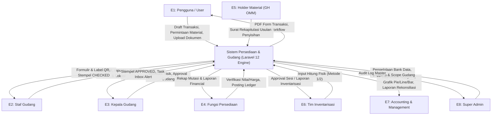
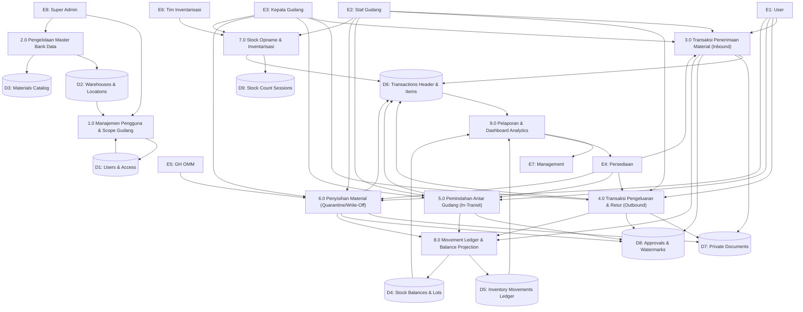
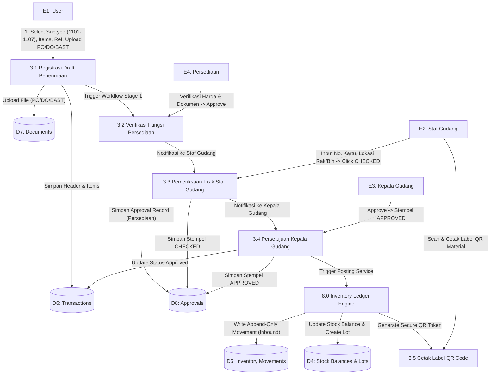
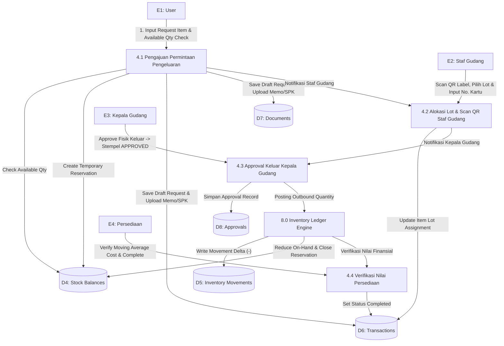
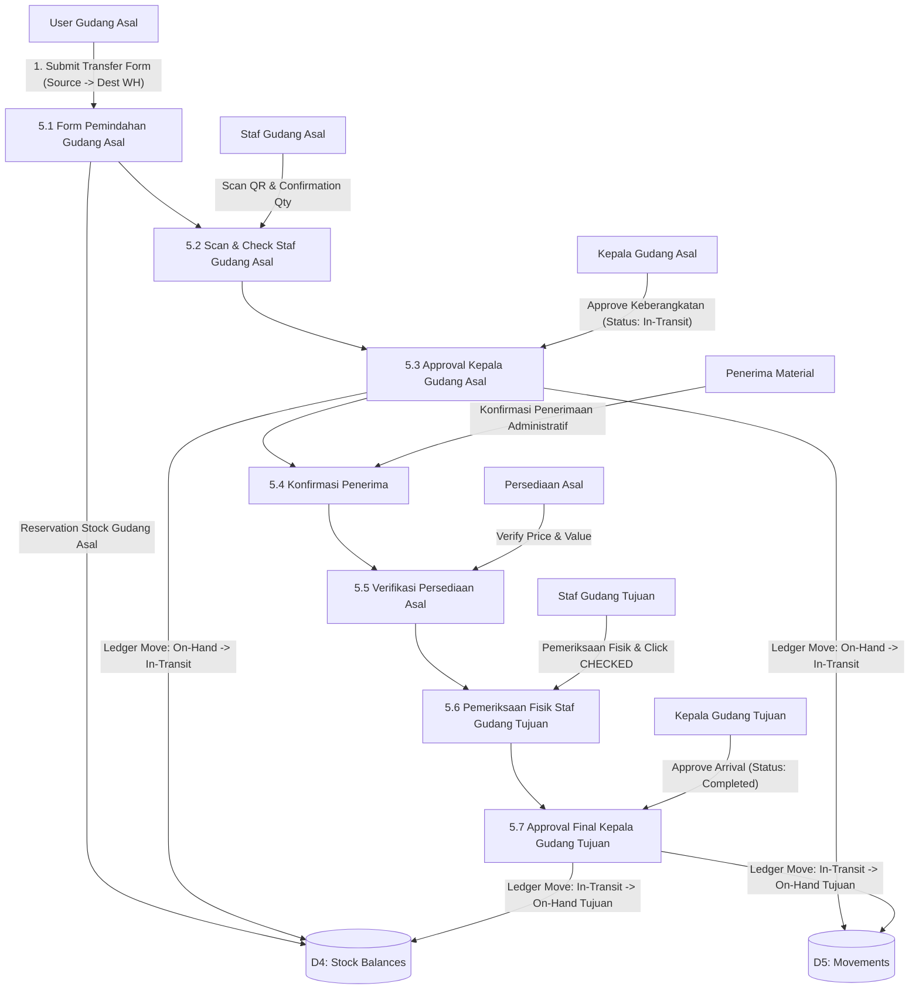
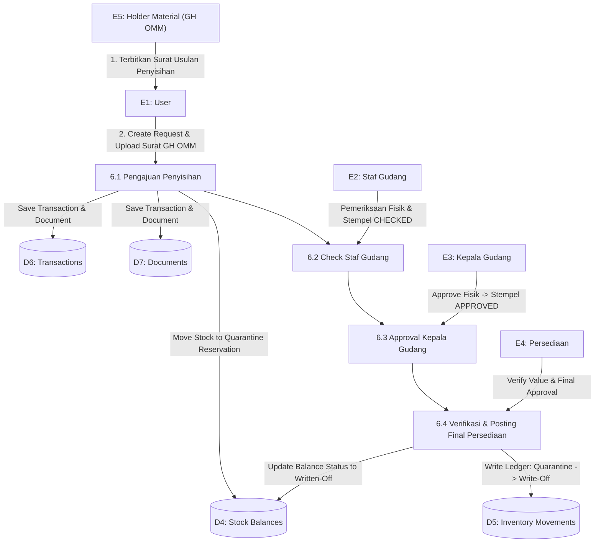
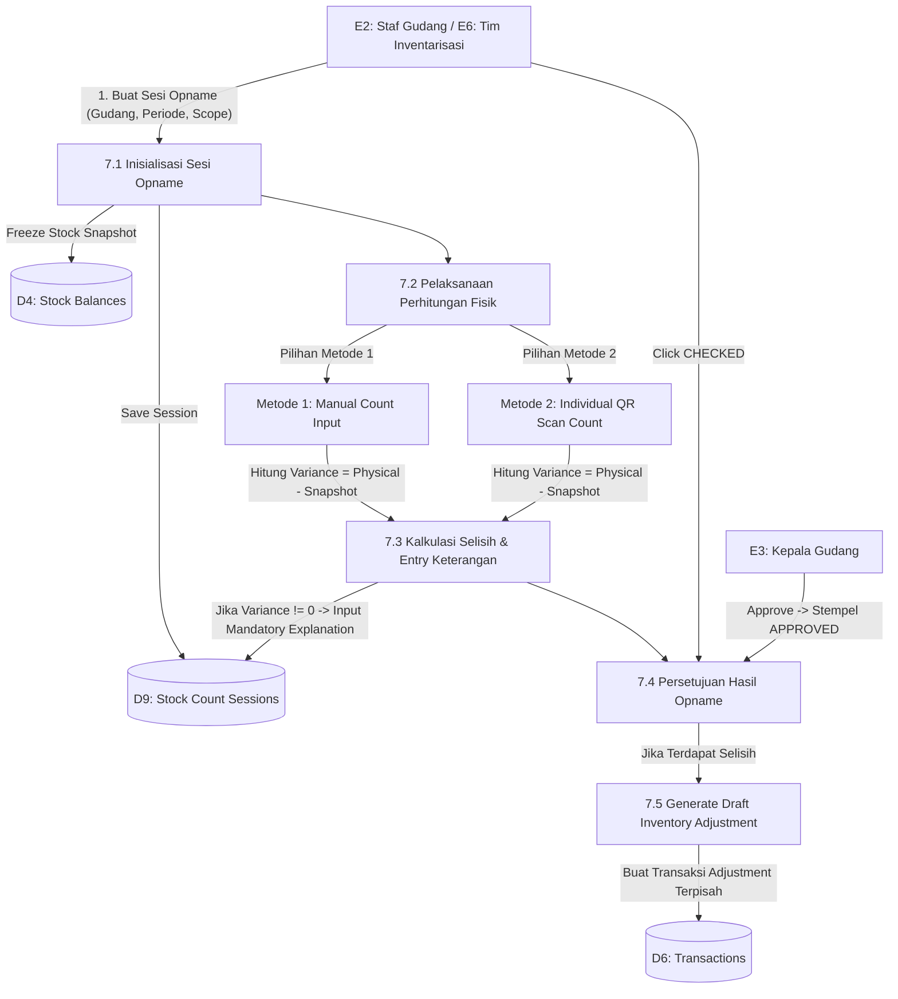

# Diagram Alir Data (Data Flow Diagram - DFD)
## Sistem Pengelolaan Persediaan Material dan Gudang (17 Lokasi Gudang)

**Versi:** 1.0  
**Tanggal:** 24 Agustus 2026  
**Dokumen Acuan:** `rancangan-aplikasi-persediaan-gudang.md`, `database.md`, `Detail.xlsx`  

---

## 1. Pendahuluan

Dokumen ini menyajikan **Diagram Alir Data (Data Flow Diagram - DFD / DAD)** untuk Sistem Pengelolaan Persediaan Material dan Gudang. Diagram ini menggambarkan bagaimana data mengalir dari **Entitas Luar (External Entities)**, diproses melalui **Proses Utama (Processes)**, disimpan pada **Penyimpanan Data (Data Stores)**, hingga menghasilkan **Keluaran/Informasi (Outputs & Reports)**.

---

## 2. Inventarisasi Komponen DFD

### 2.1 Entitas Luar (External Entities)

| Kode Entitas | Nama Entitas | Deskripsi / Peran Sistem |
|---|---|---|
| **E1** | **Pengguna / User** | Mengajukan transaksi permintaan pengeluaran, pemindahan, pengembalian, dan usulan penyisihan. |
| **E2** | **Staf Gudang** | Melakukan pemeriksaan fisik barang, mengisi nomor kartu, lokasi rak/bin, scan QR Code, serta hitung opname. |
| **E3** | **Kepala Gudang** | Menyetujui operasional pengeluaran/penerimaan fisik gudang dan hasil stock opname (`APPROVED`). |
| **E4** | **Fungsi Persediaan** | Memverifikasi harga, nilai finansial, klasifikasi transaksi, serta posting stok ke ledger. |
| **E5** | **Pengelola / Holder (GH OMM)** | Menerbitkan Surat Rekapitulasi Usulan Penyisihan Material sebagai dasar transaksi penyisihan. |
| **E6** | **Tim Inventarisasi** | Melaksanakan sesi inventarisasi fisik berkala/tahunan di gudang. |
| **E7** | **Accounting & Management** | Memantau dashboard agregat, nilai persediaan, serta laporan mutasi dan rekonsiliasi. |
| **E8** | **Super Admin** | Mengelola pengguna, hak akses gudang, dan bank data master. |

---

### 2.2 Penyimpanan Data (Data Stores)

| Kode Store | Nama Data Store | Tabel Database Terkait (`database.md`) |
|---|---|---|
| **D1** | **Master Users & Access Scope** | `users`, `user_warehouse_assignments`, `positions` |
| **D2** | **Master Gudang & Lokasi** | `warehouses`, `warehouse_locations` |
| **D3** | **Master Material & Katalog** | `materials`, `material_classifications`, `material_categories`, `uoms` |
| **D4** | **Saldo Stok & Lot Perolehan** | `stock_balances`, `stock_lots`, `stock_reservations` |
| **D5** | **Immutable Inventory Ledger** | `inventory_movements` (Append-Only Ledger) |
| **D6** | **Transaksi Header & Item** | `inventory_transactions`, `inventory_transaction_items` |
| **D7** | **Dokumen Lampiran Privat** | `transaction_documents` (S3/Private Storage) |
| **D8** | **Approval & Digital Watermark** | `transaction_approvals`, `transaction_histories` |
| **D9** | **Stock Opname & Adjustments** | `stock_count_sessions`, `stock_count_items`, `inventory_adjustments` |
| **D10** | **Spatie RBAC & Permissions** | `roles`, `permissions`, `model_has_roles`, `role_has_permissions` |

---

## 3. DFD Level 0 (Diagram Konteks / Context Diagram)

Diagram Konteks menggambarkan batas luar sistem (*system boundary*) dan interaksi antara entitas eksternal dengan aplikasi utama.

---

## 4. DFD Level 1 (Diagram Utama / Overview Diagram)

DFD Level 1 memecah sistem menjadi **9 Proses Utama**:

---

## 5. DFD Level 2 (Rincian Alur Transaksi & Operasional)

### 5.1 DFD Level 2.1: Transaksi Penerimaan Material (Inbound Subtypes 1101 - 1107)

---

### 5.2 DFD Level 2.2: Transaksi Pengeluaran & Pengembalian Material (Outbound Subtypes 2201 - 2206 & Retur)

---

### 5.3 DFD Level 2.3: Pemindahan Material Antar Gudang (7-Step Transfer Flow)

---

### 5.4 DFD Level 2.4: Penyisihan Material (Quarantine & Write-Off)

---

### 5.5 DFD Level 2.5: Stock Opname & Inventarisasi (Dua Metode Hitung)

---

## 6. Kamus Data (Data Dictionary)

### 6.1 Aliran Data Input Utama

1. **Data Pengajuan Transaksi (User Request Payload)**:
   - `transaction_type`: Enum (`receipt`, `issue`, `return`, `transfer`, `write_off`).
   - `transaction_subtype_id`: Foreign Key ke `transaction_subtypes` (misal: `1101`, `2202`, `3300`).
   - `source_warehouse_id` & `destination_warehouse_id`: ID Gudang.
   - `reference_text`: Nomor PO / Surat Jalan / Memo / Surat GH OMM.
   - `attached_documents`: Array File (MIME type whitelist, max 10MB, SHA256 checksum).
   - `items`: Array (`material_id`, `requested_quantity`, `uom_id`, `notes`).

2. **Data Hasil Perhitungan Opname (Stock Count Payload)**:
   - `session_id`: ID Sesi Stock Opname.
   - `count_method`: Enum (`manual`, `qr_scan`).
   - `physical_quantity`: Decimal precision UOM.
   - `variance_quantity`: Calculated (`physical_quantity - system_quantity`).
   - `explanation`: Text wajib diisi (*mandatory freetext*) jika `variance_quantity != 0`.
   - `scanned_label_tokens`: Array JSON Token QR Code (jika menggunakan `qr_scan`).

3. **Data Stempel Approval (Digital Approval Stamp Payload)**:
   - `stage_code`: Kode Tahapan Workflow (`stage_warehouse_check`, `stage_head_approve`, dll).
   - `decision`: Enum (`approved`, `rejected`, `revision_requested`).
   - `watermark_stamp`: Enum (`CHECKED`, `APPROVED`).
   - `notes`: Catatan persetujuan / alasan reject.
   - `audit_snapshot`: Snapshot (`actor_name`, `position`, `role`, `timestamp`, `ip_address`).

---

### 6.2 Aliran Data Output Utama

1. **PDF Formulir Transaksi Resmi**:
   - Header Nomor Transaksi `{SUBTYPE}-{WH}-{YYYYMM}-{SEQ}`.
   - Tabel Rincian Material, KIMAP, UOM, Kuantitas, Harga Satuan, Kuantitas Total.
   - Dynamic Stempel Digital (`CHECKED` dari Staf Gudang, `APPROVED` dari Kepala Gudang & Persediaan).
   - Embedded QR Code Token transaksi.

---

## 7. Pemetaan DFD ke Arsitektur Teknis Laravel 12

Untuk memastikan DFD ini dapat diimplementasikan secara langsung oleh developer backend/fullstack, setiap komponen DFD dipetakan secara eksplisit ke dalam **Struktur Modul & Class Laravel 12**:

### 7.1 Pemetaan Proses Utama DFD ke Class Laravel

| ID DFD | Nama Proses DFD | Controller / Livewire | Class Action / Service Domain | Eloquent Models & Traits Terlibat |
|---|---|---|---|---|
| **1.0** | Manajemen Pengguna & Scope Gudang | `UserController`, `RoleController` | `AssignUserWarehouseScopeAction`, `RoleAndPermissionSeeder` | `User` (`HasRoles`), `Role`, `Permission`, `UserWarehouseAssignment` |
| **2.0** | Pengelolaan Master Bank Data | `MaterialController`, `WarehouseController` | `ImportMaterialMasterAction` | `Material`, `MaterialClassification`, `Uom` |
| **3.0** | Transaksi Penerimaan (Inbound) | `ReceiptTransactionController` | `CreateReceiptTransactionAction`, `GenerateQrTokenAction` | `InventoryTransaction`, `TransactionDocument`, `StockLot` |
| **4.0** | Pengeluaran & Retur (Outbound) | `IssueTransactionController` | `CreateIssueTransactionAction`, `StockReservationService` | `InventoryTransaction`, `StockBalance`, `StockReservation` |
| **5.0** | Pemindahan Antar Gudang | `TransferTransactionController` | `ProcessInTransitTransferAction` | `InventoryTransaction`, `InventoryMovement` |
| **6.0** | Penyisihan Material | `WriteOffTransactionController` | `QuarantineMaterialAction`, `PostWriteOffAction` | `InventoryTransaction`, `StockBalance` |
| **7.0** | Stock Opname & Inventarisasi | `StockCountController` | `CountPhysicalStockAction` (Support Metode 1 & 2) | `StockCountSession`, `StockCountItem`, `InventoryAdjustment` |
| **8.0** | Movement Ledger Engine | Internal Event Listener | `InventoryPostingEngine` (`DB::transaction` + `lockForUpdate`) | `InventoryMovement`, `StockBalance` |
| **9.0** | Reporting & Analytics | `ReportController`, `DashboardController` | `GenerateExportReportJob` (Redis Queue), `DashboardAnalyticsQuery` | `vw_dashboard_inventory_composition`, `InventoryMovement` |

---

### 7.2 Pemetaan Transport & Layanan Infrastruktur Laravel

1. **Spatie Laravel-Permission (v7) & Security Scoping**:
   - **Spatie `HasRoles` Trait**: Model `User` menggunakan `use Spatie\Permission\Traits\HasRoles;` untuk mengelola hak akses granular (`givePermissionTo()`, `assignRole()`, `hasPermissionTo()`).
   - **Spatie RBAC Middleware**: Proteksi route pada `routes/web.php` menggunakan middleware Spatie v7 (misal: `middleware(['auth', 'permission:transactions.approve_warehouse_head'])`).
   - **Blade Authorization**: Pengkondisian tombol dan form approval menggunakan `@can('transactions.approve_warehouse_head') ... @endcan`.
   - **Warehouse Scoping (`WarehousePolicy`)**: Memastikan kueri Eloquent secara otomatis ter-scope dengan `$query->whereIn('source_warehouse_id', $userWarehouseIds)` berdasarkan penugasan user di `user_warehouse_assignments`.

2. **Database Transaction & Concurrency Control**:
   - **Pessimistic Locking**: `StockBalance::where(...)->lockForUpdate()->first()` digunakan saat posting movement atau reservasi stok untuk mencegah *double posting* dan *overselling*.
   - **Optimistic Concurrency**: Kolom `lock_version` pada `inventory_transactions` mencegah *lost update* saat dua approver membuka formulir bersamaan.

3. **Background Processing & Event Outbox**:
   - **Queue Jobs**: Ekspor laporan XLSX/PDF berukuran besar diproses secara asynchronous menggunakan `Laravel Queue Worker (Redis)`.
   - **Events & Listeners**: Event `TransactionPosted` mentrigger notifikasi email/in-app dan memperbarui proyeksi agregat saldo secara instan.

4. **Storage & Watermark Rendering**:
   - **S3 / Local Private Storage**: Seluruh lampiran file wajib (`PO`, `DO`, `SPK`, `SURAT_GH_OMM`) disimpan privat dengan akses unduhan menggunakan `Storage::disk('s3_private')->temporaryUrl()`.
   - **Dynamic Watermark PDF Generator**: Menggunakan dompdf/snappy untuk membuat PDF resmi bertanda stempel `CHECKED` atau `APPROVED` dari snapshot metadata `transaction_approvals`.

---
*Diagram Alir Data (DFD) ini disusun secara presisi dan 100% konsisten dengan `rancangan-aplikasi-persediaan-gudang.md`, `database.md`, `Spatie Laravel-Permission v7`, dan `Detail.xlsx`.*
