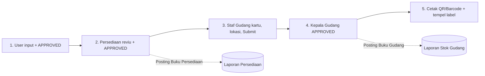
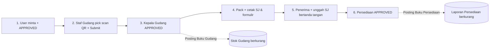
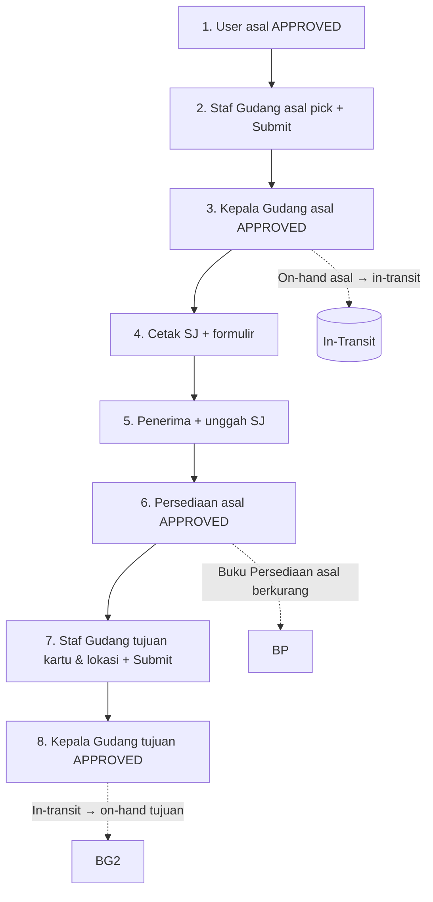
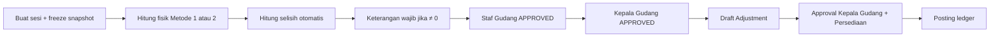
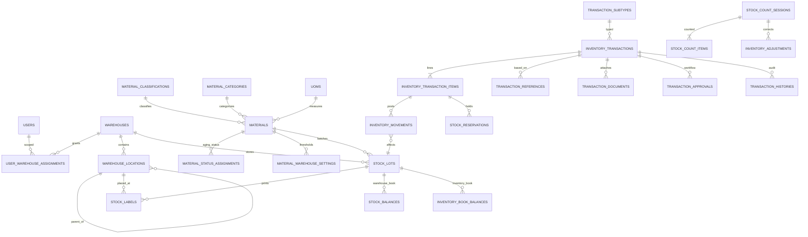

# Rancangan Aplikasi DIGIO Inventory

**Sistem Pengelolaan Persediaan Material dan Gudang**

| Atribut | Nilai |
|---|---|
| Nama aplikasi | DIGIO Inventory |
| Versi dokumen | 2.0 |
| Tanggal | 21 September 2026 |
| Status | Baseline rancangan untuk implementasi |
| Sumber bisnis | `Proses Aplikasi Inventory.pdf`, `Detail.xlsx` (tab DETAIL, MODUL, PROSES, Sheet1) |
| Target teknologi | Laravel 12 Modular Monolith, PostgreSQL 16 / MySQL 8.0+, Redis 7 |
| Cakupan operasional | 17 lokasi gudang |

Dokumen ini merombak rancangan sebelumnya agar **selaras dengan alur operasional PDF**, **memetakan seluruh kolom data Excel**, dan **siap diimplementasikan** oleh tim developer. Setiap aturan bisnis yang berbeda antara sumber dicatat sebagai keputusan desain yang tegas.

---

## Daftar Isi

1. [Tujuan & Lingkup Sistem](#1-tujuan--lingkup-sistem)
2. [Alur Proses Bisnis (Workflow)](#2-alur-proses-bisnis-workflow)
3. [Struktur Database & Mapping Data](#3-struktur-database--mapping-data-sesuai-detaillxlsx)
4. [Spesifikasi Modul & Fitur Aplikasi](#4-spesifikasi-modul--fitur-aplikasi)
5. [Kebutuhan Non-Fungsional](#5-kebutuhan-non-fungsional)

---

## 1. Tujuan & Lingkup Sistem

### 1.1 Ringkasan Tujuan

DIGIO Inventory adalah sistem web internal untuk menstandarkan siklus hidup material di 17 gudang: penerimaan, putaway ke zona/rak/bin, pengeluaran (picking–packing–FIFO/FEFO), pemindahan antar gudang, pengembalian, penyisihan, stock opname, inventarisasi, identifikasi QR/Barcode, pelaporan, dan dashboard manajemen.

Sistem memisahkan **dua buku stok** sesuai alur resmi:

| Buku | Nama laporan | Diposting saat | PIC |
|---|---|---|---|
| **Buku Gudang** | Laporan Stok Gudang | Approval Kepala Gudang | Operasional gudang |
| **Buku Persediaan** | Laporan Persediaan Material | Approval Fungsi Persediaan | Pengendalian nilai & klasifikasi |

Setiap perubahan kuantitas atau nilai hanya boleh terjadi melalui **immutable inventory ledger**. Saldo tampilan (`stock_balances` / `inventory_book_balances`) adalah proyeksi yang wajib dapat direkonsiliasi ke ledger.

### 1.2 Tujuan Bisnis

1. Menyatukan pencatatan persediaan dan gudang agar saldo, nomor kartu, lokasi, dan nilai tidak berbeda antarfungsi.
2. Menjamin setiap transaksi memiliki dokumen, pemeriksaan fisik, dan jejak approval (stempel digital `CHECKED` / `APPROVED` / `QR Passed`).
3. Mempercepat identifikasi material dengan QR Code + Barcode, termasuk cetak label dan scan pada picking/opname.
4. Menyediakan posisi stok, kartu stok (stock card), mutasi, dan nilai persediaan yang dapat diaudit.
5. Memberi peringatan dini stok rendah, material kedaluwarsa, dead stock, dan transfer yang tertahan in-transit.
6. Membatasi akses berdasarkan peran dan gudang yang ditugaskan (RBAC + warehouse scope).

### 1.3 Indikator Keberhasilan

- Tidak ada stok negatif pada kedua buku.
- Setiap delta kuantitas/nilai tertelusur ke nomor transaksi, item, lot, kartu, gudang, pengguna, dan keputusan approval.
- Permintaan keluar tidak melebihi *available quantity*.
- Picking mengikuti FIFO (periode perolehan tertua) atau FEFO (kedaluwarsa terdekat) kecuali ada override beralasan.
- Laporan Persediaan dan Laporan Stok Gudang dapat direkonsiliasi ke ledger masing-masing.
- Pengguna hanya melihat gudang yang ditugaskan.

### 1.4 Lingkup Fungsional (In Scope)

| Area | Cakupan |
|---|---|
| IAM | Login, peran, permission, penugasan gudang, audit login |
| Bank Data | Fungsi/jabatan/PIC, 17 gudang, zona/rak/bin, jenis transaksi, klasifikasi, kategori, KIMAP, UOM, status material, alasan penghapusan, kondisi material |
| Inbound | Penerimaan 1101, 1103, 1104, 1107 + putaway lokasi |
| Outbound | Pengeluaran 2201, 2202, 2203, 2205, 2206 + picking FIFO/FEFO + packing + surat jalan |
| Return | Pengembalian 1102, 1105, 1106 |
| Transfer | Pemindahan antar gudang 2204 keluar / 1104 masuk, status in-transit |
| Write-off | Usulan penghapusan + penyisihan 3300 (produktif → non-produktif) |
| Warehouse | Zoning/bin, kartu material, QR/Barcode, cetak label |
| Count | Stock opname berkala dan inventarisasi + adjustment |
| Planning | Rencana Kebutuhan Material (RKM) |
| Reporting | Stock card, laporan harian/bulanan, rekap, ekspor Excel/PDF |
| Dashboard | Komposisi nilai, transaksi, tingkat persediaan, alert real-time |

### 1.5 Di Luar Lingkup Baseline

- Pembuatan Purchase Order / kontrak pengadaan (RKM menghasilkan usulan PR, bukan PO).
- General ledger akuntansi penuh (hanya nilai persediaan dan nilai buku pada usulan penghapusan).
- Aplikasi mobile native (scan memakai web/PWA + kamera).
- Integrasi otomatis SAP/ERP sebelum kontrak API tersedia.
- Multi-UOM dan serialisasi unit kompleks (fase 1: satu UOM dasar per KIMAP).

### 1.6 Target Pengguna — Role-Based Access Control

Otorisasi bertingkat dua:

1. **Peran & permission (Spatie Laravel-Permission v7)** — membatasi aksi.
2. **Warehouse Policy Scope** — membatasi data gudang lewat `user_warehouse_assignments`.

#### 1.6.1 Katalog Peran

| Kode peran | Nama | Lokasi kerja | Tanggung jawab utama |
|---|---|---|---|
| `admin_user` | Admin Pengguna/User | Organisasi | Mengelola akun dan penugasan fungsi |
| `pejabat_user` | Pejabat Pengguna/User | OMM Region | Mengajukan dan menyetujui transaksi pengguna |
| `persediaan` | Fungsi Persediaan | OMM Region | Reviu harga/nilai/klasifikasi, posting Buku Persediaan |
| `staf_gudang` | Staf Gudang | Gudang (eksternal) | Pemeriksaan fisik, nomor kartu, lokasi, scan QR, picking, cetak label |
| `kepala_gudang` | Kepala Gudang | Gudang (eksternal) | Approval operasional; posting Buku Gudang |
| `holder_material` | Pengelola/Holder (GH OMM) | Kantor Pusat | Usulan penghapusan, surat rekapitulasi, instruksi penyisihan |
| `accounting` | Accounting | Kantor Pusat | Nilai perolehan/nilai buku pada usulan penghapusan; reviu laporan nilai |
| `management` | Management | Kantor Pusat | Dashboard dan laporan agregat (read-only) |
| `tim_inventarisasi` | Tim Inventarisasi | Kantor Pusat / gudang | Pelaksanaan inventarisasi fisik |
| `super_admin` | Super Admin | Global | Bank data, konfigurasi, dukungan sistem |

#### 1.6.2 Matriks Akses Modul

Keterangan: `C` create, `R` read, `U` process/update, `A` approve, `S` submit/check, `M` manage.

| Modul | User | Persediaan | Staf Gudang | Kepala Gudang | Holder | Accounting | Management | Tim Inv. | Super Admin |
|---|:---:|:---:|:---:|:---:|:---:|:---:|:---:|:---:|:---:|
| Penerimaan | C/R/A | R/A | R/U/S | R/A | R | R | R | — | M |
| Pengeluaran | C/R/A | R/A | R/U/S | R/A | R | R | R | — | M |
| Pengembalian | C/R/A | R/A | R/U/S | R/A | R | R | R | — | M |
| Pemindahan | C/R/A | R/A | R/U/S | R/A | R | R | R | — | M |
| Penyisihan | C/R/A | R/A | R/U/S | R/A | C/R/A | R | R | — | M |
| Usulan Penghapusan | C/R/A | R | R | R | R/A | R/U/A | R | — | M |
| RKM | C/R/A | R | R | R | R | R | R | — | M |
| Stock Opname | R | R | C/U/A | A | R | R | R | — | M |
| Inventarisasi | R | R | R | A | R | R | R | C/U/A | M |
| QR / Label | R | R | C/U | R | R | R | R | R | M |
| Laporan | R | R | R | R | R | R | R | R | M |
| Dashboard | R | R | R | R | R | R | R | R | M |
| Bank Data | R | R | R | R | R | R | R | R | M |

Permission granular yang wajib di-seed:

```text
master_data.view | master_data.create | master_data.edit | master_data.delete
transactions.view | transactions.create | transactions.submit
transactions.check_warehouse | transactions.approve_warehouse_head
transactions.verify_inventory | transactions.post | transactions.cancel | transactions.reverse
stock_opname.create_session | stock_opname.input_count | stock_opname.approve
labels.print | labels.reprint | qr.scan
reports.view | reports.export
dashboard.view_assigned_warehouse | dashboard.view_all_warehouses
alerts.manage_threshold
users.manage | roles.manage
audit.view
```

### 1.7 Master Referensi Bisnis (Detail.xlsx)

#### 1.7.1 Lokasi Gudang (17)

Sumber resmi kode: tab `Sheet1`. Nama gudang nomor 3 berbeda antar-sheet (`Gudang Panaran` vs `Gudang Pekanbaru / PKR`) — **baseline memakai Sheet1** sampai business owner mengesahkan.

| No | Nama Gudang | Kode |
|---:|---|---|
| 1 | Gudang Medan | `MDN` |
| 2 | Gudang Batam | `BTM` |
| 3 | Gudang Pekanbaru | `PKR` |
| 4 | Gudang Sutami | `STM` |
| 5 | Gudang Terbanggi Besar | `TBB` |
| 6 | Gudang Pagardewa | `PGD` |
| 7 | Gudang Palembang | `PLM` |
| 8 | Gudang Bojonegara | `BJN` |
| 9 | Gudang Bogor | `BGR` |
| 10 | Gudang Jakarta | `JKT` |
| 11 | Gudang Klari | `KRI` |
| 12 | Gudang Surya Cipta | `SRC` |
| 13 | Gudang Cirebon | `CRB` |
| 14 | Gudang Semarang | `SMG` |
| 15 | Gudang Berbek | `BRK` |
| 16 | Gudang Ngoro | `NGR` |
| 17 | Gudang Pasuruan | `PSR` |

#### 1.7.2 Klasifikasi Material

| Kode | Nama | Catatan |
|---|---|---|
| `MPS` | Material Persediaan | Produktif |
| `ABT` | Material Aset Belum Terpasang | Produktif; retur ABT beralih ke MPS |
| `SKL` | Material Sirkulasi | Laporan lama menyebut `MKL` — mapping kode lama ke `SKL` |
| `MT` | Material Tercatat | Penerimaan 1107 |
| `MEJ` | Material Eks Jaringan | Pengembalian 1105 |

#### 1.7.3 Kategori Material

| Kode | Nama | Catatan FEFO |
|---|---|---|
| `TBG` | Tubular Goods | FIFO |
| `CAV` | Cock and Valve | FIFO |
| `FAF` | Fitting and Flange | FIFO |
| `INS` | Instrument | FIFO |
| `CHM` | Bahan Kimia | **FEFO wajib** (lacak kedaluwarsa) |

Urutan tampilan di DETAIL vs Sheet1 berbeda; identitas adalah **kode unik**, bukan urutan.

#### 1.7.4 Status Material

| Kode | Nama | Penggunaan alert |
|---|---|---|
| `FM` | Fast Moving | Normal |
| `SM` | Slow Moving | Warning aging |
| `PDS` | Potential Dead Stock | Alert management |
| `DS` | Dead Stock | Calon usulan penghapusan / penyisihan |

#### 1.7.5 Jenis / Subjenis Transaksi

| Main | Sub | Kode | Modul | Keterangan |
|---|---|---|---|---|
| 11 Penerimaan | 01 Pengadaan/Pembelian | `1101` | Inbound | Dari supplier setelah BAST |
| 11 Penerimaan | 02 Pengembalian (retur) | `1102` | Return | MPS/ABT |
| 11 Penerimaan | 03 Serah Terima Material Proyek | `1103` | Inbound | BAP |
| 11 Penerimaan | 04 Pemindahan Antar Gudang | `1104` | Transfer-in | Referensi formulir pemindahan |
| 11 Penerimaan | 05 Material Eks Jaringan | `1105` | Return | BA pencabutan |
| 11 Penerimaan | 06 Material Sirkulasi | `1106` | Return | BA pencabutan |
| 11 Penerimaan | 07 Material Tercatat | `1107` | Inbound | BAP |
| 22 Pengeluaran | 01 Pemeliharaan/Perbaikan | `2201` | Outbound | |
| 22 Pengeluaran | 02 Proyek | `2202` | Outbound | Dokumen referensi dapat diminta reviewer |
| 22 Pengeluaran | 03 Pemindahtanganan | `2203` | Outbound | BA hasil penjualan |
| 22 Pengeluaran | 04 Pemindahan Antar Gudang | `2204` | Transfer-out | Tidak dipilih di form pengeluaran reguler |
| 22 Pengeluaran | 05 Kalibrasi | `2205` | Outbound | |
| 22 Pengeluaran | 06 Survey/Studi/Penelitian | `2206` | Outbound | |
| 33 Penyisihan | 00 Penyisihan Material | `3300` | Write-off | Produktif → non-produktif |

Satu transaksi hanya boleh berisi **satu** klasifikasi transaksi.

### 1.8 Keputusan Desain yang Mengikat

1. Aplikasi web internal; fase 1 standalone dengan impor/ekspor Excel.
2. Kuantitas dan harga bertipe desimal tervalidasi, bukan freetext bebas.
3. Master (jabatan, klasifikasi, kategori, KIMAP, UOM, jenis transaksi) **wajib dari bank data**.
4. Lokasi penyimpanan pada sumber disebut freetext; **implementasi memakai master Zona/Rak/Bin** plus catatan bebas, agar zoning, picking, dan opname dapat diotomatisasi.
5. QR menyimpan token acak (UUID), bukan payload harga. Barcode Code-128 menyimpan nomor kartu.
6. Ledger append-only. Koreksi lewat reversal/adjustment yang disetujui.
7. Valuasi baseline: **moving weighted average** pada Buku Persediaan; picking fisik: **FIFO/FEFO**.
8. Reject dan revision adalah status terpisah. Reject wajib alasan.
9. Staf Gudang **tidak melihat harga satuan dan jumlah harga** pada inbound/outbound hingga tahap Fungsi Persediaan.

---

## 2. Alur Proses Bisnis (Workflow)

### 2.1 Model Status Transaksi

| Status | Makna |
|---|---|
| `draft` | Masih dapat diedit pembuat |
| `submitted` | Diajukan ke tahap berikutnya |
| `under_review` | Sedang direviu |
| `revision_requested` | Dikembalikan dengan catatan |
| `rejected` | Ditolak, tidak dilanjutkan |
| `approved` | Tahap approval saat ini selesai |
| `warehouse_posted` | Buku Gudang sudah terposting |
| `inventory_posted` | Buku Persediaan sudah terposting |
| `in_transit` | Material dalam perjalanan (transfer) |
| `completed` | Seluruh tahap selesai |
| `cancelled` | Dibatalkan sebelum posting |
| `reversed` | Dibalik lewat transaksi reversal |

Status tahap (`current_stage`) disimpan terpisah agar posisi workflow terlihat tanpa mengubah arti status utama.

Stempel digital pada PDF formulir:

| Stempel | PIC | Makna |
|---|---|---|
| `APPROVED` | User, Kepala Gudang, Persediaan, Holder, Accounting, Tim Inventarisasi | Persetujuan sah |
| `CHECKED` | Staf Gudang (sumber Excel) | Pemeriksaan fisik selesai |
| `SUBMITTED` | Staf Gudang (sumber PDF) | Data dikirim ke Kepala Gudang |
| `QR Passed` | Sistem | Seluruh item penerimaan sudah memiliki label QR |

**Keputusan implementasi:** tombol Staf Gudang berlabel **Submit** (sesuai PDF terbaru). Sistem tetap mencetak stempel `CHECKED` pada kolom Gudang agar formulir resmi kompatibel dengan Excel.

### 2.2 Alur Barang Masuk (Inbound / Goods Receipt) dari Supplier

Berlaku untuk subtype **1101, 1103, 1104, 1107**. 1101 adalah penerimaan dari pengadaan/pembelian (supplier) setelah administrasi kontrak sampai BAST selesai.



#### 2.2.1 Tahap 1 — Input & Approval Pengguna/User (OMM Region)

| Field | Wajib | Sumber input | Aturan |
|---|:---:|---|---|
| Nomor transaksi | Ya | Sistem | `{SUBTYPE}-{WH}-{YYYYMM}-{SEQ}` |
| Tanggal transaksi | Ya | User | Format `DD/MM/YYYY` |
| Kepada | Ya | Bank data jabatan | Kepala/Koordinator Gudang terkait |
| Dari | Ya | Bank data jabatan | Pengguna sesuai lokasi material/gudang |
| Klasifikasi transaksi | Ya | Bank data | Hanya 1101 / 1103 / 1104 / 1107; satu per transaksi |
| Referensi | Ya | Bank data dan/atau freetext | Lihat matriks referensi |
| Upload dokumen | Ya | File | Sesuai klasifikasi |
| Penjelasan | Ya | Freetext | Uraian transaksi |
| Klasifikasi material | Ya | Bank data | Filter KIMAP |
| Kategori material | Ya | Bank data | Filter KIMAP |
| KIMAP + nama material | Ya | Bank data | Tidak freetext |
| Satuan (UOM) | Ya | Sistem | Mengikuti master material |
| Jumlah diterima | Ya | Numerik | `> 0` |
| Harga satuan | Ya | Numerik | 1104 di-generate dari formulir pemindahan |
| Jumlah harga | Ya | Sistem | `qty × unit_price` |
| Approval User | Ya | Klik | Watermark `APPROVED` kolom Pengguna/User |

**Matriks referensi & dokumen inbound**

| Subtype | Referensi wajib | Dokumen unggah |
|---|---|---|
| 1101 Pengadaan/Pembelian | Surat Pesanan, Surat Jalan/DO, BAP, BAST, Penyedia Barang | PO, DO, BAP, BAST |
| 1103 Serah Terima Proyek | Berita Acara Pemeriksaan | BAP |
| 1104 Pemindahan Antar Gudang | Formulir Pemindahan Material, Asal Material | Formulir pemindahan |
| 1107 Material Tercatat | Berita Acara Pemeriksaan | BAP |

Untuk **1104**, klasifikasi material, kategori, KIMAP, nama, UOM, harga satuan, dan jumlah harga **tidak diinput ulang** — di-generate dari formulir pemindahan asal.

#### 2.2.2 Tahap 2 — Reviu Fungsi Persediaan

- Persediaan **tidak melakukan input**. Seluruh data tahap 1 tampil utuh termasuk harga.
- Benar → `APPROVED` kolom Persediaan. **Buku Persediaan terposting** (laporan persediaan bertambah).
- Ada reviu → `revision_requested` / `rejected` + catatan, kembali ke User.

#### 2.2.3 Tahap 3 — Staf Gudang (putaway)

Harga satuan dan jumlah harga **disembunyikan**. Field baru:

| Field | Wajib | Aturan |
|---|:---:|---|
| Nomor kartu | Ya | Freetext identitas fisik; unik per gudang |
| Lokasi penyimpanan | Ya | Pilih Zona → Rak → Bin (master) |
| Keterangan | Tidak | Freetext |
| Submit | Ya | Stempel `CHECKED`, data ke Kepala Gudang |

Sistem membuat/menautkan `stock_lots` (periode perolehan = `MM/YY` tanggal transaksi) dan merencanakan label QR.

#### 2.2.4 Tahap 4 — Kepala Gudang

- Reviu data (tanpa harga) → `APPROVED` kolom Gudang.
- **Buku Gudang terposting** (`on_hand` bertambah di bin tujuan).
- Reject mengembalikan ke Staf Gudang.

#### 2.2.5 Tahap 5 — Cetak QR Code & Barcode

- Staf Gudang wajib mencetak label dan menempelkannya pada seluruh material.
- Setelah seluruh item memiliki QR, formulir mendapat watermark **`QR Passed`**.
- Jika belum dicetak: notifikasi ke Staf Gudang & Kepala Gudang, masuk antrian *pending process*.

Isi tampilan setelah scan (server-side):

- Klasifikasi, kategori, KIMAP, nama, UOM, periode perolehan, nomor kartu, gudang, lokasi (zona/rak/bin), kuantitas sisa, status material, status stok, tanggal kedaluwarsa (jika ada).

### 2.3 Alur Penyimpanan & Manajemen Lokasi Gudang (Warehouse Zoning / Bin)

Setiap gudang memiliki hierarki lokasi yang sama.

```text
WAREHOUSE (contoh: BGR)
 └── ZONE        (contoh: Z-A Bahan Kimia, Z-B Tubular, Z-RCV Receiving, Z-SHP Shipping)
      └── RACK   (contoh: RAK-A1)
           └── BIN (contoh: A1-02-03)
```

Lokasi khusus (wajib di-seed per gudang):

| Tipe | Kode saran | Fungsi |
|---|---|---|
| `staging_in` | `RCV` | Area penerimaan sebelum putaway |
| `staging_out` | `SHP` | Area packing / waiting issue |
| `transit` | `TRN` | Buffer in-transit antar gudang |
| `quarantine` | `QRN` | Material usulan hapus / sengketa |
| `non_productive` | `NPD` | Material hasil penyisihan 3300 |
| `bin` | sesuai denah | Lokasi simpan tetap |

#### 2.3.1 Putaway (setelah inbound)

1. Material secara logis masuk `staging_in` saat Kepala Gudang inbound menyetujui, atau langsung ke bin yang diisi Staf Gudang pada tahap 3.
2. **Keputusan baseline:** Staf Gudang wajib memilih bin tujuan pada tahap 3 inbound; sistem memvalidasi bin aktif, berkapasitas, dan sesuai zona kategori (contoh Bahan Kimia hanya di zona CHM).
3. Mutasi bin internal (tanpa ganti gudang, tanpa ganti nilai) memakai transaksi `location_transfer` berapproval Kepala Gudang, menghasilkan movement `putaway` / `bin_move` pada Buku Gudang saja.

#### 2.3.2 Aturan lokasi

- Satu label/kartu berada di satu bin pada satu waktu.
- Material `quarantined` dan `written_off` tidak bisa dipilih pengeluaran/transfer reguler.
- Transfer antar gudang: stok asal pindah ke lokasi `transit` gudang asal, kemudian ke `staging_in` gudang tujuan, lalu putaway bin tujuan.
- Master lokasi dikelola Super Admin; Staf Gudang tidak mengetik lokasi bebas sebagai identitas (hanya catatan tambahan).

### 2.4 Alur Barang Keluar (Outbound / Picking / Packing / FIFO-FEFO)

Berlaku subtype **2201, 2202, 2203, 2205, 2206**. Subtype 2204 diproses di modul pemindahan.



#### 2.4.1 Tahap 1 — Permintaan User

| Field | Wajib | Aturan |
|---|:---:|---|
| Nomor & tanggal | Ya | Nomor sistem, tanggal user |
| Kepada / Dari | Ya | Bank data jabatan |
| Klasifikasi transaksi | Ya | 2201 / 2202 / 2203 / 2205 / 2206 |
| Referensi | Tidak* | Freetext: Surat Persetujuan Pemanfaatan, BA Hasil Penjualan |
| Upload dokumen | Tidak* | Wajib secara bisnis untuk 2202, 2203, 2206; reviewer boleh reject jika kosong |
| Penjelasan | Ya | Freetext |
| Klasifikasi + KIMAP + UOM | Ya | Bank data; UOM generated |
| Jumlah diminta | Ya | Ditolak jika `> available_quantity` |
| Approval User | Ya | `APPROVED` kolom Pengguna/User |

\*PDF menetapkan referensi/upload **optional**, tetapi reviewer/verifikator boleh menolak jika klasifikasi 2202/2203/2206 tidak dilampiri dokumen.

Saat submit, sistem membuat **reservasi stok** pada lot FIFO/FEFO terpilih agar tidak overselling.

#### 2.4.2 Strategi Picking FIFO / FEFO

| Kondisi material | Strategi | Urutan lot |
|---|---|---|
| `is_expiry_tracked = true` (default kategori `CHM`) | **FEFO** | `expiry_date ASC`, lalu `acquisition_period ASC` |
| Lainnya | **FIFO** | `acquisition_period ASC`, lalu `received_at ASC` |

Alur picking Staf Gudang:

1. Sistem menampilkan *suggested pick list* per baris: lot, kartu, bin, qty.
2. Staf **wajib scan QR** label. Scan mengisi nomor kartu (generated) dan mengikat lot.
3. Kuantitas: scan seluruh unit **atau** scan sekali + input qty.
4. `qty_issued ≤ qty_requested` dan `≤ remaining_quantity` lot/label. Jika lebih, sistem menolak.
5. Scan lot yang **bukan** kandidat FIFO/FEFO berikutnya wajib mengisi `fifo_override_reason`; dicatat di audit log.
6. Setelah pick, kuantitas pindah ke lokasi `staging_out` (packing).

#### 2.4.3 Tahap 3 — Kepala Gudang

- Approval → watermark `APPROVED` kolom Gudang.
- **Buku Gudang berkurang**. Reservation terpenuhi.
- Reject + catatan kembali ke Staf Gudang.

#### 2.4.4 Tahap 4 — Packing & Cetak Dokumen

Staf Gudang mencetak:

- Formulir Pengeluaran Material
- Surat Jalan (ditandatangani manual sesuai ketentuan)

Dokumen ini adalah bukti sah mengeluarkan material dari area gudang dan dokumen perjalanan.

#### 2.4.5 Tahap 5 — Penerima

- Staf Gudang mengisi nama instansi dan nama penerima.
- **Wajib unggah** surat jalan yang sudah ditandatangani penerima.
- Approval kolom Penerima.

#### 2.4.6 Tahap 6 — Fungsi Persediaan

- Seluruh data termasuk harga satuan (dari lot/valuation) dan jumlah harga (`qty_issued × unit_price`) tampil.
- Persediaan tidak input harga.
- Approval → **Buku Persediaan berkurang**, status `completed`.
- Reviu → reject + catatan kembali ke fungsi gudang.

### 2.5 Alur Pengembalian Material (Return)

Subtype **1102** (MPS/ABT), **1105** (Eks Jaringan), **1106** (Sirkulasi).

1. **User** mengisi header. Referensi:
   - 1102 / kalibrasi: pilih Formulir Pengeluaran sebelumnya (bank data) → klasifikasi, kategori, KIMAP, harga **generated**.
   - 1105 / 1106: BA Pemasangan/Pencabutan (freetext) + unggah BAP. Harga satuan diisi `0`.
   - Retur ABT **beralih klasifikasi menjadi MPS**.
2. Jumlah dikembalikan numerik; approval User.
3. **Staf Gudang:** scan QR, jumlah diterima `≤` jumlah dikembalikan, nomor kartu, lokasi bin, submit.
   - 1102 MPS: nomor kartu dapat generated dari kartu asal.
   - ABT/sirkulasi/eks jaringan: kartu baru.
4. **Kepala Gudang** approve → posting Buku Gudang.
5. **Persediaan** approve → posting Buku Persediaan (`jumlah harga = qty_diterima × harga satuan`).

### 2.6 Alur Pemindahan Antar Gudang (Mutasi)

Kode keluar `2204`, kode masuk tujuan `1104`. Gudang asal ≠ gudang tujuan.



Aturan penting:

- Jumlah diminta tidak boleh melebihi stok tersedia gudang asal.
- Picking wajib scan QR + FIFO/FEFO.
- Setelah Kepala Gudang asal approve, stok fisik gudang asal berkurang dan masuk **in-transit** (tidak langsung menambah gudang tujuan).
- Staf Gudang tujuan menyiapkan **nomor kartu baru** dan bin putaway.
- Penerimaan 1104 di gudang tujuan memakai data item/harga dari formulir pemindahan (tidak input ulang).
- Transfer terlambat terhadap SLA memicu notifikasi.

### 2.7 Alur Penyisihan Material (3300)

Penyisihan hanya dilakukan setelah ada **Surat Pengelola/Holder (GH OMM)** berdasarkan Formulir Rekapitulasi Usulan Penghapusan.

1. User: header + referensi Formulir Rekapitulasi + Nota Dinas, unggah dokumen, pilih KIMAP, jumlah disisihkan `≤ available`. Approval User.
2. Staf Gudang: **nomor kartu baru** (beralih menjadi material penyisihan), keterangan, submit.
3. Kepala Gudang approve:
   - Buku Gudang produktif **berkurang**
   - Buku Gudang non-produktif/penyisihan **bertambah**
4. Persediaan approve (harga generated):
   - Laporan Persediaan produktif berkurang
   - Laporan Persediaan non-produktif bertambah

Laporan mutasi **hanya** mencatat transaksi material produktif.

### 2.8 Alur Stok Opname & Penyesuaian (Stock Adjustment & Audit)

Periode: berkala mingguan dan/atau periodik bulanan. Pelaksana: Staf Gudang, approval Kepala Gudang.



#### 2.8.1 Pelaksanaan hitung

Scan QR menampilkan: klasifikasi, kategori, KIMAP, nama, saldo akhir.

| Metode | Cara | Hasil |
|---|---|---|
| Metode 1 Manual | Hitung fisik, input qty | `physical_quantity` |
| Metode 2 QR Scan | Scan setiap unit item yang sama | Sistem mengakumulasi jumlah scan |

Rumus: `variance = physical_quantity − snapshot_quantity` (hasil hitung dikurangi saldo akhir).

Jika `variance ≠ 0`, kolom penjelasan **wajib**.

**Selisih tidak mengubah stok secara otomatis.** Sistem membuat draft `inventory_adjustment` yang wajib disetujui Kepala Gudang dan Fungsi Persediaan sebelum posting ke kedua buku.

### 2.9 Inventarisasi

Alur identik dengan opname, pelaksana **Tim Inventarisasi**, approval Tim Inventarisasi lalu Kepala Gudang. Output: Laporan Inventarisasi Material.

### 2.10 Rencana Kebutuhan Material (RKM) — dari PDF

User menyusun RKM sebelum Purchase Requisition. Pemilihan item melalui Inventory Material List (IML).

| Field | Sumber | Aturan |
|---|---|---|
| Nomor & tanggal | Sistem / user | `DD/MM/YYYY` |
| Klasifikasi, KIMAP, nama | Bank data | Jika KIMAP belum ada, register dulu |
| Periode perolehan, UOM, lokasi gudang | Sistem | Mengikuti material terpilih |
| BQ (Bill of Quantity) | User | Numerik |
| SOH | Sistem | Stok akhir pada tanggal RKM |
| ALS (Allocation Stock) | Sistem | Rekap NCI sebelumnya |
| AVS (Available Stock) | Sistem | `SOH − ALS` real-time |
| NCI (Non Cash Item) | User | Ditolak jika `NCI > 2 × SOH` |
| CI (Cash Item) | Sistem | `BQ − NCI` |
| PR | Sistem | `PR = CI` |
| Justifikasi | User | Wajib |
| Approval | User | Watermark Pengguna |

### 2.11 Usulan Penghapusan — dari PDF

1. **User** mengajukan sesuai kriteria DAK: klasifikasi, KIMAP, tahun perolehan (sistem), lokasi gudang (sistem), jumlah, alasan (bank data), kondisi (bank data), unggah foto/BA kehilangan, approval.
2. **Pengelola/Holder** reviu, penjelasan, approval → data ke Accounting. Output: Formulir Rekapitulasi Usulan Penghapusan.
3. **Accounting** isi nilai perolehan dan nilai buku (`N/A` jika tidak ada), keterangan opsional, approval → kembali ke Holder.
4. Holder menerbitkan Nota Dinas penyisihan ke Accounting, Persediaan, dan Gudang → memicu modul 3300.

### 2.12 Aturan Dokumen & Approval

| Modul | Attach wajib | Jenis dokumen |
|---|:---:|---|
| Penerimaan | Ya | PO, DO, BAP, BAST sesuai subtype |
| Pengeluaran | Kondisional | Nota Dinas / Memo / SPK / Surat Persetujuan / BA Penjualan |
| Pengembalian | Ya | Formulir pengeluaran atau BA pencabutan + BAP |
| Pemindahan | Ya | Surat persetujuan + SJ bertanda tangan (tahap penerima) |
| Penyisihan | Ya | Formulir rekapitulasi + Nota Dinas GH OMM |
| Stock Opname | Tidak | Foto opsional |
| Inventarisasi | Tidak | Foto opsional |
| Usulan Penghapusan | Ya | Foto material / BA kehilangan |
| RKM | Tidak | — |

Aturan teknis: file di object storage privat; database hanya metadata + checksum; MIME whitelist; tidak diganti setelah posted (versioning); unduhan lewat signed URL; reject wajib alasan; pembuat tidak menyetujui tahap reviewer pada transaksi yang sama.

### 2.13 Penomoran Transaksi

```text
{SUBTYPE}-{WAREHOUSE}-{YYYYMM}-{SEQUENCE}
Contoh: 1101-MDN-202609-000001
        2202-BGR-202609-000015
        3300-JKT-202609-000003
        SO-BGR-202609-000001
        RKM-MDN-202609-000004
```

Sequence per kombinasi subtype + gudang + periode, unique constraint, dibuat di server.

---

## 3. Struktur Database & Mapping Data (Sesuai Detail.xlsx)

### 3.1 Prinsip Skema

1. **Immutable ledger** — `inventory_movements` append-only, punya `book_type` (`warehouse` | `inventory`).
2. **Projection saldo** — `stock_balances` (Buku Gudang) dan `inventory_book_balances` (Buku Persediaan), di-update dalam satu DB transaction dengan `SELECT … FOR UPDATE`.
3. **Lot + label** — kuantitas dan harga mengikuti lot; identitas fisik mengikuti kartu/QR.
4. **Warehouse scope** — setiap query transaksi/stok terfilter gudang user.
5. Tipe numerik: kuantitas `DECIMAL(14,4)`, uang `DECIMAL(18,4)`.

### 3.2 Mapping Kolom Bisnis → Tabel

| Kolom pada form/laporan (Excel/PDF) | Tabel.kolom | Tipe | Keterangan |
|---|---|---|---|
| Nomor transaksi | `inventory_transactions.transaction_number` | `varchar(50)` | Generated, unique |
| Tanggal transaksi `DD/MM/YYYY` | `inventory_transactions.transaction_date` | `date` | Input user |
| Periode perolehan `MM/YY` | `stock_lots.acquisition_period` | `char(6)` | `YYYYMM` dari tanggal inbound |
| Kepada | `inventory_transactions.to_position_id` | FK `positions` | Bank data |
| Dari | `inventory_transactions.from_position_id` | FK `positions` | Bank data |
| Klasifikasi transaksi | `inventory_transactions.transaction_subtype_id` | FK | 1101…3300 |
| Referensi / Berdasarkan | `transaction_references.reference_number` | `varchar(100)` | Freetext atau FK transaksi |
| Upload dokumen | `transaction_documents.*` | metadata | File di object storage |
| Penjelasan | `inventory_transactions.explanation` | `text` | Mandatory |
| Klasifikasi material | `materials.classification_id` | FK | MPS, ABT, SKL, MT, MEJ |
| Kategori material | `materials.category_id` | FK | TBG, CAV, FAF, INS, CHM |
| KIMAP | `materials.kimap` | `varchar(30)` | Unique |
| Nama material | `materials.name` | `varchar(255)` | Bank data |
| Satuan / UOM | `materials.base_uom_id` / item `uom_id` | FK | Generated |
| Jumlah diterima/diminta/dikeluarkan/dikembalikan/disisihkan | `inventory_transaction_items.*_quantity` | `decimal(14,4)` | Validasi ≥ 0 |
| Harga satuan | `inventory_transaction_items.unit_price` | `decimal(18,4)` | Disembunyikan dari Staf Gudang |
| Jumlah harga | `inventory_transaction_items.total_amount` | `decimal(18,4)` | `qty × price` |
| Nomor kartu | `stock_labels.card_number` | `varchar(50)` | Unik per gudang |
| Lokasi penyimpanan | `warehouse_locations.id` | FK | Zona/Rak/Bin |
| Keterangan gudang | `inventory_transaction_items.notes` | `text` | Optional |
| Status material | `material_status_assignments.status_code` | enum | FM/SM/PDS/DS |
| Watermark approval | `transaction_approvals.watermark_stamp` | enum | CHECKED/APPROVED |
| Saldo akhir | `stock_balances.on_hand_quantity` | `decimal(14,4)` | Buku Gudang |
| QR Code | `stock_labels.qr_token` | `char(36)` | UUID |
| Barcode | `stock_labels.barcode` | `varchar(64)` | Code-128 = nomor kartu |

### 3.3 Rancangan Tabel Master Barang (Item Master)

#### 3.3.1 `material_classifications`

| Kolom | Tipe | Null | Keterangan |
|---|---|:---:|---|
| `id` | `bigint PK` | Tidak | |
| `code` | `varchar(10) UNIQUE` | Tidak | MPS, ABT, SKL, MT, MEJ |
| `name` | `varchar(100)` | Tidak | |
| `is_productive` | `boolean` | Tidak | Default true; false untuk stok penyisihan |
| `sort_order` | `int` | Tidak | Default 0 |
| `is_active` | `boolean` | Tidak | Default true |
| `created_at` / `updated_at` | `timestamp` | Tidak | |

#### 3.3.2 `material_categories`

| Kolom | Tipe | Null | Keterangan |
|---|---|:---:|---|
| `id` | `bigint PK` | Tidak | |
| `code` | `varchar(10) UNIQUE` | Tidak | TBG, CAV, FAF, INS, CHM |
| `name` | `varchar(100)` | Tidak | |
| `requires_expiry` | `boolean` | Tidak | True untuk CHM |
| `sort_order` | `int` | Tidak | |
| `is_active` | `boolean` | Tidak | |
| `created_at` / `updated_at` | `timestamp` | Tidak | |

#### 3.3.3 `uoms`

| Kolom | Tipe | Null | Keterangan |
|---|---|:---:|---|
| `id` | `bigint PK` | Tidak | |
| `code` | `varchar(10) UNIQUE` | Tidak | EA, MTR, SET, KG, LTR |
| `name` | `varchar(50)` | Tidak | |
| `decimal_precision` | `tinyint` | Tidak | 0–4 |
| `is_active` | `boolean` | Tidak | |

#### 3.3.4 `materials` — Item Master

| Kolom | Tipe | Null | Keterangan |
|---|---|:---:|---|
| `id` | `bigint PK` | Tidak | |
| `kimap` | `varchar(30) UNIQUE` | Tidak | Kode identitas material |
| `name` | `varchar(255)` | Tidak | Nama resmi bank data |
| `classification_id` | `FK material_classifications` | Tidak | |
| `category_id` | `FK material_categories` | Tidak | |
| `base_uom_id` | `FK uoms` | Tidak | Satu UOM dasar fase 1 |
| `description` | `text` | Ya | |
| `min_stock_quantity` | `decimal(14,4)` | Tidak | Default 0; threshold low stock global |
| `max_stock_quantity` | `decimal(14,4)` | Ya | Opsional overstock |
| `reorder_point` | `decimal(14,4)` | Ya | Alert pemesanan |
| `is_expiry_tracked` | `boolean` | Tidak | Default mengikuti kategori |
| `shelf_life_days` | `int` | Ya | Untuk hitung FEFO / expired alert |
| `is_serialized` | `boolean` | Tidak | Default false |
| `is_active` | `boolean` | Tidak | Nonaktif tidak bisa transaksi baru |
| `created_at` / `updated_at` | `timestamp` | Tidak | |

Index: `(classification_id, category_id)`, `(name)` full-text/trigram sesuai engine.

#### 3.3.5 `material_warehouse_settings`

Threshold stok per gudang (mengalahkan nilai global item master).

| Kolom | Tipe | Null | Keterangan |
|---|---|:---:|---|
| `id` | `bigint PK` | Tidak | |
| `material_id` | `FK materials` | Tidak | |
| `warehouse_id` | `FK warehouses` | Tidak | |
| `min_stock_quantity` | `decimal(14,4)` | Tidak | |
| `reorder_point` | `decimal(14,4)` | Ya | |
| Unique | `(material_id, warehouse_id)` | | |

#### 3.3.6 `material_status_assignments`

| Kolom | Tipe | Null | Keterangan |
|---|---|:---:|---|
| `id` | `bigint PK` | Tidak | |
| `material_id` | `FK materials` | Tidak | |
| `warehouse_id` | `FK warehouses` | Tidak | Status dapat beda per gudang |
| `status_code` | `enum(FM, SM, PDS, DS)` | Tidak | |
| `effective_from` | `date` | Tidak | |
| `effective_until` | `date` | Ya | Null = berlaku |
| `reason` | `text` | Ya | |
| `assigned_by` | `FK users` | Tidak | |

#### 3.3.7 Master pendukung lokasi & organisasi

**`warehouses`:** `id`, `code varchar(10) unique`, `name`, `region_code`, `address`, `timezone default Asia/Jakarta`, `is_active`.

**`warehouse_locations`:** `id`, `warehouse_id FK`, `code varchar(50)`, `name`, `type enum(zone, rack, bin, staging_in, staging_out, transit, quarantine, non_productive)`, `parent_id FK self`, `capacity_quantity decimal(14,4) null`, `allowed_category_id FK null`, `is_active`, unique `(warehouse_id, code)`.

**`users`:** `id`, `employee_number unique`, `name`, `email unique`, `password`, `status enum(active, inactive)`, `last_login_at`, timestamps.

**`organizational_functions`:** `id`, `code unique`, `name`, `parent_id`, `is_active`.

**`positions`:** `id`, `function_id FK`, `code unique`, `name`, `is_active`.

**`user_position_assignments`:** `user_id`, `position_id`, `valid_from`, `valid_until`, `is_primary`.

**`user_warehouse_assignments`:** `user_id`, `warehouse_id`, `role_id`, `role_scope varchar(50)`, `valid_from`, `valid_until`, unique `(user_id, warehouse_id, role_scope)`.

**`transaction_subtypes`:** `id`, `code varchar(10) unique` (1101…3300), `main_type enum(receipt, issue, return, transfer, write_off, adjustment, rkm, disposal_proposal)`, `name`, `requires_reference boolean`, `requires_document boolean`, `is_active`.

**`writeoff_reasons`** dan **`material_conditions`:** master bank data untuk usulan penghapusan (`code`, `name`, `is_active`).

### 3.4 Rancangan Tabel Transaksi Stok (Masuk, Keluar, Mutasi, Opname)

#### 3.4.1 `inventory_transactions` — Header

| Kolom | Tipe | Null | Keterangan |
|---|---|:---:|---|
| `id` | `uuid PK` | Tidak | |
| `transaction_number` | `varchar(50) UNIQUE` | Tidak | |
| `transaction_type` | `enum` | Tidak | receipt, issue, return, transfer, write_off, adjustment, location_transfer |
| `transaction_subtype_id` | `FK transaction_subtypes` | Tidak | |
| `source_warehouse_id` | `FK warehouses` | Tidak | |
| `destination_warehouse_id` | `FK warehouses` | Ya | Wajib untuk transfer |
| `to_position_id` | `FK positions` | Tidak | Kolom Kepada |
| `from_position_id` | `FK positions` | Tidak | Kolom Dari |
| `transaction_date` | `date` | Tidak | |
| `status` | `enum` | Tidak | Lihat 2.1 |
| `current_stage` | `varchar(50)` | Tidak | |
| `requested_by` | `FK users` | Tidak | |
| `reference_text` | `varchar(255)` | Ya | Ringkasan “berdasarkan” |
| `explanation` | `text` | Tidak | Mandatory |
| `receiver_name` | `varchar(150)` | Ya | Pengeluaran/transfer |
| `receiver_institution` | `varchar(150)` | Ya | |
| `submitted_at` / `warehouse_posted_at` / `inventory_posted_at` / `completed_at` | `timestamp` | Ya | Dual posting |
| `lock_version` | `int` | Tidak | Optimistic lock |
| `created_at` / `updated_at` | `timestamp` | Tidak | |
| `deleted_at` | `timestamp` | Ya | Soft delete hanya draft |

#### 3.4.2 `inventory_transaction_items` — Detail

| Kolom | Tipe | Null | Keterangan |
|---|---|:---:|---|
| `id` | `bigint PK` | Tidak | |
| `transaction_id` | `FK uuid` | Tidak | Cascade |
| `line_number` | `int` | Tidak | Unique per transaksi |
| `material_id` | `FK materials` | Tidak | |
| `uom_id` | `FK uoms` | Tidak | |
| `source_location_id` | `FK warehouse_locations` | Ya | Bin asal |
| `destination_location_id` | `FK warehouse_locations` | Ya | Bin tujuan / putaway |
| `requested_quantity` | `decimal(14,4)` | Tidak | Diminta / dikembalikan / disisihkan |
| `processed_quantity` | `decimal(14,4)` | Tidak | Diterima / dikeluarkan; default 0 |
| `unit_price` | `decimal(18,4)` | Tidak | Default 0 |
| `total_amount` | `decimal(18,4)` | Tidak | Generated |
| `source_lot_id` | `FK stock_lots` | Ya | Lot FIFO/FEFO |
| `source_stock_label_id` | `FK stock_labels` | Ya | Hasil scan |
| `card_number` | `varchar(50)` | Ya | Snapshot kartu |
| `fifo_override_reason` | `text` | Ya | Wajib jika loncat lot |
| `notes` | `text` | Ya | Keterangan staf gudang |
| Unique | `(transaction_id, line_number)` | | |

#### 3.4.3 `transaction_references`

| Kolom | Tipe | Keterangan |
|---|---|---|
| `id` | `bigint PK` | |
| `transaction_id` | `FK` | |
| `reference_type` | `varchar(50)` | PO, DO, BAP, BAST, ND, SPK, SJ, FORM_TRANSFER, FORM_ISSUE, SURAT_GH_OMM, … |
| `reference_number` | `varchar(100)` | |
| `referenced_transaction_id` | `uuid FK null` | Contoh retur → pengeluaran asal |
| `issued_at` | `date null` | |
| `issuer` | `varchar(150) null` | Penyedia barang / asal material |

#### 3.4.4 `transaction_documents`

| Kolom | Tipe | Keterangan |
|---|---|---|
| `id` | `bigint PK` | |
| `transaction_id` | `FK` | |
| `document_type_code` | `varchar(30)` | PO, DO, BAP, BAST, ND_SPK, SJ_SIGNED, SURAT_GH_OMM, PHOTO |
| `file_name` | `varchar(255)` | |
| `object_key` | `varchar(500)` | Path storage |
| `mime_type` | `varchar(100)` | Whitelist |
| `size` | `bigint` | Byte |
| `checksum` | `char(64)` | SHA-256 |
| `version` | `int` | Default 1 |
| `uploaded_by` / `uploaded_at` | FK / timestamp | |

#### 3.4.5 `transaction_approvals`

| Kolom | Tipe | Keterangan |
|---|---|---|
| `id` | `bigint PK` | |
| `transaction_id` | `FK` | |
| `stage_code` | `varchar(50)` | `user_approve`, `inventory_verify`, `warehouse_check`, `warehouse_head`, `receiver`, `dest_warehouse_check`, `dest_warehouse_head` |
| `sequence` | `int` | Urutan workflow |
| `required_role` | `varchar(50)` | |
| `assigned_user_id` | `FK users null` | |
| `decision` | `enum(pending, approved, rejected, revision_requested)` | |
| `watermark_stamp` | `enum(CHECKED, APPROVED, QR_PASSED)` | |
| `notes` | `text null` | Wajib jika reject/revision |
| `actor_name_snapshot` / `position_snapshot` / `role_snapshot` | `varchar` | Bukti tidak berubah meski master berubah |
| `decided_at` | `timestamp null` | |
| `ip_address` | `varchar(45)` | |
| `user_agent` | `text` | |

#### 3.4.6 `transaction_histories`

`id`, `transaction_id`, `activity`, `from_status`, `to_status`, `metadata json`, `actor_id`, `created_at`.

#### 3.4.7 `stock_lots`

| Kolom | Tipe | Keterangan |
|---|---|---|
| `id` | `bigint PK` | |
| `warehouse_id` / `material_id` | FK | |
| `acquisition_period` | `char(6)` | YYYYMM — dasar FIFO |
| `received_at` | `timestamp` | Tie-breaker FIFO |
| `expiry_date` | `date null` | Dasar FEFO |
| `receipt_item_id` | `bigint null` | Asal inbound |
| `unit_price` | `decimal(18,4)` | |
| `original_quantity` / `remaining_quantity` | `decimal(14,4)` | |
| `stock_class` | `enum(productive, non_productive)` | Penyisihan mengubah class |
| `status` | `enum(active, exhausted, quarantined, written_off)` | |

#### 3.4.8 `stock_labels`

| Kolom | Tipe | Keterangan |
|---|---|---|
| `id` | `bigint PK` | |
| `stock_lot_id` | FK | |
| `warehouse_location_id` | FK | Bin saat ini |
| `qr_token` | `char(36) UNIQUE` | UUID v4 |
| `barcode` | `varchar(64) UNIQUE` | Code-128 |
| `card_number` | `varchar(50)` | Unique `(warehouse_id via lot, card_number)` |
| `label_quantity` / `remaining_quantity` | `decimal(14,4)` | |
| `printed_count` | `int` | |
| `last_printed_at` | `timestamp null` | |
| `reprint_reason` | `text null` | Wajib saat cetak ulang |
| `status` | `enum(active, consumed, void, reprinted)` | |

#### 3.4.9 `inventory_movements` — Ledger

| Kolom | Tipe | Keterangan |
|---|---|---|
| `id` | `uuid PK` | |
| `transaction_id` / `transaction_item_id` | FK | |
| `book_type` | `enum(warehouse, inventory)` | Dual book |
| `warehouse_id` / `warehouse_location_id` | FK | |
| `material_id` / `stock_lot_id` | FK | |
| `stock_label_id` | FK null | |
| `movement_type` | `enum` | inbound, outbound, transit_in, transit_out, putaway, bin_move, quarantine, write_off, adjustment |
| `quantity_delta` | `decimal(14,4)` | + masuk / − keluar |
| `amount_delta` | `decimal(18,4)` | |
| `occurred_at` | `timestamp` | |
| `posted_by` | `FK users` | |
| `reversal_of_id` | `uuid null` | |
| Index | `(book_type, warehouse_id, material_id, occurred_at)` | Stock card & mutasi |

#### 3.4.10 `stock_balances` — Proyeksi Buku Gudang

Unique `(warehouse_id, warehouse_location_id, material_id, stock_lot_id, stock_class)`.

Kolom kuantitas: `on_hand_quantity`, `reserved_quantity`, `in_transit_quantity`, `quarantined_quantity`.

Formula aplikasi:

```text
available = on_hand − reserved − quarantined
```

Tidak boleh negatif setelah posting.

#### 3.4.11 `inventory_book_balances` — Proyeksi Buku Persediaan

Unique `(warehouse_id, material_id, stock_lot_id, stock_class)`.

Kolom: `quantity`, `average_unit_cost`, `total_value`, timestamps.

#### 3.4.12 `stock_reservations`

`id`, `transaction_item_id`, `stock_lot_id`, `reserved_quantity`, `consumed_quantity`, `status enum(active, fulfilled, released, expired)`, `expires_at`.

#### 3.4.13 Stock Opname / Inventarisasi

**`stock_count_sessions`:** `session_number unique`, `session_type enum(stock_opname, inventarisasi)`, `warehouse_id`, `period_start`, `period_end`, `snapshot_at`, `scope`, `status enum(draft, in_progress, completed, approved, cancelled)`, `created_by`, `approved_by`.

**`stock_count_items`:** `session_id`, `material_id`, `stock_lot_id`, `stock_label_id`, `count_method enum(manual, qr_scan)`, `system_quantity`, `physical_quantity`, `variance_quantity`, `explanation` (wajib jika variance ≠ 0), `scanned_label_tokens json`, `counted_by`, `counted_at`.

**`inventory_adjustments`:** `stock_count_session_id`, `status enum(draft, pending_approval, approved, posted, rejected)`, `reason`, `approved_by_head`, `approved_by_inventory`, `posted_at`. Saat posted, engine menulis pasangan movement warehouse + inventory.

#### 3.4.14 RKM & Usulan Penghapusan

**`material_requirement_plans`:** `plan_number`, `warehouse_id`, `plan_date`, `classification_id`, `status`, `justification`, `requested_by`.

**`material_requirement_plan_items`:** `material_id`, `acquisition_period`, `bq_quantity`, `soh_quantity`, `als_quantity`, `avs_quantity`, `nci_quantity`, `ci_quantity`, `pr_quantity`. Constraint aplikasi: `nci_quantity ≤ 2 × soh_quantity`.

**`disposal_proposals`:** `proposal_number`, `to_position_id`, `from_position_id`, `classification_id`, `explanation`, `status`, `holder_notes`, `requested_by`.

**`disposal_proposal_items`:** `material_id`, `acquisition_year`, `warehouse_id`, `quantity`, `reason_id`, `condition_id`, `notes`, `acquisition_value`, `book_value`.

### 3.5 Relasi Antar Tabel (Database Schema Relations)



Relasi implementasi (Eloquent) yang wajib:

| Model | Relasi | Target | Kegunaan |
|---|---|---|---|
| `User` | `belongsToMany warehouses` | `Warehouse` | Scope akses |
| `Warehouse` | `hasMany locations` | `WarehouseLocation` | Zoning |
| `Material` | `belongsTo classification/category/baseUom` | master | Item master |
| `Material` | `hasMany stockLots` | `StockLot` | FIFO/FEFO |
| `StockLot` | `hasMany stockLabels` | `StockLabel` | QR/kartu |
| `InventoryTransaction` | `hasMany items/documents/approvals/movements` | — | Dokumen utuh |
| `StockBalance` | accessor `available_quantity` | — | Validasi outbound |

### 3.6 Constraint & Aturan Integritas

1. `materials.kimap`, `warehouses.code`, `inventory_transactions.transaction_number`, `stock_labels.qr_token` unique.
2. `available_quantity ≥ 0`; posting yang membuat negatif **wajib gagal** (row lock).
3. Transfer: `source_warehouse_id ≠ destination_warehouse_id`.
4. Satu approval aktif per `(transaction_id, stage_code, sequence)`.
5. Transaksi `posted`/`completed` tidak bisa dihapus; draft saja yang soft-delete.
6. `total_amount` dihitung server, bukan dari klien.
7. Idempotency key pada endpoint approve/post untuk cegah double submit.
8. Rekonsiliasi harian:

```text
opening + SUM(inventory_movements.quantity_delta) = closing
per (book_type, warehouse, material, lot)
```

### 3.7 Mesin Posting (untuk developer)

Urutan wajib dalam `DB::transaction`:

1. Otorisasi + validasi state machine.
2. `lockForUpdate` pada `stock_balances` / `inventory_book_balances` + reservation.
3. Validasi ulang qty dan `lock_version`.
4. Insert `inventory_movements` (satu atau dua baris sesuai buku yang jatuh tempo).
5. Update projection saldo.
6. Update status transaksi + approval snapshot.
7. Tulis `audit_logs` + outbox notifikasi.
8. Commit. Worker mengirim notifikasi setelah commit.

---

## 4. Spesifikasi Modul & Fitur Aplikasi

### 4.1 Dashboard & Notifikasi Real-time

#### 4.1.1 Filter global

Periode, region/gudang, klasifikasi (MPS/ABT/SKL/MT/MEJ), kategori, status material (FM/SM/PDS/DS), jenis transaksi.

Filter gudang otomatis ter-scope kecuali permission `dashboard.view_all_warehouses`.

#### 4.1.2 KPI

| KPI | Sumber |
|---|---|
| Total qty & nilai persediaan produktif | `inventory_book_balances` stock_class=productive |
| Nilai MPS vs ABT | join klasifikasi |
| Jumlah transaksi penerimaan / pengeluaran periode | header posted |
| Nilai in-transit | `stock_balances.in_transit_quantity` |
| Nilai non-produktif / penyisihan | stock_class=non_productive |
| Approval tertunda & aging | `transaction_approvals.decision=pending` |
| Selisih opname belum adjustment | `inventory_adjustments.status != posted` |
| Item low stock | on_hand vs min_stock |
| Lot expired / expiring | `stock_lots.expiry_date` |

#### 4.1.3 Visualisasi (sesuai PDF / Excel)

| Grup | Metric | Dimensi | Tipe grafik |
|---|---|---|---|
| Komposisi nilai MPS | Rp dan % | Per gudang / kategori / status FM-SM-PDS-DS | Pie |
| Komposisi nilai ABT | Rp dan % | Per gudang / kategori / status | Pie |
| Transaksi material | Penerimaan Rp & % | Per klasifikasi transaksi | Bar |
| Transaksi material | Pengeluaran Rp & % | Per klasifikasi transaksi | Bar |
| Tingkat persediaan MPS | Saldo akhir per bulan | Tahun berjalan | Line |
| Tingkat persediaan MPS | Saldo akhir per tahun | Multi tahun | Bar |
| Tingkat persediaan ABT | Saldo akhir per bulan / tahun | | Line / Bar |
| Operasional | Aging approval, durasi in-transit | | Bar horizontal |

View SQL baseline: `vw_dashboard_inventory_composition` (agregasi gudang × klasifikasi × kategori × status × nilai).

#### 4.1.4 Notifikasi real-time

Kanal: in-app (wajib) + email opsional. Transport: Redis queue + broadcast (Laravel Echo / polling 15 detik sebagai fallback). Kegagalan kirim **tidak** membatalkan transaksi.

| Kode event | Pemicu | Penerima | Prioritas |
|---|---|---|---|
| `txn.submitted` | Submit tahap | PIC tahap berikutnya | Normal |
| `txn.revision` | Revision requested | Pelaku sebelumnya | Tinggi |
| `txn.rejected` | Reject | Pembuat | Tinggi |
| `txn.approved` | Approval selesai tahap | PIC berikutnya | Normal |
| `qr.print_pending` | Inbound warehouse posted, QR belum lengkap | Staf & Kepala Gudang | Tinggi |
| `transfer.overdue` | In-transit > SLA (default 7 hari) | User asal, Kepala kedua gudang, Persediaan | Tinggi |
| `reservation.expiring` | Reservasi mendekati kedaluwarsa | Pembuat outbound | Normal |
| `opname.variance` | Variance ≠ 0 | Kepala Gudang, Persediaan | Tinggi |
| `stock.low` | `available ≤ min_stock` atau reorder point | Persediaan, Kepala Gudang, User gudang | Tinggi |
| `stock.expired` | `expiry_date ≤ today` | Staf Gudang, Persediaan | Kritis |
| `stock.expiring` | `expiry_date ≤ today + 30 hari` | Staf Gudang, Persediaan | Tinggi |
| `stock.dead` | Status PDS/DS baru | Holder, Persediaan | Normal |
| `export.ready` | Job ekspor selesai | Peminta | Normal |

Low stock dievaluasi job setiap 15 menit dan **on posting**. Expired dievaluasi scheduler harian 00:05 WIB plus on inbound (jika FEFO). Deduplikasi alert: satu open alert per `(type, warehouse_id, material_id, lot_id)` sampai diselesaikan.

### 4.2 Manajemen Inventaris & Barcode / QR Generator

#### 4.2.1 Inventory Material List (IML)

Halaman posisi stok per gudang dengan filter klasifikasi, kategori, status, lokasi, lot, kartu. Kolom: KIMAP, nama, UOM, bin, nomor kartu, periode perolehan, expiry, on-hand, reserved, available, in-transit, quarantined, status FM–DS, nilai (hanya peran yang berhak). Dipakai juga sebagai pemilih item RKM.

#### 4.2.2 Kartu Stok (Stock Card)

Satu kartu per kombinasi gudang + KIMAP (+ lot/kartu). Menampilkan saldo berjalan dari ledger Buku Gudang:

| Tanggal | No. transaksi | Klasifikasi trx | Referensi | Masuk | Keluar | Saldo | Lokasi | User posting | Keterangan |
|---|---|---|---|---|---|---|---|---|---|

Saldo awal periode + mutasi = saldo akhir. Ekspor Excel/PDF.

#### 4.2.3 Generator QR & Barcode

| Aspek | Spesifikasi |
|---|---|
| QR payload | Hanya `qr_token` UUID; data lengkap diambil API `GET /qr/{token}` setelah otorisasi |
| Barcode | Code-128 = `barcode` / nomor kartu, untuk scanner laser gudang |
| Konten cetak label | Klasifikasi, KIMAP, nama (dipotong), UOM, periode perolehan, nomor kartu, kode gudang, kode bin, QR, barcode |
| Cetak | Wajib setelah inbound Kepala Gudang approve; batch print per transaksi |
| Cetak ulang | Wajib alasan; `printed_count++`; status `reprinted`; audit |
| Label void | Tidak dapat di-scan untuk transaksi baru |
| Watermark | `QR Passed` pada formulir penerimaan jika semua item `printed_count ≥ 1` |

Endpoint: `POST /transactions/{id}/labels/print`, `POST /labels/{id}/reprint`, `GET /qr/{token}`, `POST /scan`.

#### 4.2.4 Operasi gudang lain

- Pindah bin internal.
- Monitor reserved / in-transit / quarantine / non-produktif.
- Pending process: QR belum cetak, transfer overdue, approval menumpuk.

### 4.3 Modul Laporan

Setiap laporan dapat difilter: gudang, periode, klasifikasi material (MPS, ABT, MEJ, MT, SKL/MKL), status FM/SM/PDS/DS, penyisihan (produktif vs non-produktif), jenis transaksi, KIMAP.

| Kode | Nama | Isi minimum | Frekuensi |
|---|---|---|---|
| RPT-01 | Laporan Persediaan Material | Gudang, klasifikasi, kategori, KIMAP, nama, UOM, periode perolehan, nomor kartu, saldo awal, penerimaan, pengeluaran, penyisihan, saldo akhir, harga satuan, nilai, status | Harian / bulanan / ad-hoc |
| RPT-02 | Laporan Stok Gudang | Qty operasional per gudang, zona/rak/bin, lot, kartu, status stok | Harian / ad-hoc |
| RPT-03 | Laporan Mutasi | Movement berurutan produktif: waktu, no trx, klasifikasi trx, referensi, masuk, keluar, harga, nilai, saldo berjalan, user | Harian / bulanan |
| RPT-04 | Rekapitulasi Penerimaan | Agregasi 1101/1103/1104/1107 | Bulanan |
| RPT-05 | Rekapitulasi Pengeluaran | Agregasi 2201–2206 | Bulanan |
| RPT-06 | Rekapitulasi Penyisihan | Agregasi 3300 | Bulanan |
| RPT-07 | Stock Card | Lihat 4.2.2 | Ad-hoc |
| RPT-08 | Laporan Stock Opname | Snapshot, fisik, selisih, penjelasan, approval | Per sesi |
| RPT-09 | Laporan Inventarisasi | Sama seperti opname, PIC Tim Inventarisasi | Per sesi |
| RPT-10 | Laporan In-Transit | Transfer belum complete, aging | Harian |
| RPT-11 | Laporan Non-Produktif | Stok penyisihan | Bulanan |
| RPT-12 | Low Stock & Expired | Item di bawah min / lot expired | Harian |

#### 4.3.1 Ekspor Excel / PDF

- XLSX untuk analitik (kolom sesuai laporan).
- PDF untuk formulir resmi (penerimaan, pengeluaran, surat jalan, pemindahan, penyisihan, RKM, usulan hapus) lengkap stempel digital.
- `> 10.000` baris diproses queue; notifikasi saat siap; unduhan ber-expiry dan diaudit.
- Watermark `CHECKED` / `APPROVED` / `QR Passed` diambil dari snapshot `transaction_approvals`, tidak bisa dipalsukan dari klien.

### 4.4 Modul Lain yang Wajib Ada

| Modul | Fitur inti |
|---|---|
| IAM | Login Fortify, reset password, Spatie role/permission, penugasan gudang |
| Bank Data | CRUD/import Excel master di bagian 1.7 dan 3.3 |
| Transaksi | DataTables server-side, form bertahap, inbox approval, timeline |
| RKM | IML picker, validasi NCI, generate CI/PR |
| Usulan Penghapusan | Alur User → Holder → Accounting → Holder → trigger 3300 |
| Audit Log | Halaman Super Admin / Auditor |

Halaman minimum: Login, Dashboard role-based, Inbox tugas, Daftar & detail transaksi, Scan QR, Posisi stok, Stock card, Sesi opname, Administrasi master, Audit log.

---

## 5. Kebutuhan Non-Fungsional

### 5.1 Keamanan Sistem

| Kontrol | Spesifikasi |
|---|---|
| Transport | TLS 1.2+ pada semua environment non-lokal |
| Autentikasi | Laravel Fortify/Sanctum; password Argon2id/bcrypt; session regenerate on login |
| MFA | Wajib Super Admin dan Accounting; opsional peran lain |
| Otorisasi | Policy per aksi + query scope gudang; `@can` / `permission:` middleware |
| CSRF | Aktif untuk web; API memakai token |
| Rate limit | Login, scan, ekspor, approval |
| Upload | Whitelist MIME (`pdf, jpg, jpeg, png, xlsx, docx`), batas ukuran (disarankan 10 MB), checksum, hook antivirus |
| Storage | Bucket privat; unduhan signed URL berumur pendek |
| Rahasia harga | Field harga tidak dikirim ke payload Staf/Kepala Gudang |
| QR | Token tidak memuat harga; token void ditolak tanpa membocorkan data material |
| Header | HSTS, X-Content-Type-Options, X-Frame-Options, Referrer-Policy |
| Backup | Harian + point-in-time; uji restore berkala |
| SSO | Interface disiapkan; tidak memblokir go-live fase 1 |

### 5.2 Performa

| Aspek | Target baseline |
|---|---|
| Ketersediaan | 99,5% pada jam operasional |
| Transaksi interaktif | P95 < 2 detik |
| List DataTables terfilter | P95 < 5 detik |
| Dashboard KPI | P95 < 3 detik (view/agregat terindeks) |
| Ekspor besar | Asinkron > 10.000 baris |
| Concurrency | Aman terhadap double posting dan overselling (row lock + idempotency) |
| Job alert | Low stock ≤ 15 menit; expired ≤ H+0 00:05 WIB |
| Browser | Dua versi terbaru Chrome/Edge |
| Bahasa | Indonesia; timezone `Asia/Jakarta`; tanggal tampilan `DD/MM/YYYY` |

Index wajib: `(transaction_number)`, `(source_warehouse_id, status, transaction_date)`, `(warehouse_id, material_id)` pada balances, `(qr_token)`, `(book_type, warehouse_id, material_id, occurred_at)` pada movements.

Cache Redis: katalog master, komposisi dashboard (invalidate on posting).

### 5.3 Pencatatan Log Aktivitas Pengguna (Audit Trail)

Tabel `audit_logs` append-only:

| Kolom | Tipe | Keterangan |
|---|---|---|
| `id` | `uuid` | |
| `occurred_at` | `timestamp` | |
| `actor_id` | `FK users null` | Null untuk sistem/job |
| `actor_name_snapshot` | `varchar` | |
| `role_snapshot` | `varchar` | |
| `warehouse_id` | `FK null` | |
| `action` | `varchar(50)` | login, logout, create, update, submit, approve, reject, post, reverse, print, reprint, export, download, scan |
| `auditable_type` / `auditable_id` | morph | |
| `before_json` / `after_json` | `json null` | Tidak boleh berisi password, token, isi file |
| `ip_address` | `varchar(45)` | |
| `user_agent` | `text` | |
| `request_id` | `uuid` | Korelasi log aplikasi |

Peristiwa wajib tercatat: login gagal/sukses, perubahan master, seluruh transisi workflow, posting/reversal, cetak/cetak ulang QR, scan, ekspor, unduh dokumen, perubahan threshold alert, perubahan role/gudang user.

Retensi mengikuti kebijakan perusahaan (baseline 5 tahun untuk transaksi dan audit). Log aplikasi terpusat, terstruktur JSON, tanpa menyimpan rahasia.

Halaman Audit: filter waktu, aktor, aksi, gudang, nomor transaksi; hanya `audit.view`.

### 5.4 Penanganan Error Bisnis

| Kondisi | Respons |
|---|---|
| Stok tidak cukup | HTTP 422, tampilkan `available_quantity` terbaru |
| Melanggar FIFO/FEFO tanpa alasan | 422, minta `fifo_override_reason` |
| `NCI > 2 × SOH` | 422 pada RKM |
| Qty diterima > qty dikembalikan / qty dikeluarkan > qty diminta | 422 |
| Transaksi berubah (lock_version) | 409 Conflict, minta reload |
| Approval bukan giliran / bukan gudangnya | 403, security event |
| Dokumen mandatory kurang | 422, daftar jenis dokumen yang kurang |
| Posting ganda | Kembalikan hasil semula via idempotency key |
| QR tidak valid/nonaktif | Pesan aman, tanpa data material |
| Queue notifikasi gagal | Retry backoff; transaksi tetap sah |

### 5.5 Observability & Operasional

- Health check, queue monitor, failed job alert.
- Job rekonsiliasi ledger vs projection setiap malam; selisih → alert Super Admin.
- Environment: development, staging/UAT, production.
- CI minimum: lint, test, dependency scan, build, deploy staging, smoke, approval production.

---

## Lampiran A — Matriks Dual Posting

| Modul | Buku Gudang terposting | Buku Persediaan terposting |
|---|---|---|
| Penerimaan 1101/1103/1104/1107 | Approval Kepala Gudang | Approval Fungsi Persediaan (lebih awal) |
| Pengeluaran 2201–2206 | Approval Kepala Gudang | Approval Fungsi Persediaan (setelah SJ penerima) |
| Pengembalian 1102/1105/1106 | Approval Kepala Gudang | Approval Fungsi Persediaan |
| Transfer keluar | Approval Kepala Gudang asal → in-transit | Approval Persediaan asal |
| Transfer masuk | Approval Kepala Gudang tujuan | Mengikuti penerimaan 1104 / kebijakan posting tujuan |
| Penyisihan 3300 | Kepala Gudang: produktif − / non-produktif + | Persediaan: produktif − / non-produktif + |
| Adjustment opname | Setelah kedua approval adjustment | Setelah kedua approval adjustment |
| Pindah bin internal | Ya (qty tidak berubah, lokasi berubah) | Tidak |

## Lampiran B — Temuan Normalisasi Sumber

| Temuan | Sumber | Keputusan baseline |
|---|---|---|
| Nama gudang 3 berbeda | DETAIL: Panaran; Sheet1: Pekanbaru/PKR | Pakai Sheet1 `PKR` sampai pengesahan |
| Kode sirkulasi | Master `SKL`; laporan `MKL` | Simpan `SKL`, mapping `MKL` |
| Urutan kategori tertukar | DETAIL vs Sheet1 | Identitas = kode, bukan urutan |
| Nomor langkah transfer 6 lalu 5 FINISH | Excel | Ikuti PDF 8 langkah berurutan |
| Lokasi disebut freetext | Excel/PDF | Master Zona/Rak/Bin + catatan |
| Harga disebut freetext | Excel | `DECIMAL` tervalidasi |
| Upload pengeluaran optional vs MODUL “Ya” | PDF vs tab MODUL | Optional di form; reviewer boleh reject untuk 2202/2203/2206 |
| Submit vs CHECKED Staf Gudang | PDF vs Excel | Tombol Submit, stempel CHECKED |
| Metode valuasi tidak disebut | — | Moving weighted average + FIFO/FEFO fisik |
| Tim Inventarisasi tidak ada di daftar fungsi DETAIL | Muncul di PROSES | Ditambah sebagai peran |
| RKM & Usulan Penghapusan | Ada di PDF, minim di Excel | Masuk lingkup sesuai PDF |

## Lampiran C — Definition of Done Implementasi

1. Pengguna hanya mengakses gudang yang ditugaskan.
2. Workflow menolak transisi tidak sah.
3. Dual posting sesuai Lampiran A.
4. Stok tidak negatif; posting tidak ganda.
5. Picking memaksa scan QR dan FIFO/FEFO.
6. Selisih opname tidak mengubah saldo tanpa adjustment.
7. QR void tidak dipakai transaksi baru.
8. Laporan saldo = ledger.
9. Alert low stock & expired aktif.
10. Audit trail lengkap tanpa menyimpan rahasia.

---

**Penutup.** Dokumen versi 2.0 merapikan rancangan DIGIO Inventory menjadi lima bagian implementasi: tujuan & RBAC, workflow operasional (inbound, zoning, outbound FIFO/FEFO, opname), skema data yang memetakan seluruh kolom `Detail.xlsx`, spesifikasi modul dashboard/label/laporan, serta keamanan–kinerja–audit. Langkah berikutnya adalah pengesahan master gudang nomor 3 dan UAT skenario per subtype transaksi.
