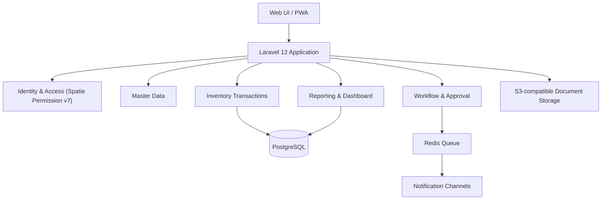
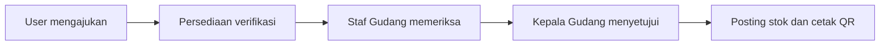
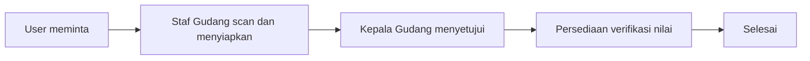
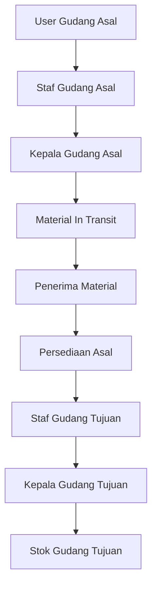
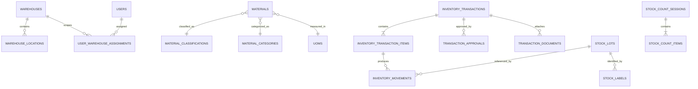

# Rancangan Aplikasi Pengelolaan Persediaan Material dan Gudang

**Versi:** 1.0  
**Tanggal:** 24 Agustus 2026  
**Basis kebutuhan:** `Detail.xlsx` (Mencakup 3 Tab: `DETAIL`, `MODUL`, dan `PROSES`)  
**Target teknologi:** Laravel 12 Modular Monolith  
**Status dokumen:** Baseline rancangan untuk review bisnis dan teknis

---

## 1. Ringkasan Eksekutif

Aplikasi ini dirancang sebagai pusat pengelolaan persediaan material dan aktivitas gudang untuk 17 lokasi gudang. Sistem menangani seluruh siklus material, mulai dari penerimaan, pengeluaran, pengembalian, pemindahan antar gudang, penyisihan, stock opname, inventarisasi, pencetakan QR Code, hingga pelaporan dan dashboard manajemen.

Rancangan menggunakan **Laravel 12 Modular Monolith** agar pengembangan awal tetap cepat dan sederhana, tetapi batas antarmodul tetap jelas. Sistem stok menggunakan **immutable inventory ledger** sebagai sumber kebenaran, ditambah tabel saldo untuk pembacaan cepat. Setiap perubahan stok hanya boleh terjadi melalui transaksi database yang tervalidasi, tercatat dalam audit log, dan mengikuti workflow persetujuan.

Output utama sistem:

- Data persediaan material yang konsisten antara fungsi persediaan dan gudang.
- Workflow approval yang dapat ditelusuri untuk setiap transaksi.
- Pemantauan saldo, mutasi, nilai persediaan, dan material dalam perjalanan.
- Identifikasi material menggunakan QR Code.
- Stock opname dan inventarisasi yang terdokumentasi.
- Laporan operasional dan dashboard manajemen.
- Jejak audit lengkap untuk perubahan data dan keputusan approval.

## 2. Tujuan Sistem

### 2.1 Tujuan Bisnis

1. Menstandarkan proses pengelolaan material pada seluruh gudang.
2. Mengurangi pencatatan manual dan perbedaan saldo antarfungsi.
3. Memastikan setiap transaksi memiliki dokumen, pemeriksaan, dan approval yang sesuai.
4. Menyediakan posisi stok dan nilai persediaan secara cepat dan dapat diaudit.
5. Mempercepat identifikasi, pemindahan, stock opname, dan inventarisasi menggunakan QR Code.
6. Menyediakan informasi untuk fungsi operasional, accounting, dan management.

### 2.2 Indikator Keberhasilan

- Tidak ada stok negatif akibat transaksi aplikasi.
- Setiap perubahan kuantitas memiliki movement ledger dan histori approval.
- Seluruh transaksi dapat ditelusuri dari nomor transaksi ke dokumen, material, gudang, pengguna, dan jurnal stok.
- Saldo laporan dapat direkonsiliasi dengan ledger.
- Transaksi serentak tidak menghasilkan double posting atau saldo ganda.
- Laporan dapat difilter berdasarkan gudang, periode, klasifikasi, kategori, status, material, dan jenis transaksi.
- Hak akses pengguna selalu dibatasi berdasarkan peran dan gudang yang ditugaskan.

## 3. Asumsi dan Keputusan Desain

Dokumen ini menggunakan keputusan baseline berikut agar rancangan dapat langsung diterjemahkan menjadi implementation plan:

1. Sistem merupakan aplikasi internal berbasis web.
2. Fase pertama berjalan standalone dengan impor/ekspor Excel; integrasi SSO dan ERP disiapkan melalui service interface dan API.
3. Database utama menggunakan PostgreSQL 16. MySQL 8 dapat digunakan dengan penyesuaian kecil jika menjadi standar infrastruktur perusahaan.
4. Metode valuasi baseline adalah **moving weighted average**. Jika kebijakan accounting perusahaan menetapkan metode lain, valuation service menjadi satu-satunya komponen yang diganti.
5. Kuantitas dan harga disimpan sebagai nilai numerik desimal, bukan freetext.
6. Satu material memiliki satu UOM dasar pada fase pertama. Konversi multi-UOM menjadi pengembangan lanjutan.
7. QR Code menyimpan token acak/UUID, bukan seluruh data material. Data terbaru ditampilkan setelah token diverifikasi oleh server.
8. Workflow didefinisikan sebagai state machine per jenis transaksi di source code, sedangkan pelaku, keputusan, catatan, dan waktunya disimpan di database.
9. Inventory ledger bersifat append-only. Kesalahan posting diperbaiki melalui reversal atau adjustment yang disetujui, bukan mengubah movement lama.
10. Status material Fast Moving, Slow Moving, Potential Dead Stock, dan Dead Stock dikelola oleh Fungsi Persediaan dengan tanggal berlaku. Otomatisasi berbasis umur atau frekuensi transaksi dapat ditambahkan setelah rumus bisnis disahkan.

## 4. Ruang Lingkup

### 4.1 Termasuk dalam Fase Implementasi Utama

- Autentikasi, pengguna, peran, permission, dan pembatasan per gudang.
- Bank data/master data.
- Master material, klasifikasi, kategori, KIMAP, UOM, dan status material.
- Gudang dan lokasi penyimpanan.
- Saldo stok, lot/perolehan, kartu material, reservation, dan inventory ledger.
- Penerimaan material.
- Pengeluaran material.
- Pengembalian material.
- Pemindahan material antar gudang.
- Penyisihan material.
- Stock opname.
- Inventarisasi.
- QR Code dan pencetakan label.
- Dokumen transaksi.
- Workflow approval/reject/revision.
- Notifikasi dalam aplikasi dan email opsional.
- Laporan dan ekspor.
- Dashboard.
- Audit log dan monitoring aktivitas.

### 4.2 Tidak Termasuk dalam Baseline

- Pembelian/procurement dan pembuatan PO.
- General ledger accounting lengkap.
- Pengelolaan vendor secara menyeluruh.
- Optimasi rute pengiriman.
- Aplikasi mobile native.
- Integrasi otomatis dengan SAP/ERP sebelum kontrak API tersedia.
- Konversi multi-UOM dan serialisasi unit kompleks.

## 5. Aktor dan Hak Akses

### 5.1 Daftar Peran

| Peran | Tanggung jawab utama | Cakupan data |
|---|---|---|
| Admin Pengguna/User | Mengelola akun dan penugasan fungsi pengguna | Sesuai organisasi yang dikelola |
| Pejabat Pengguna/User | Mengajukan dan menyetujui transaksi dari fungsi pengguna | Gudang/region yang ditugaskan |
| Fungsi Persediaan | Verifikasi transaksi, harga, nilai, dan laporan persediaan | Region yang ditugaskan |
| Staf Gudang | Pemeriksaan fisik, scan QR, lokasi, nomor kartu, dan pencetakan | Gudang yang ditugaskan |
| Kepala Gudang | Approval operasional gudang | Gudang yang dipimpin |
| Pengelola/Holder | Mengelola kepemilikan material dan usulan penyisihan | Organisasi/material terkait |
| Accounting | Review laporan nilai dan rekonsiliasi | Region atau seluruh perusahaan |
| Management | Melihat dashboard dan laporan agregat | Read-only sesuai kewenangan |
| Tim Inventarisasi | Melaksanakan sesi inventarisasi | Sesi dan gudang yang ditugaskan |
| Super Admin | Konfigurasi global, master data, dan dukungan sistem | Seluruh data |

### 5.2 Matriks Akses Ringkas

Keterangan: `C` membuat, `R` melihat, `U` memproses, `A` menyetujui, `M` mengelola.

| Modul | User | Persediaan | Staf Gudang | Kepala Gudang | Holder | Accounting | Management | Super Admin |
|---|---:|---:|---:|---:|---:|---:|---:|---:|
| Penerimaan | C/R | R/U/A | R/U | R/A | R | R | R | M |
| Pengeluaran | C/R | R/U/A | R/U | R/A | R | R | R | M |
| Pengembalian | C/R | R/U/A | R/U | R/A | R | R | R | M |
| Pemindahan | C/R | R/U/A | R/U | R/A | R | R | R | M |
| Penyisihan | C/R | R/U/A | R/U | R/A | C/R | R | R | M |
| Stock Opname | R | R | C/U | A | R | R | R | M |
| Inventarisasi | R | R | R | A | R | R | R | M |
| Laporan | R | R | R | R | R | R | R | M |
| Dashboard | R | R | R | R | R | R | R | M |
| Bank Data | R | R | R | R | R | R | R | M |

Implementasi otorisasi dan permission menggunakan **Spatie Laravel-Permission v7** yang dipadukan dengan **Laravel Authorization Policy** dan **Warehouse Scoping Middleware**.

Otorisasi sistem bekerja pada 2 tingkatan:
1. **Tingkat Peran & Permission (Spatie RBAC)**: Membatasi aksi/fitur yang boleh dilakukan pengguna (`transactions.create`, `transactions.check_warehouse`, `transactions.approve_warehouse_head`, `transactions.verify_inventory`, `transactions.post`, dll).
2. **Tingkat Cakupan Gudang (Warehouse Policy Scope)**: Membatasi data fisik gudang yang dapat diakses oleh pengguna sesuai penugasan di `user_warehouse_assignments`.

## 6. Arsitektur Aplikasi

### 6.1 Pendekatan

Sistem menggunakan modular monolith. Seluruh modul berjalan dalam satu deployment Laravel, tetapi business logic dipisahkan berdasarkan domain agar mudah diuji dan dapat diekstrak menjadi service terpisah jika skala meningkat.



### 6.2 Komponen Teknologi

| Komponen | Pilihan baseline | Fungsi |
|---|---|---|
| Backend | PHP 8.3+ dan Laravel 12 | Business logic, Web Controller, DataTables Service, Queue, Scheduler |
| Frontend | Blade, jQuery, AJAX, DataTables (Yajra), Bootstrap 5 / Tailwind | UI internal dengan server-side DataTables, filter dinamis, dan AJAX modal form |
| DataTables Engine | Yajra Laravel DataTables 11+ | Server-side processing, pagination, multi-column search, export PDF/XLSX |
| Database | PostgreSQL 16 / MySQL 8.0 | Transaksi, constraint, locking, analytics reporting |
| Cache/Queue | Redis 7 | Queue DataTables export, cache saldo, distributed lock |
| File storage | S3-compatible storage | Dokumen transaksi privat dan hasil ekspor PDF/XLSX |
| Web server | Nginx dan PHP-FPM | Runtime aplikasi |
| Authentication | Laravel Fortify/Sanctum | Login lokal, session security, dan API token |
| Authorization | Spatie Laravel-Permission v7 + Laravel Policy | Role & Permission RBAC dengan scope gudang |
| QR | Server-side QR generator | Label QR dan scan token endpoint |
| Monitoring | Laravel log, queue monitor, health check | Observability dan operasi |

### 6.3 Design Pattern Arsitektur Laravel 12

Aplikasi ini menggabungkan **6 Design Pattern Modern** pada framework Laravel 12 untuk mendukung pengkodean yang rapi, terisolasi, aman, serta siap menangani transaksi **AJAX** dan **DataTables Server-Side**:

1. **Modular Monolith / Domain-Driven Design (DDD) Light Pattern**:
   - Logika bisnis utama dikelompokkan ke dalam **Domain Modules** (`app/Domain/Transactions`, `app/Domain/Inventory`, `app/Domain/MasterData`, `app/Domain/Reporting`).
   - Mencegah *tight coupling* antara HTTP Controllers dengan aturan bisnis persediaan, sehingga aplikasi mudah di-maintain dan diuji.

2. **Action / Single Responsibility Principle (SRP) Pattern**:
   - Setiap penggunaan fungsi bisnis (*use case*) dibungkus dalam satu **Class Action** khusus (misal: `CreateReceiptTransactionAction`, `ProcessInTransitTransferAction`, `CountPhysicalStockAction`, `PostWriteOffAction`).
   - Controller tetap ramping (*Thin Controller, Fat Action/Domain*).

3. **DataTables Server-Side Processing Pattern (Yajra DataTable Service)**:
   - Logika penyiapan tabel (*querying*, *sorting*, *filtering*, *badge rendering*, *action buttons*) dipisahkan ke dalam **Class DataTable** (`app/DataTables/TransactionDataTable.php`, `StockBalanceDataTable.php`).
   - Mendukung pencarian berkecepatan tinggi, pagination server-side, dan ekspor data tanpa membebani memori browser.

4. **AJAX Controller & Standardized JSON Response Pattern**:
   - Seluruh interaksi modal, pembuatan draft, upload dokumen, serta keputusan approval (*Approve*/*Reject*/*Revision*) diproses via **AJAX POST/PATCH**.
   - Controller mengembalikan format JSON standar (`{ success: true, message: "...", data: {...} }`), lalu frontend memperbarui tampilan secara otomatis via `table.ajax.reload(null, false)`.

5. **Immutable Ledger & Balance Projection (CQRS Light) Pattern**:
   - **Write Model**: Setiap transaksi mutasi fisik/keuangan hanya ditulis *append-only* di `inventory_movements`.
   - **Read Model**: Tampilan saldo cepat membaca `stock_balances` (Projection Cache), dan dashboard membaca `vw_dashboard_inventory_composition` (Analytics View).

6. **Policy & Query Scope Authorization Pattern**:
   - Keamanan tingkat gudang dijamin via `WarehousePolicy` dan **Query Scope**, di mana kueri Eloquent/DataTables secara otomatis memfilter `$query->whereIn('source_warehouse_id', $userWarehouseIds)`.

---

### 6.4 Struktur Folder Proyek Laravel 12

```text
app/
├── DataTables/                      # Class DataTables Yajra Server-Side (Pattern 3)
│   ├── MaterialDataTable.php
│   ├── StockBalanceDataTable.php
│   ├── TransactionDataTable.php
│   ├── StockOpnameDataTable.php
│   └── AuditLogDataTable.php
├── Domain/                          # Core Domain Logic & Action Classes (Pattern 1 & 2)
│   ├── Identity/
│   │   ├── Models/
│   │   └── Services/
│   ├── MasterData/
│   │   ├── Actions/
│   │   └── Models/
│   ├── Inventory/
│   │   ├── Services/               # Ledger Engine, Reservation, Valuation
│   │   └── Models/
│   ├── Transactions/
│   │   ├── Receipt/                # Inbound (1101-1107)
│   │   ├── Issue/                  # Outbound (2201-2206)
│   │   ├── ReturnMaterial/         # Retur Transaksi
│   │   ├── Transfer/               # Pemindahan Antar Gudang
│   │   └── WriteOff/               # Penyisihan Material
│   ├── WarehouseOperations/        # QR Code Scan, Stock Opname, Inventarisasi
│   └── Reporting/                  # Query Analytics & Export Services
├── Http/
│   ├── Controllers/                 # Thin Controllers untuk AJAX Response (Pattern 4)
│   │   ├── Admin/                  # Controller Master Data & User
│   │   ├── Transaction/            # Controller Form, Approval & AJAX Process
│   │   ├── Warehouse/              # Controller Posisi Stok & QR Scan
│   │   └── Report/                 # Controller Laporan & Dashboard Analytics
│   ├── Requests/                   # FormRequest Validation (AJAX & Web)
│   └── Middleware/                 # WarehouseScopeMiddleware, SecurityHeader
├── Models/                          # Eloquent Models & Relationships
├── Policies/                        # Authorization Policies per Gudang (Pattern 6)
├── Services/                        # PdfWatermarkGenerator, QrCodeService
└── Support/

resources/
├── views/
│   ├── layouts/
│   │   └── app.blade.php           # Layout utama (Bootstrap + DataTables CSS/JS)
│   ├── datatables/                 # Custom Action Buttons & Badge Templates
│   │   ├── transaction_actions.blade.php
│   │   └── status_badge.blade.php
│   ├── pages/
│   │   ├── transactions/           # Halaman List (DataTables) & Modals (AJAX)
│   │   ├── stock_balances/
│   │   ├── stock_opname/
│   │   └── reports/
│   └── pdf/                        # Template Cetak PDF Form + Watermark Digital
routes/
├── web.php                         # Route Web & AJAX DataTables Endpoints
└── api.php                         # API Endpoint Scanner QR Code
```

### 6.5 Pola Interaksi DataTables Server-Side & AJAX

1. **Yajra DataTables Server-Side Processing**:
   - Seluruh daftar transaksi, saldo stok, dan mutasi menggunakan `Yajra DataTables`.
   - Pengambilan data dilakukan secara asynchronous via AJAX HTTP GET (`/transactions/datatable`).
   - Query pada DataTables Class secara otomatis menerapkan `WarehousePolicy Scope` (`whereIn('source_warehouse_id', $userWarehouseIds)`).
   - Mendukung pencarian instan (*instant search*), penyaringan dinamis per gudang/status (FM, SM, PDS, DS), dan pagination tanpa *reload* halaman.

2. **Form Submissions & Workflow Actions via AJAX**:
   - Form pembuatan draft, upload dokumen (`PO`/`DO`/`SPK`/`Surat GH OMM`), dan persetujuan (*Approve*/*Reject*/*Revision*) dilakukan via **AJAX POST/PATCH**.
   - Respon AJAX mengembalikan JSON standar (`{ success: true, message: '...', redirect_url: '...' }`).
   - Setelah persetujuan berhasil, DataTables di-refresh otomatis menggunakan method `table.ajax.reload(null, false)` tanpa mengganggu posisi halaman user.

## 7. Modul Sistem

### 7.1 Identity and Access Management (Spatie Permission v7)

- Login, logout, lupa kata sandi, dan reset password (Laravel Fortify).
- Pengelolaan pengguna (`users`) dan status aktif/nonaktif.
- **Manajemen Peran & Izin (Spatie RBAC v7)**:
  - CRUD Roles (`super_admin`, `admin_user`, `pejabat_user`, `staf_gudang`, `kepala_gudang`, `persediaan`, `holder_material`, `accounting`, `management`, `tim_inventarisasi`).
  - CRUD Granular Permissions (`master_data.*`, `transactions.*`, `stock_opname.*`, `reports.*`).
  - Penetapan Spatie Roles ke Pengguna via Trait `HasRoles` (`$user->assignRole($role)`).
- **Penetapan Scope Gudang**: Penetapan hak akses gudang fisik ke pengguna via `user_warehouse_assignments`.
- Penetapan fungsi organisasi (`organizational_functions`), jabatan (`positions`), dan PIC.
- Session log dan audit riwayat login.
- Interface service untuk integrasi SSO pada fase berikutnya.

### 7.2 Bank Data

- Fungsi organisasi, jabatan, dan PIC.
- Lokasi gudang dan kode gudang.
- Lokasi penyimpanan/rack/bin.
- Jenis dan subjenis transaksi.
- Klasifikasi material.
- Kategori material.
- KIMAP dan nama material.
- UOM.
- Status material.
- Jenis dokumen dan aturan dokumen wajib.
- Konfigurasi penomoran transaksi.

### 7.3 Inventory Core

- Saldo on-hand, reserved, available, in-transit, quarantined, dan written-off.
- Lot/periode perolehan dan harga satuan.
- Nomor kartu material.
- Lokasi penyimpanan.
- Inventory movement append-only.
- Reservation untuk transaksi keluar dan pemindahan.
- Reversal dan adjustment terkendali.
- Rekonsiliasi saldo terhadap ledger.

### 7.4 Transaksi Material

- Penerimaan.
- Pengeluaran.
- Pengembalian.
- Pemindahan antar gudang.
- Penyisihan.
- Dokumen, referensi, catatan, dan approval.

### 7.5 Warehouse Operations

- Scan QR Code.
- Cetak dan cetak ulang label.
- Stock opname.
- Inventarisasi.
- Penempatan dan pemindahan lokasi internal.
- Penanganan selisih.

### 7.6 Reporting and Dashboard

- Laporan persediaan.
- Laporan stok gudang.
- Laporan mutasi.
- Rekap transaksi.
- Laporan stock opname dan inventarisasi.
- Dashboard nilai, komposisi, transaksi, dan tren.

## 8. Model Status Transaksi

Status umum digunakan secara konsisten pada seluruh transaksi:

| Status | Makna |
|---|---|
| `draft` | Belum diajukan dan masih dapat diedit pembuat |
| `submitted` | Diajukan ke tahapan pertama |
| `under_review` | Sedang diproses reviewer/approver |
| `revision_requested` | Dikembalikan kepada pelaku sebelumnya dengan catatan |
| `rejected` | Ditolak dan tidak dapat dilanjutkan |
| `approved` | Seluruh approval selesai |
| `posted` | Movement stok/nilai telah tercatat |
| `completed` | Seluruh aktivitas operasional selesai |
| `cancelled` | Dibatalkan sebelum posting dengan alasan |
| `reversed` | Posting dibalik melalui transaksi reversal |

Status tahapan disimpan terpisah dari status transaksi agar posisi workflow dapat diketahui tanpa mengubah arti status utama.

## 9. Workflow Transaksi

### 9.1 Penerimaan Material



1. User membuat transaksi, memilih subtype penerimaan, mengisi referensi, mengunggah dokumen, dan memasukkan item.
2. Sistem menghasilkan nomor transaksi.
3. Fungsi Persediaan memeriksa informasi, klasifikasi, harga, dan dokumen.
4. Staf Gudang memeriksa fisik, mengisi nomor kartu, lokasi penyimpanan, dan catatan.
5. Kepala Gudang melakukan approval.
6. Sistem mem-posting penerimaan ke ledger dan saldo stok dalam satu database transaction.
7. Staf Gudang mencetak QR Code. Sistem mencatat status `qr_printed`, jumlah cetak, pengguna, dan waktu.

Aturan penting:

- Subtype valid: 1101, 1103, 1104, dan 1107 untuk penerimaan langsung.
- Subtype pengembalian 1102, 1105, dan 1106 diproses pada modul pengembalian.
- Jumlah harga dihitung sistem: `quantity_received × unit_price`.
- Penerimaan dari transfer menggunakan data item dan harga dari transfer, bukan input ulang.

### 9.2 Pengeluaran Material



1. User memilih material dan jumlah yang diminta.
2. Sistem memvalidasi `available_quantity` dan membuat reservation saat transaksi diajukan.
3. Staf Gudang memindai QR, memilih lot/kartu, dan mengisi jumlah yang dikeluarkan.
4. Kepala Gudang menyetujui pengeluaran fisik; kuantitas keluar diposting ke ledger.
5. Fungsi Persediaan memverifikasi harga dan nilai transaksi.
6. Sistem menutup reservation dan menyelesaikan transaksi.

Aturan penting:

- Permintaan tidak boleh melebihi stok tersedia.
- Jumlah dikeluarkan tidak boleh melebihi jumlah diminta atau saldo lot.
- Harga berasal dari inventory lot/valuation service.
- Subtype pengeluaran baseline: 2201, 2202, 2203, 2205, dan 2206.
- Subtype 2204 digunakan oleh workflow pemindahan antar gudang.

### 9.3 Pengembalian Material

1. User memilih transaksi pengeluaran asal jika tersedia.
2. Data klasifikasi, kategori, material, KIMAP, UOM, harga, dan jumlah maksimum diturunkan dari referensi.
3. User mengisi jumlah dikembalikan dan mengunggah dokumen.
4. Staf Gudang melakukan scan/pemeriksaan, mencatat jumlah diterima, nomor kartu, dan lokasi.
5. Kepala Gudang menyetujui penerimaan fisik.
6. Fungsi Persediaan memverifikasi nilai dan menyelesaikan posting.

Sistem menolak jumlah diterima yang melebihi jumlah dikembalikan. Untuk material yang tidak memiliki referensi transaksi lama, Persediaan wajib memvalidasi harga sebelum posting final.

### 9.4 Pemindahan Antar Gudang



1. User gudang asal mengajukan material dan tujuan.
2. Sistem membuat reservation pada gudang asal.
3. Staf Gudang Asal melakukan scan dan konfirmasi jumlah.
4. Kepala Gudang Asal menyetujui keberangkatan; stok berpindah dari on-hand ke in-transit.
5. Penerima material mengonfirmasi penerimaan administratif/fisik awal.
6. Persediaan asal memverifikasi harga dan nilai.
7. Staf Gudang Tujuan melakukan pemeriksaan fisik dan check.
8. Kepala Gudang Tujuan menyetujui; sistem mengurangi in-transit dan menambah stok tujuan.

Transfer tidak boleh langsung menambah stok tujuan saat stok asal dikeluarkan. Status in-transit wajib tersedia agar material yang sedang dikirim tetap dapat direkonsiliasi.

### 9.5 Penyisihan Material

1. User membuat transaksi berdasarkan Surat/Formulir Rekapitulasi Usulan Penyisihan Material dari Pengelola/Holder Material (GH OMM).
2. Sistem memvalidasi saldo dan memindahkan jumlah ke reservation/quarantine.
3. Staf Gudang memeriksa material dan nomor kartu, lalu memberikan tanda periksa (`CHECKED`).
4. Kepala Gudang menyetujui kondisi fisik (`APPROVED`).
5. Fungsi Persediaan memverifikasi harga dan nilai (`APPROVED`).
6. Pada approval final, sistem memindahkan saldo dari quarantined menjadi written-off melalui ledger.

Material yang sudah berstatus quarantined tidak dapat dipilih untuk pengeluaran atau transfer reguler.

### 9.6 Stock Opname

1. Staf Gudang membuat sesi berdasarkan gudang, periode (mingguan/bulanan), dan ruang lingkup.
2. Sistem mengambil snapshot saldo pada saat sesi dikunci.
3. Tim menghitung fisik material dengan 2 (dua) metode pilihan:
   - **Metode 1 (Manual Count Input)**: Menghitung fisik material secara manual, kemudian menginput kuantitas hasil hitung.
   - **Metode 2 (QR Scan Count)**: Memindai QR Code pada setiap item material secara individu, di mana sistem secara otomatis menghitung akumulasi total item yang di-scan.
4. Sistem menghitung `variance = physical_quantity - snapshot_quantity`.
5. Keterangan wajib diisi (*mandatory freetext*) jika variance tidak nol.
6. Staf Gudang melakukan konfirmasi (`CHECKED`) dan Kepala Gudang menyetujui hasil (`APPROVED`).
7. Selisih tidak otomatis mengubah stok. Sistem membuat draft inventory adjustment untuk approval terpisah oleh Kepala Gudang dan Fungsi Persediaan.

### 9.7 Inventarisasi

Alur sama dengan stock opname, tetapi pelaksana adalah Tim Inventarisasi yang ditugaskan pada sesi. Sistem menyimpan surat tugas, anggota, periode, gudang, ruang lingkup, hasil per item (menggunakan Metode 1 atau Metode 2 scan QR), foto/dokumen, serta approval Tim Inventarisasi (`APPROVED`) dan Kepala Gudang (`APPROVED`).

## 10. Aturan Dokumen dan Approval

### 10.1 Dokumen dan Mandatory Attachment Rules

Sesuai spesifikasi pada Tab **`PROSES`** `Detail.xlsx`, aturan lampiran dokumen (*attach file*) untuk setiap modul transaksi adalah sebagai berikut:

| Modul Transaksi | Attach File Mandatory | Jenis Dokumen Wajib / Keterangan |
|---|:---:|---|
| **Penerimaan Material** | **YA** | Dokumen Penerimaan: PO, DO, BAP (Berita Acara Pemeriksaan), BAST (Berita Acara Serah Terima). |
| **Pengeluaran Material** | **YA** | Dokumen Pengeluaran: Nota Dinas, Memo Internal, atau SPK. |
| **Pengembalian Material** | **YA** | Dokumen Pengembalian: Nota Dinas, Memo, atau Berita Acara Pencabutan. |
| **Pemindahan Material** | **YA** | Dokumen Pemindahan Antar Gudang: Surat Jalan / Memo Pemindahan. |
| **Penyisihan Material** | **YA** | Dokumen Penyisihan: Nota Dinas / Memo / Surat Rekapitulasi Usulan Penyisihan dari GH OMM. |
| **Stock Opname** | TIDAK | Aktivitas internal opname fisik (tidak mewajibkan file upload). |
| **Inventarisasi** | TIDAK | Sesi inventarisasi fisik (foto pendukung opsional). |

Aturan teknis dokumen:
- Dokumen disimpan di object storage; database hanya menyimpan metadata dan object key.
- File diperiksa berdasarkan extension, MIME type, ukuran, dan checksum.
- File tidak dapat diganti setelah transaksi posted; koreksi dilakukan dengan menambah versi dokumen.
- Unduhan dokumen wajib melalui authorization dan signed URL berumur pendek.

### 10.2 Approval dan Dynamic Watermark Stamp

- Approver tidak boleh menyetujui tahapan yang bukan kewenangannya.
- Pembuat tidak boleh menyetujui tahapan reviewer pada transaksi yang sama, kecuali kebijakan tertulis mengizinkan.
- Reject wajib memiliki alasan.
- Revision mengembalikan transaksi ke tahapan yang ditentukan dan menyimpan versi perubahan.
- Approval menyimpan user, role snapshot, position snapshot, warehouse scope, keputusan, catatan, timestamp, dan IP/user agent.
- **Dynamic Watermark Stamp**: Setiap persetujuan atau pemeriksaan menghasilkan stempel digital (*watermark*) pada cetakan formulir resmi:
  - Stempel `CHECKED` untuk pemeriksaan Staf Gudang / Gudang Tujuan.
  - Stempel `APPROVED` untuk persetujuan Pengguna, Kepala Gudang, Persediaan, dan Tim Inventarisasi.
  - Watermark merupakan representasi dari data `transaction_approvals` yang aman dan tidak dapat dipalsukan.
- Setelah posted, field finansial dan kuantitas dikunci.

## 11. Penomoran Transaksi

Format baseline:

```text
{SUBTYPE}-{WAREHOUSE}-{YYYYMM}-{SEQUENCE}
```

Contoh:

```text
1101-MDN-202608-000001
2202-BGR-202608-000015
3300-JKT-202608-000003
```

Nomor dibuat di server menggunakan tabel sequence per subtype, gudang, dan periode. Unique constraint mencegah nomor ganda saat transaksi serentak.

## 12. Rancangan Data

### 12.1 Entity Relationship Utama



### 12.2 Tabel Identity dan Organisasi

#### `users`

- `id`
- `employee_number`
- `name`
- `email`
- `password`
- `status`
- `last_login_at`
- timestamps

#### `organizational_functions`

- `id`, `code`, `name`, `parent_id`, `is_active`

#### `positions`

- `id`, `function_id`, `code`, `name`, `is_active`

#### `user_position_assignments`

- `user_id`, `position_id`, `valid_from`, `valid_until`, `is_primary`

#### `warehouses`

- `id`, `code`, `name`, `region_code`, `address`, `timezone`, `is_active`

#### `warehouse_locations`

- `id`, `warehouse_id`, `code`, `name`, `type`, `parent_id`, `is_active`

#### `user_warehouse_assignments`

- `user_id`, `warehouse_id`, `role_scope`, `valid_from`, `valid_until`

### 12.3 Tabel Master Material

#### `material_classifications`

- `id`, `code`, `name`, `is_active`, `sort_order`

#### `material_categories`

- `id`, `code`, `name`, `is_active`, `sort_order`

#### `uoms`

- `id`, `code`, `name`, `decimal_precision`, `is_active`

#### `materials`

- `id`
- `kimap` — unique
- `name`
- `classification_id`
- `category_id`
- `base_uom_id`
- `description`
- `is_serialized`
- `is_active`

#### `material_status_assignments`

- `id`, `material_id`, `warehouse_id`
- `status_code` — FM/SM/PDS/DS
- `effective_from`, `effective_until`
- `reason`, `assigned_by`

### 12.4 Tabel Transaksi

#### `inventory_transactions`

- `id` — UUID/ULID
- `transaction_number` — unique
- `transaction_type` — receipt/issue/return/transfer/write_off/adjustment
- `transaction_subtype_id`
- `source_warehouse_id`
- `destination_warehouse_id`
- `transaction_date`
- `status`
- `current_stage`
- `requested_by`
- `reference_text`
- `explanation`
- `submitted_at`, `posted_at`, `completed_at`
- `lock_version` — optimistic concurrency pada proses edit
- timestamps, soft delete hanya untuk draft

#### `inventory_transaction_items`

- `id`, `transaction_id`, `line_number`
- `material_id`, `uom_id`
- `source_location_id`, `destination_location_id`
- `requested_quantity`, `processed_quantity`
- `unit_price`, `total_amount`
- `source_lot_id`, `source_stock_label_id`
- `card_number`, `notes`

#### `transaction_references`

- `id`, `transaction_id`, `reference_type`, `reference_number`
- `referenced_transaction_id`, `issued_at`, `issuer`

#### `transaction_documents`

- `id`, `transaction_id`, `document_type_id`
- `file_name`, `object_key`, `mime_type`, `size`, `checksum`
- `version`, `uploaded_by`, `uploaded_at`

#### `transaction_approvals`

- `id`, `transaction_id`, `stage_code`, `sequence`
- `required_role`, `assigned_user_id`
- `decision`, `notes`
- `actor_name_snapshot`, `position_snapshot`, `role_snapshot`
- `decided_at`, `ip_address`, `user_agent`

#### `transaction_histories`

- `id`, `transaction_id`, `activity`, `from_status`, `to_status`
- `metadata`, `actor_id`, `created_at`

### 12.5 Tabel Inventory

#### `stock_lots`

- `id`, `warehouse_id`, `material_id`
- `acquisition_period`, `receipt_item_id`
- `unit_price`, `original_quantity`, `remaining_quantity`
- `status`

#### `stock_labels`

- `id`, `stock_lot_id`, `warehouse_location_id`
- `qr_token` — unique dan tidak mudah ditebak
- `card_number`
- `label_quantity`, `remaining_quantity`
- `printed_count`, `last_printed_at`, `status`

#### `inventory_movements`

- `id`, `transaction_id`, `transaction_item_id`
- `warehouse_id`, `warehouse_location_id`
- `material_id`, `stock_lot_id`, `stock_label_id`
- `movement_type`
- `quantity_delta`, `amount_delta`
- `occurred_at`, `posted_by`
- `reversal_of_id`

#### `stock_balances`

- `warehouse_id`, `warehouse_location_id`, `material_id`, `stock_lot_id`
- `on_hand_quantity`
- `reserved_quantity`
- `in_transit_quantity`
- `quarantined_quantity`
- `average_unit_cost`
- `updated_at`

Unique key menggunakan kombinasi gudang, lokasi, material, dan lot. Perubahan dilakukan dengan row lock di dalam database transaction.

#### `stock_reservations`

- `id`, `transaction_item_id`, `stock_lot_id`
- `reserved_quantity`, `consumed_quantity`
- `status`, `expires_at`

### 12.6 Tabel Stock Opname dan Inventarisasi

#### `stock_count_sessions`

- `id`, `session_number`, `session_type`
- `warehouse_id`, `period_start`, `period_end`, `snapshot_at`
- `scope`, `status`, `created_by`, `approved_by`, timestamps

#### `stock_count_assignments`

- `session_id`, `user_id`, `role_in_session`

#### `stock_count_items`

- `session_id`, `material_id`, `stock_lot_id`, `stock_label_id`
- `system_quantity`, `physical_quantity`, `variance_quantity`
- `explanation`, `counted_by`, `counted_at`

#### `inventory_adjustments`

- `id`, `stock_count_session_id`, `status`, `reason`
- `approved_by_head`, `approved_by_inventory`, `posted_at`

### 12.7 Constraint Penting

- `materials.kimap` unique.
- `warehouses.code` unique.
- `inventory_transactions.transaction_number` unique.
- `stock_labels.qr_token` unique.
- Quantity tidak boleh negatif pada transaksi input.
- `available_quantity = on_hand_quantity - reserved_quantity - quarantined_quantity`.
- Saldo tidak boleh negatif setelah posting.
- Approved/posted transaction tidak dapat dihapus.
- Satu approval aktif per transaction dan stage sequence.
- Transfer wajib memiliki gudang asal berbeda dari gudang tujuan.

## 13. Konsistensi dan Posting Stok

Setiap posting menggunakan pola berikut:

1. Authorization dan validasi state.
2. Memulai database transaction.
3. Mengunci baris `stock_balances` dan reservation terkait menggunakan `SELECT ... FOR UPDATE`.
4. Memvalidasi ulang saldo dan versi transaksi.
5. Menulis movement ledger.
6. Memperbarui projection `stock_balances`.
7. Memperbarui status transaksi.
8. Menulis outbox event dan audit log.
9. Commit.
10. Queue worker memproses notifikasi setelah commit.

Idempotency key wajib tersedia pada endpoint posting/approval untuk mencegah double submit akibat klik ganda atau retry jaringan.

## 14. API Utama

Prefix API: `/api/v1`

### 14.1 Master Data

```text
GET    /warehouses
GET    /warehouses/{warehouse}/locations
GET    /materials
GET    /materials/{material}
POST   /materials
PATCH  /materials/{material}
GET    /transaction-types
GET    /document-types
```

### 14.2 Transaksi

```text
GET    /transactions
POST   /transactions
GET    /transactions/{transaction}
PATCH  /transactions/{transaction}
POST   /transactions/{transaction}/items
POST   /transactions/{transaction}/documents
POST   /transactions/{transaction}/submit
POST   /transactions/{transaction}/approve
POST   /transactions/{transaction}/request-revision
POST   /transactions/{transaction}/reject
POST   /transactions/{transaction}/cancel
POST   /transactions/{transaction}/reverse
```

### 14.3 QR dan Operasi Gudang

```text
GET    /qr/{token}
POST   /transactions/{transaction}/scan
POST   /transactions/{transaction}/labels/print
POST   /stock-counts
POST   /stock-counts/{session}/scan
POST   /stock-counts/{session}/submit
POST   /stock-counts/{session}/approve
```

### 14.4 Laporan

```text
GET    /reports/inventory
GET    /reports/warehouse-stock
GET    /reports/movements
GET    /reports/transactions
GET    /reports/stock-counts
POST   /exports
GET    /exports/{export}
```

Semua list endpoint menggunakan pagination, filter whitelist, sort whitelist, dan pembatasan warehouse scope.

## 15. Halaman Aplikasi

### 15.1 Umum

- Login.
- Dashboard sesuai role.
- Notifikasi dan daftar tugas approval.
- Profil dan pengaturan akun.

### 15.2 Transaksi

- Daftar transaksi dengan filter dan saved view.
- Form transaksi bertahap: header, referensi/dokumen, item, review, submit.
- Detail transaksi dengan timeline.
- Inbox approval.
- Scan QR dan pemeriksaan fisik.
- Cetak formulir, surat jalan, dan label QR.

### 15.3 Gudang

- Posisi stok.
- Kartu material.
- Lokasi penyimpanan.
- Material reserved, quarantined, dan in-transit.
- Sesi stock opname.
- Sesi inventarisasi.

### 15.4 Administrasi

- Pengguna, role, permission, dan penugasan gudang.
- Gudang dan lokasi.
- Master material.
- Jenis transaksi dan dokumen wajib.
- Import master data.
- Audit log.

## 16. Laporan

### 16.1 Laporan Persediaan Material

Kolom minimum:

- Gudang dan lokasi.
- Klasifikasi dan kategori.
- KIMAP dan nama material.
- UOM.
- Periode perolehan.
- Nomor kartu/lot.
- Saldo awal, penerimaan, pengeluaran, penyisihan, saldo akhir.
- Harga satuan dan nilai saldo akhir.
- Status material.

### 16.2 Laporan Stok Gudang

Fokus pada kuantitas operasional per gudang, lokasi, material, lot, kartu, dan status stok.

### 16.3 Laporan Mutasi

Menampilkan seluruh movement berurutan dengan nomor transaksi, waktu, jenis, referensi, masuk, keluar, nilai, saldo berjalan, dan pengguna posting.

### 16.4 Rekapitulasi Transaksi

Agregasi berdasarkan periode, gudang, jenis/subtype, klasifikasi, kategori, material, status, dan unit organisasi.

### 16.5 Ekspor

- XLSX untuk data analitis.
- PDF untuk formulir dan laporan resmi.
- Ekspor besar diproses melalui queue.
- Setiap hasil ekspor memiliki expiry dan audit download.

## 17. Dashboard

### 17.1 Filter Global

- Periode.
- Region/gudang.
- Klasifikasi.
- Kategori.
- Status material.
- Jenis transaksi.

### 17.2 KPI

- Total kuantitas dan nilai persediaan.
- Total material persediaan dan ABT.
- Jumlah transaksi penerimaan/pengeluaran.
- Nilai material in-transit.
- Nilai material quarantined/penyisihan.
- Jumlah approval tertunda.
- Selisih stock opname belum diselesaikan.

### 17.3 Visualisasi Grafik

Sesuai spesifikasi `Detail.xlsx`, dashboard dilengkapi dengan berbagai grafik interaktif:

1. **Komposisi Nilai Persediaan Material (Rp dan %)**:
   - **Grafik Pie Material Persediaan (MPS)**: Komposisi per Gudang, per Kategori (Tubular Goods, Fitting & Flange, dll), dan per Status Material (FM, SM, PDS, DS).
   - **Grafik Pie Material Asset Belum Terpasang (ABT)**: Komposisi per Gudang, per Kategori, dan per Status Material (FM, SM, PDS, DS).
2. **Transaksi Material (Rp dan %)**:
   - **Grafik Pie Penerimaan Material**: Distribusi nilai transaksi per sub-klasifikasi transaksi.
   - **Grafik Pie Pengeluaran Material**: Distribusi nilai transaksi per sub-klasifikasi transaksi.
3. **Tingkat Persediaan (Inventory Levels)**:
   - **Grafik Garis (Line Chart)**: Tren Saldo Akhir per Bulan untuk Material Persediaan dan Material ABT.
   - **Grafik Batang (Bar Chart)**: Perbandingan Saldo Akhir tiap Tahun untuk Material Persediaan dan Material ABT.
4. **Monitoring Operational & Approval**:
   - **Grafik Aging Approval**: Transaksi mengantap per tahapan approval.
   - **Grafik In-Transit**: Durasi pengiriman material antar gudang.

## 18. QR Code

Data yang tampil setelah scan:

- Klasifikasi material.
- Kategori material.
- KIMAP.
- Nama material.
- UOM.
- Periode perolehan.
- Nomor kartu.
- Gudang dan lokasi saat ini.
- Kuantitas label dan sisa kuantitas.
- Status material dan status stok.

Aturan:

- Token QR tidak mengandung harga atau data sensitif.
- Label yang dibatalkan menampilkan status tidak aktif.
- Cetak ulang wajib memiliki alasan.
- Riwayat scan dan cetak disimpan.
- Scan offline tidak termasuk baseline; tampilan dapat dibuat PWA dengan cache halaman dasar, tetapi validasi transaksi tetap membutuhkan koneksi server.

## 19. Notifikasi

Pemicu minimum:

- Transaksi diajukan.
- Approval ditugaskan.
- Revision diminta.
- Transaksi ditolak.
- Approval selesai.
- Material transfer belum diterima melewati SLA.
- QR penerimaan belum dicetak.
- Reservation mendekati kedaluwarsa.
- Stock opname memiliki selisih.
- Ekspor laporan selesai.

Notifikasi disimpan di aplikasi. Email dapat diaktifkan per jenis notifikasi. Kegagalan pengiriman notifikasi tidak boleh membatalkan transaksi bisnis.

## 20. Keamanan dan Audit

- CSRF protection untuk web dan token authentication untuk API.
- Rate limit pada login, scan, dan endpoint ekspor.
- Password menggunakan Argon2id/bcrypt sesuai konfigurasi Laravel.
- MFA dapat diwajibkan untuk Super Admin dan Accounting.
- Authorization menggunakan policy pada setiap action.
- File privat, signed URL, whitelist MIME, dan antivirus integration hook.
- Enkripsi koneksi TLS dan enkripsi storage/database sesuai fasilitas infrastruktur.
- Audit log mencakup login, perubahan master, perubahan transaksi, approval, posting, cetak ulang QR, ekspor, dan akses dokumen sensitif.
- Log tidak menyimpan password, token, atau isi dokumen.
- Backup database harian dan point-in-time recovery sesuai kemampuan platform.
- Uji restore dilakukan berkala.

## 21. Penanganan Error

| Kondisi | Respons sistem |
|---|---|
| Stok tidak cukup | Tolak transaksi dan tampilkan available quantity terbaru |
| Transaksi sudah berubah | Tolak dengan conflict response dan minta reload |
| Approval bukan giliran pengguna | Forbidden dan catat security event |
| Dokumen mandatory belum lengkap | Tolak submit dan tampilkan daftar dokumen kurang |
| Upload gagal | Pertahankan draft dan izinkan retry |
| Posting ganda | Kembalikan hasil posting sebelumnya melalui idempotency key |
| Queue notifikasi gagal | Retry dengan backoff; transaksi tetap sah |
| QR tidak valid/nonaktif | Tampilkan pesan aman tanpa membocorkan data material |
| Export besar | Jalankan asynchronous dan kirim notifikasi saat selesai |

## 22. Kebutuhan Nonfungsional

| Aspek | Target baseline |
|---|---|
| Availability | 99,5% pada jam operasional |
| Response time | P95 kurang dari 2 detik untuk transaksi normal |
| Report list | P95 kurang dari 5 detik untuk filter umum |
| Export besar | Asynchronous untuk lebih dari 10.000 baris |
| Concurrency | Aman terhadap double posting dan overselling stok |
| Audit retention | Minimal mengikuti kebijakan retensi perusahaan |
| Browser | Dua versi terbaru Chrome/Edge |
| Accessibility | Navigasi keyboard, label form, dan kontras yang memadai |
| Localization | Bahasa Indonesia; timezone dan format tanggal terkonfigurasi |

## 23. Strategi Testing

### 23.1 Unit Test

- Perhitungan saldo tersedia.
- Moving weighted average.
- Validasi subtype transaksi.
- State transition.
- Document requirement.
- Penomoran transaksi.
- QR token validation.

### 23.2 Feature Test

- Authorization per role dan gudang.
- Create, submit, revision, reject, approve, post, cancel, dan reversal.
- Upload dokumen.
- Reservation dan release.
- Transfer in-transit.
- Stock opname dan adjustment.
- Filter dan ekspor laporan.

### 23.3 Concurrency Test

- Dua user meminta material terakhir secara bersamaan.
- Klik approval/posting berulang.
- Retry request dengan idempotency key sama.
- Transfer dan pengeluaran pada lot yang sama.

### 23.4 Reconciliation Test

Untuk setiap material dan gudang:

```text
opening balance + sum(movements) = closing balance
```

Total saldo projection harus sama dengan total ledger pada checkpoint rekonsiliasi.

### 23.5 UAT

UAT dilakukan menggunakan skenario nyata untuk setiap subtype transaksi, dokumen wajib, approval, laporan, QR, selisih stock opname, dan pembatasan akses gudang.

## 24. Deployment dan Operasional

### 24.1 Environment

- Development.
- Staging/UAT.
- Production.

### 24.2 Komponen Production

- Nginx.
- PHP-FPM application instances.
- Queue worker dan scheduler.
- PostgreSQL.
- Redis.
- S3-compatible object storage.
- Centralized log dan monitoring.

### 24.3 CI/CD

Pipeline minimum:

1. Install dependency.
2. Static analysis dan code style.
3. Unit/feature test.
4. Build frontend asset.
5. Security/dependency scan.
6. Build deployment artifact/container.
7. Deploy staging.
8. Smoke test.
9. Manual approval production.
10. Deploy production dan health check.

Migration database menggunakan strategi backward-compatible. Backup atau snapshot dilakukan sebelum migration berisiko tinggi.

## 25. Roadmap Implementasi

Estimasi berlaku untuk tim 3–5 orang: backend/full-stack, frontend/QA, dan product/business representative.

| Fase | Durasi | Hasil |
|---|---:|---|
| 0. Discovery dan normalisasi data | 1–2 minggu | Master data sah, workflow final, prototype form |
| 1. Foundation dan IAM | 2 minggu | Project, CI/CD, login, role, warehouse scope, audit dasar |
| 2. Bank data dan inventory core | 3 minggu | Material, gudang, lokasi, lot, saldo, ledger, reservation |
| 3. Penerimaan dan QR | 3 minggu | Workflow penerimaan sampai posting dan label QR |
| 4. Pengeluaran dan pengembalian | 3 minggu | Workflow keluar/retur dan valuasi |
| 5. Transfer dan penyisihan | 3 minggu | In-transit, destination receipt, quarantine/write-off |
| 6. Stock opname dan inventarisasi | 2–3 minggu | Sesi hitung, selisih, adjustment |
| 7. Laporan dan dashboard | 2–3 minggu | Laporan, ekspor, KPI, chart |
| 8. Hardening dan UAT | 2 minggu | Security, performance, reconciliation, training, go-live |

Total baseline: **18–23 minggu**, bergantung pada kesiapan master data, keputusan bisnis, dan kecepatan UAT.

## 26. Struktur GitHub

### 26.1 Label

```text
type:epic
type:feature
type:task
type:bug
area:iam
area:master-data
area:inventory
area:transaction
area:workflow
area:warehouse
area:reporting
area:security
priority:p0
priority:p1
priority:p2
status:blocked
needs:business-review
```

### 26.2 Milestone

- M0 — Discovery.
- M1 — Foundation.
- M2 — Inventory Core.
- M3 — Inbound and QR.
- M4 — Outbound and Return.
- M5 — Transfer and Write-off.
- M6 — Stock Count.
- M7 — Reporting.
- M8 — UAT and Go-live.

## 27. Backlog Epic dan Issue GitHub

### EPIC-01 — Project Foundation

| ID | Issue | Prioritas | Dependensi |
|---|---|---:|---|
| INV-001 | Inisialisasi Laravel 12 dan standar struktur domain | P0 | - |
| INV-002 | Konfigurasi PostgreSQL, Redis, queue, scheduler, dan storage | P0 | INV-001 |
| INV-003 | Menyiapkan environment development, staging, production | P0 | INV-001 |
| INV-004 | Menyiapkan CI untuk lint, static analysis, dan test | P0 | INV-001 |
| INV-005 | Menyiapkan health check dan structured logging | P1 | INV-002 |
| INV-006 | Menetapkan convention enum, DTO, action, event, dan policy | P1 | INV-001 |
| INV-007 | Menyiapkan seed data minimum dan factory | P1 | INV-001 |

### EPIC-02 — Identity, Role, dan Warehouse Scope

| ID | Issue | Prioritas | Dependensi |
|---|---|---:|---|
| INV-010 | Implementasi login, logout, reset password, dan session security | P0 | INV-001 |
| INV-011 | Implementasi role dan permission granular | P0 | INV-010 |
| INV-012 | Implementasi penugasan user ke gudang/region | P0 | INV-011 |
| INV-013 | Implementasi organizational function dan position | P1 | INV-011 |
| INV-014 | Membuat policy warehouse-scoped query | P0 | INV-012 |
| INV-015 | Membuat halaman administrasi pengguna | P1 | INV-012 |
| INV-016 | Menambahkan interface integrasi SSO | P2 | INV-010 |
| INV-017 | Menulis test matriks akses lintas gudang | P0 | INV-014 |

### EPIC-03 — Bank Data dan Material Master

| ID | Issue | Prioritas | Dependensi |
|---|---|---:|---|
| INV-020 | CRUD dan import gudang | P0 | INV-012 |
| INV-021 | CRUD lokasi penyimpanan/rack/bin | P0 | INV-020 |
| INV-022 | CRUD klasifikasi material | P0 | INV-001 |
| INV-023 | CRUD kategori material | P0 | INV-001 |
| INV-024 | CRUD UOM | P0 | INV-001 |
| INV-025 | CRUD KIMAP dan master material | P0 | INV-022, INV-023, INV-024 |
| INV-026 | CRUD status material dan effective date | P1 | INV-025 |
| INV-027 | CRUD jenis/subtype transaksi | P0 | INV-001 |
| INV-028 | CRUD jenis dokumen dan requirement per subtype | P0 | INV-027 |
| INV-029 | Validasi dan laporan error import master data | P1 | INV-020, INV-025 |

### EPIC-04 — Inventory Ledger dan Stock Balance

| ID | Issue | Prioritas | Dependensi |
|---|---|---:|---|
| INV-030 | Membuat model stock lot | P0 | INV-025 |
| INV-031 | Membuat inventory movement append-only | P0 | INV-030 |
| INV-032 | Membuat stock balance projection | P0 | INV-031 |
| INV-033 | Membuat stock reservation service | P0 | INV-032 |
| INV-034 | Implementasi moving weighted average service | P0 | INV-031 |
| INV-035 | Implementasi posting dengan database row lock | P0 | INV-032 |
| INV-036 | Implementasi idempotency key untuk posting | P0 | INV-035 |
| INV-037 | Implementasi reversal dan adjustment | P1 | INV-035 |
| INV-038 | Membuat rekonsiliasi ledger terhadap saldo | P0 | INV-032 |
| INV-039 | Menulis concurrency test untuk stok terakhir | P0 | INV-033, INV-035 |

### EPIC-05 — Workflow dan Dokumen

| ID | Issue | Prioritas | Dependensi |
|---|---|---:|---|
| INV-040 | Membuat state machine transaksi | P0 | INV-006 |
| INV-041 | Membuat approval record dan stage assignment | P0 | INV-040, INV-014 |
| INV-042 | Implementasi submit, approve, revision, reject, cancel | P0 | INV-041 |
| INV-043 | Membuat transaction timeline dan history | P1 | INV-042 |
| INV-044 | Implementasi upload dokumen privat | P0 | INV-028 |
| INV-045 | Validasi dokumen mandatory berdasarkan subtype | P0 | INV-044 |
| INV-046 | Membuat versioning dokumen setelah submit | P1 | INV-044 |
| INV-047 | Membuat notifikasi tugas approval | P1 | INV-041 |

### EPIC-06 — Penerimaan Material dan QR

| ID | Issue | Prioritas | Dependensi |
|---|---|---:|---|
| INV-050 | Membuat form draft penerimaan | P0 | INV-025, INV-040 |
| INV-051 | Implementasi aturan subtype dan referensi penerimaan | P0 | INV-050 |
| INV-052 | Implementasi approval User dan Persediaan | P0 | INV-041, INV-050 |
| INV-053 | Implementasi check Staf Gudang dan lokasi material | P0 | INV-021, INV-052 |
| INV-054 | Implementasi approval Kepala Gudang dan posting receipt | P0 | INV-035, INV-053 |
| INV-055 | Membuat stock label dan secure QR token | P0 | INV-030, INV-054 |
| INV-056 | Membuat template cetak QR dan watermark QR Passed | P1 | INV-055 |
| INV-057 | Mencatat cetak ulang dan alasan | P1 | INV-056 |
| INV-058 | Membuat formulir penerimaan PDF | P1 | INV-054 |

### EPIC-07 — Pengeluaran dan Pengembalian

| ID | Issue | Prioritas | Dependensi |
|---|---|---:|---|
| INV-060 | Membuat form permintaan pengeluaran | P0 | INV-033, INV-040 |
| INV-061 | Validasi available stock dan reservation | P0 | INV-060 |
| INV-062 | Implementasi scan dan alokasi lot pengeluaran | P0 | INV-055, INV-061 |
| INV-063 | Implementasi approval Kepala Gudang dan posting quantity | P0 | INV-035, INV-062 |
| INV-064 | Implementasi verifikasi nilai oleh Persediaan | P0 | INV-034, INV-063 |
| INV-065 | Membuat formulir pengeluaran dan surat jalan PDF | P1 | INV-063 |
| INV-066 | Membuat form pengembalian berbasis transaksi asal | P0 | INV-060 |
| INV-067 | Implementasi pemeriksaan dan posting pengembalian | P0 | INV-035, INV-066 |
| INV-068 | Menangani pengembalian tanpa referensi historis | P1 | INV-067 |

### EPIC-08 — Pemindahan dan Penyisihan

| ID | Issue | Prioritas | Dependensi |
|---|---|---:|---|
| INV-070 | Membuat form pemindahan antar gudang | P0 | INV-033, INV-040 |
| INV-071 | Implementasi scan dan approval gudang asal | P0 | INV-070 |
| INV-072 | Implementasi status dan ledger in-transit | P0 | INV-031, INV-071 |
| INV-073 | Implementasi konfirmasi penerima dan Persediaan asal | P0 | INV-072 |
| INV-074 | Implementasi pemeriksaan dan approval gudang tujuan | P0 | INV-073 |
| INV-075 | Menambahkan monitoring transfer terlambat | P1 | INV-072 |
| INV-076 | Membuat form penyisihan dan quarantine reservation | P0 | INV-033, INV-040 |
| INV-077 | Implementasi approval dan posting write-off | P0 | INV-037, INV-076 |
| INV-078 | Membuat laporan material quarantined/written-off | P1 | INV-077 |

### EPIC-09 — Stock Opname dan Inventarisasi

| ID | Issue | Prioritas | Dependensi |
|---|---|---:|---|
| INV-080 | Membuat sesi stock opname dan snapshot | P0 | INV-032 |
| INV-081 | Membuat assignment petugas sesi | P1 | INV-012, INV-080 |
| INV-082 | Implementasi scan/input physical count | P0 | INV-055, INV-080 |
| INV-083 | Menghitung variance dan mewajibkan penjelasan | P0 | INV-082 |
| INV-084 | Implementasi approval Kepala Gudang | P0 | INV-041, INV-083 |
| INV-085 | Membuat adjustment dari selisih | P0 | INV-037, INV-084 |
| INV-086 | Membuat sesi inventarisasi dan tim | P1 | INV-081 |
| INV-087 | Membuat laporan stock opname dan inventarisasi | P1 | INV-084, INV-086 |

### EPIC-10 — Laporan dan Dashboard

| ID | Issue | Prioritas | Dependensi |
|---|---|---:|---|
| INV-090 | Membuat laporan persediaan material | P0 | INV-032 |
| INV-091 | Membuat laporan stok gudang | P0 | INV-032 |
| INV-092 | Membuat laporan mutasi ledger | P0 | INV-031 |
| INV-093 | Membuat rekapitulasi transaksi | P1 | INV-040 |
| INV-094 | Membuat filter global dan saved view | P1 | INV-090 |
| INV-095 | Membuat service ekspor asynchronous XLSX/PDF | P1 | INV-090, INV-091, INV-092 |
| INV-096 | Membuat KPI dashboard | P1 | INV-090, INV-093 |
| INV-097 | Membuat chart komposisi dan tren | P1 | INV-096 |
| INV-098 | Membuat dashboard approval dan transfer aging | P1 | INV-043, INV-075 |

### EPIC-11 — Security, Audit, dan Observability

| ID | Issue | Prioritas | Dependensi |
|---|---|---:|---|
| INV-100 | Membuat audit log terstruktur | P0 | INV-010 |
| INV-101 | Mengaudit perubahan master data | P0 | INV-100, INV-020 |
| INV-102 | Mengaudit approval, posting, reversal, dan ekspor | P0 | INV-100, INV-042 |
| INV-103 | Menambahkan rate limit dan security header | P1 | INV-010 |
| INV-104 | Menambahkan validasi keamanan upload | P0 | INV-044 |
| INV-105 | Menambahkan queue monitoring dan failure alert | P1 | INV-002 |
| INV-106 | Menambahkan reconciliation scheduled job | P0 | INV-038 |
| INV-107 | Menyusun backup dan restore test procedure | P1 | INV-003 |

### EPIC-12 — UAT, Migrasi, dan Go-live

| ID | Issue | Prioritas | Dependensi |
|---|---|---:|---|
| INV-110 | Membersihkan dan mengesahkan master 17 gudang | P0 | INV-020 |
| INV-111 | Membersihkan KIMAP, kategori, klasifikasi, dan UOM | P0 | INV-025 |
| INV-112 | Menyiapkan template import saldo awal dan lot | P0 | INV-030 |
| INV-113 | Melakukan dry run migrasi dan rekonsiliasi | P0 | INV-038, INV-112 |
| INV-114 | Menulis skenario UAT seluruh subtype | P0 | Semua modul transaksi |
| INV-115 | Melaksanakan performance dan concurrency test | P0 | INV-039, INV-095 |
| INV-116 | Melaksanakan security review | P0 | EPIC-11 |
| INV-117 | Menyiapkan manual pengguna dan pelatihan | P1 | UAT stabil |
| INV-118 | Menyiapkan cutover dan rollback plan | P0 | INV-113, INV-116 |
| INV-119 | Go-live dan hypercare | P0 | INV-118 |

## 28. Template Isi GitHub Issue

```markdown
## Tujuan
Jelaskan hasil bisnis/teknis yang harus dicapai.

## Ruang Lingkup
- Item pekerjaan yang termasuk.
- Item pekerjaan yang tidak termasuk.

## Acceptance Criteria
- [ ] Skenario utama berhasil.
- [ ] Authorization sesuai role dan gudang.
- [ ] Validasi dan pesan error tersedia.
- [ ] Audit log tercatat jika relevan.
- [ ] Unit/feature test tersedia.
- [ ] Dokumentasi diperbarui.

## Dependensi
- #nomor-issue

## Catatan Teknis
Keputusan implementasi, constraint database, event, dan endpoint terkait.
```

## 29. Acceptance Criteria Tingkat Sistem

1. Pengguna hanya dapat mengakses gudang yang ditugaskan.
2. Setiap workflow mengikuti urutan approval yang ditetapkan.
3. Sistem menolak state transition yang tidak valid.
4. Posting tidak dapat dilakukan dua kali.
5. Stok tidak dapat menjadi negatif.
6. Setiap movement dapat ditelusuri ke transaksi dan approval.
7. Transfer memiliki posisi in-transit yang terukur.
8. Penyisihan memiliki tahap quarantine sebelum write-off.
9. Selisih opname tidak langsung mengubah saldo tanpa adjustment approval.
10. QR nonaktif tidak dapat dipakai dalam transaksi baru.
11. Laporan saldo dapat direkonsiliasi dengan ledger.
12. Export dan dokumen menghormati hak akses gudang.

## 30. Temuan Normalisasi dari `Detail.xlsx`

Temuan berikut perlu disahkan pada Fase 0. Rancangan sudah memberikan rekomendasi agar proses tidak berhenti:

| Temuan | Kondisi sumber | Rekomendasi baseline |
|---|---|---|
| Nama gudang nomor 3 berbeda | `DETAIL`: Gudang Panaran; `Sheet1`: Gudang Pekanbaru/PKR | Gunakan daftar master resmi; jangan impor sebelum business owner mengesahkan |
| Kode Material Sirkulasi berbeda | Master memakai `SKL`; bagian laporan menyebut `MKL` | Gunakan `SKL` sebagai baseline dan sediakan mapping kode lama |
| Urutan kategori berbeda | Cock and Valve serta Fitting and Flange tertukar antar-sheet | Gunakan kode unik; urutan tampilan tidak menjadi identitas |
| Penomoran transfer tidak konsisten | Setelah langkah 6 terdapat langkah 5 FINISH | Gunakan urutan 1–7 sesuai workflow pada dokumen ini |
| Harga dan jumlah disebut freetext | Berisiko menghasilkan data tidak numerik | Gunakan decimal tervalidasi dengan precision UOM/currency |
| Metode valuasi tidak disebutkan | Harga laporan belum memiliki rule akuntansi | Gunakan moving weighted average sebagai baseline |
| Koreksi selisih opname tidak dijelaskan | Risiko saldo berubah tanpa approval | Buat adjustment transaction terpisah |
| Reject dan revision belum konsisten | Sebagian proses hanya menyebut reject | Pisahkan `revision_requested` dan `rejected` |
| Tim Inventarisasi belum ada di daftar fungsi | Muncul pada workflow inventarisasi | Tambahkan contextual role Tim Inventarisasi |
| Detail isi QR terbatas | Hanya menyebut beberapa atribut | Gunakan secure token dan tampilkan data server-side sesuai Bagian 18 |

## 31. Definition of Done

Satu issue dianggap selesai jika:

- Acceptance criteria terpenuhi.
- Authorization dan warehouse scope diuji.
- Business rule berada pada domain/action, bukan hanya UI.
- Migration memiliki constraint dan index yang diperlukan.
- Unit/feature test lulus.
- Tidak ada perubahan stok tanpa ledger.
- Audit log tersedia untuk aktivitas penting.
- Error message dapat dipahami pengguna.
- Dokumentasi API dan workflow diperbarui.
- Code review selesai.
- Berhasil diuji pada staging.

## 32. Urutan Implementasi yang Direkomendasikan

1. Sahkan master gudang, kode transaksi, klasifikasi, kategori, UOM, dan KIMAP.
2. Bangun IAM dan warehouse scope.
3. Bangun inventory ledger, balance, lot, reservation, dan valuation.
4. Bangun workflow generik serta dokumen.
5. Implementasikan penerimaan sebagai vertical slice pertama.
6. Validasi ledger dan laporan dasar menggunakan data penerimaan.
7. Implementasikan pengeluaran dan pengembalian.
8. Implementasikan transfer dan penyisihan.
9. Implementasikan stock opname dan inventarisasi.
10. Lengkapi laporan, dashboard, hardening, migrasi, dan UAT.

Urutan ini menempatkan konsistensi stok sebagai fondasi. Modul transaksi tidak boleh dikembangkan terpisah dengan cara masing-masing memperbarui saldo secara langsung.

---

## Penutup

Rancangan ini mengubah daftar proses pada `Detail.xlsx` menjadi arsitektur aplikasi, workflow, model data, aturan kontrol stok, roadmap, dan backlog pengembangan yang dapat langsung dipindahkan menjadi GitHub Epic dan Issue. Langkah berikutnya adalah pengesahan master data dan workflow oleh business owner, kemudian pembuatan implementation plan teknis per milestone.
